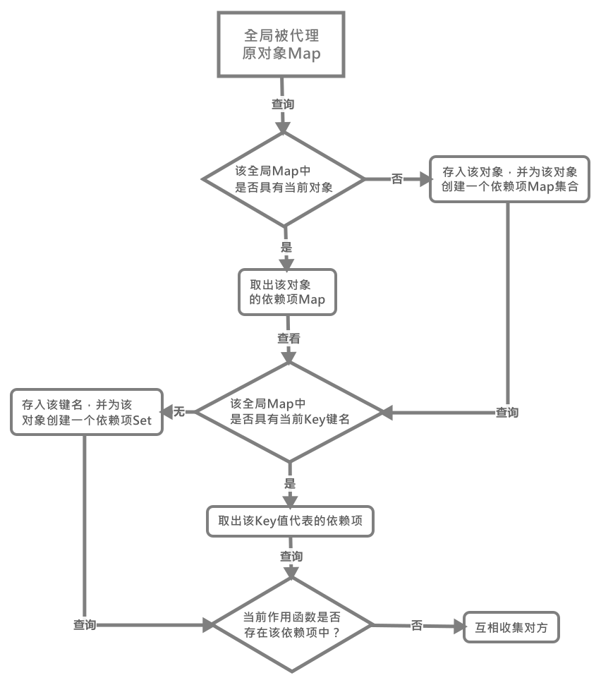

# dep依赖项

在`Vue3.x`中`Dep`依赖项已经不是用单独的`闭包 + class Dep`来实现，而是转而使用`native class Set`来进行实现，这主要得利于`class Map`可以将对象作为键值来进行存储和访问，那么现在我们按两个部分来介绍`3.x`中的依赖项

## 依赖项收集

在看如果进行依赖项收集之前，我们首先要清楚以下几个变量是用来干什么的：

```js
// 存放所有被代理对象的WeakMap
const targetMap = new WeakMap();

// 当前在处理的观察者对象
let activeEffect;
```

简单的介绍下，前者呢是用于存放所有已被代理对象的依赖项`Map`，后者则是当前要进行依赖项收集的`effect`作用函数。

那么我们继续来看看其依赖项收集的函数`track()`函数：

```js
function track(target, type, key) {
    if (!shouldTrack || activeEffect === undefined) {
        return;
    }

    // 在全局依赖项map中是否有该对象？
    let depsMap = targetMap.get(target);

    // 如果不存在该对象，则将其作为一个依赖项Map进行存储
    if (depsMap === void 0) {
        targetMap.set(target, (depsMap = new Map()));
    }

    // 那么该键值的依赖项是否存在于这个对象之中？
    let dep = depsMap.get(key);

    // 如果没有则新增一个依赖项存入其中
    if (dep === void 0) {
        depsMap.set(key, (dep = new Set()));
    }

    // 如果该依赖项没有被当前的effect函数观察，则将其添加到其观察者对象中
    if (!dep.has(activeEffect)) {
        dep.add(activeEffect);

        // 同时将该依赖项添加到观察者的依赖项队列中
        activeEffect.deps.push(dep);
    }
}
```

看完是不是有点晕，怎么一下`Map`一下`Set`的，这里我来说明下这个依赖项创建的大致过程和收集依赖项的过程：

1. 全局的被代理的原对象为键值的`Map`是否存在当前被代理的对象？有则直接取出该`Map`值跳转至`3`
2. 如果没有该对象，则将其作为键名、新增一个`Map`作为键值存放进行
3. 当前新增或已有的`Map`是否存在该对象中该键值`key`？有则直接取出该`key`代表的`Set`值，跳转至`5`
4. 如果没有则为其初始化一个代表该`key`的依赖项`Set`对象，跳转至`5`
5. 当前的这个依赖项是否已经被当前`activeEffect`作用函数观察？
6. 如果已观察则直接跳过；未观察则互相将其添加到各自的队列中

那么这里用图来总结一下就是：



## 依赖项更新

