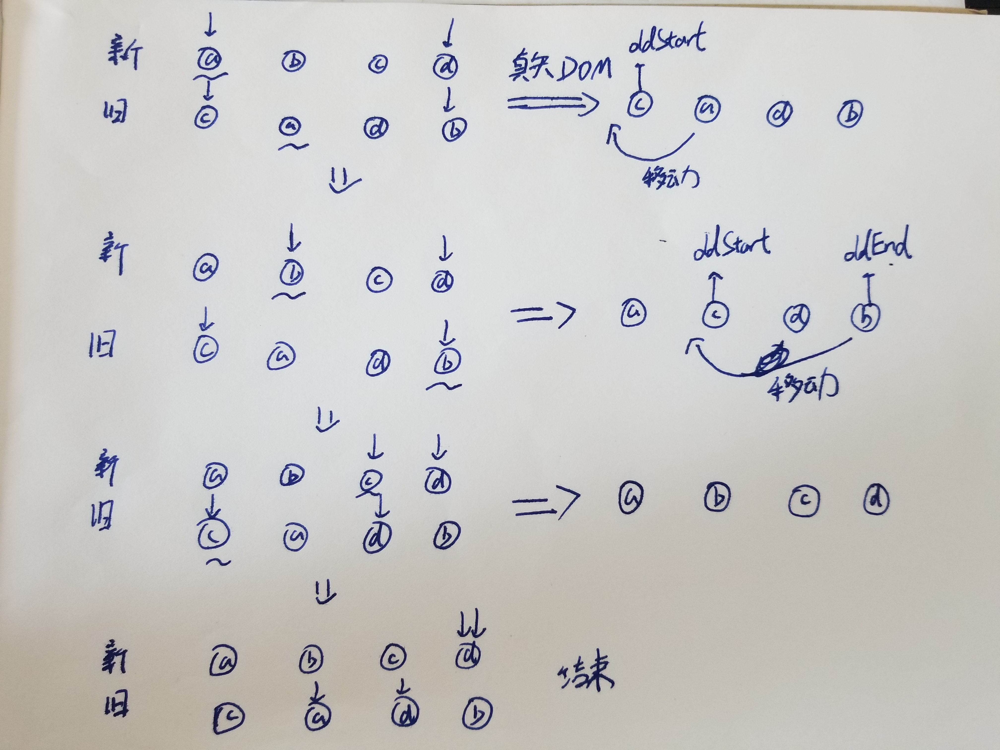
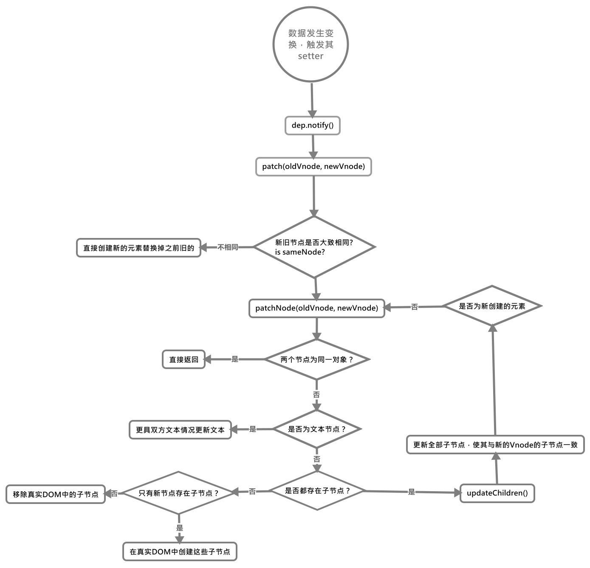

# VNode更新策略——diff算法

之前在笔记本上已经写过一遍了，但是笔记本丢了，没办法只有重新在写一次。
咳咳好了，言归正传，首先我们介绍下当数据发生变换时，vue怎么更新结点的。

## 数据发生变换时Vue如何更新节点

众所周知，Vue在生成的真实DOM是根据虚拟DOM Vnode的结构生成的，当某个虚拟DOM节点发生变化时，就会生成一个新的虚拟DOM节点，然后在更具前后两个虚拟节点进行对比，在发现不一样时就会用新的虚拟节点替换旧的节点，然后直接在真实DOM上进行修改。

而在这期间对比两个虚拟节点的函数就叫做`patch()`，在diff的过程中，其会一边比较两个虚拟节点一边给真实DOM打补丁

### diff比较时注意点

在用diff算法比较新旧节点时，只会在同层级比较，不会跨级比较，如：

```html
<!-- template 1 -->
<div>
    <p>模版1</p>
</div>

<!-- template 2 -->
<div>
    <span>模版2</span>
</div>
```

在上面的代码中，DOM结构由模版1变为了模版2，在此变化期间，diff算法只会将`<div>`与`<div>`、`<p>`与`<span>`元素进行比较，而不会用`<div>`与`<span>`元素进行比较。

## diff的流程

当数据发生变换时，我们知道改变一个vue中数据时，会触发其数据中定义的`setter`，在`setter`中会通过`dep.notify()`来通知订阅者Watcher更新所有的依赖项，然后Watcher就会调用`patch()`函数来给真实的DOM打补丁, 更新对应的视图

首先我们来看以下patch()函数

## patch()

以下为精简后的patch()函数，保留了其核心功能

```js
function patch (oldVnode, vnode) {

    // 截取部分代码
    if (sameVnode(oldVnode, vnode)) {
        patchVnode(oldVnode, vnode)
    } else {

        // 当前oldVnode对应的真实元素节点
        const oEl = oldVnode.el

        // 旧元素的父元素
        let parentEle = api.parentNode(oEl)

        // 根据Vnode生成新元素
        createEle(vnode)

        if (parentEle !== null) {

            // 将新元素添加进父元素
            api.insertBefore(parentEle, vnode.el, api.nextSibling(oEl))

            // 移除以前的旧元素节点
            api.removeChild(parentEle, oldVnode.el)
            oldVnode = null
        }
    }
    // some code
    return vnode
}
```

在`patch()`过程中，根据新旧虚拟节点是否大致为同一节点，来进行进一步的判断，当大致相同时才有比较的价值，不同时则直接创建新元素进行替换即可，具体对比如下

### sameVnode()——两个节点是否在大致上相同

通过该函数来判断两个虚拟节点是否在大致上相同，如果连这个条件都不满足则直接可视为不同的节点

```js
function sameVnode (a, b) {

    // 当两个节点的key、tag、是否为注释、都具有节点属性、input类型是否相同
    return (
        a.key === b.key && (
            (
            a.tag === b.tag &&
                a.isComment === b.isComment &&
                isDef(a.data) === isDef(b.data) &&
                sameInputType(a, b)
            )
        )
    )
}
```

如果新旧虚拟节点相同，那么就会对其进行进一步的比较，检查它们的子节点，调用`patchVnode()`函数

### patchVnode()

当新旧节点大致相同时，便会调用该方法对两个节点进行进一步的比较，然后对DOM进行对应的更新，具体过程如下(精简后)

```js
patchVnode (oldVnode, vnode) {

    // 获取真实的DOM元素
    const el = vnode.el = oldVnode.el;
    let i, oldCh = oldVnode.children, ch = vnode.children;

    // 新旧节点是同一个时，肯定直接返回就完事了
    if (oldVnode === vnode) return;

    // 两个节点为文本节点，但文本不同时，替换文本即可
    if (oldVnode.text !== null && vnode.text !== null && oldVnode.text !== vnode.text) {
        api.setTextContent(el, vnode.text)
    }else {
        updateEle(el, vnode, oldVnode)

        // 当两者的子节点不同时，进行对比后更新
        if (oldCh && ch && oldCh !== ch) {
            updateChildren(el, oldCh, ch)
        }else if (ch){

            // 之前没有子节点，现在有时，创建子节点DOM元素
            createEle(vnode) //create el's children dom
        }else if (oldCh){

            // 之前有子节点，现在没有时，直接删除子节点
            api.removeChildren(el)
        }
    }
}
```

`patchNode()`干了以下的事：
1. 若新旧虚拟节点指向同一对象(相同)，直接返回，否则跳转`2`
2. 是否都为文本节点但文本不同，满足条件时直接替换文本，否则跳转`3`
3. 根据两个虚拟节点的是否有子节点来进行判断，只有旧节点有时跳转`4`，只有新节点有时跳转`5`，否则跳转`6`
4. 新节点不存在子节点，所以直接删除DOM元素子节点即可。
5. 因为旧节点不存在子节点，所以直接为DOM元素创建子节点即可。
6. 两者都有子节点且不同，`updateChildren()`调用进一步对其进行对比

### updateChildren()——对子节点对比后进行更新
该方法分别在两个节点上用双指针来对子节点进行对比，来更新DOM元素，具体代码如下：
```js
function updateChildren(parentElm, oldCh, newCh, insertedVnodeQueue, removeOnly) {
    let oldStartIdx = 0
    let newStartIdx = 0
    let oldEndIdx = oldCh.length - 1
    let oldStartVnode = oldCh[0]
    let oldEndVnode = oldCh[oldEndIdx]
    let newEndIdx = newCh.length - 1
    let newStartVnode = newCh[0]
    let newEndVnode = newCh[newEndIdx]
    let oldKeyToIdx, idxInOld, vnodeToMove, refElm

    // removeOnly is a special flag used only by <transition-group>
    // to ensure removed elements stay in correct relative positions
    // during leaving transitions
    const canMove = !removeOnly

    if (process.env.NODE_ENV !== 'production') {
      checkDuplicateKeys(newCh)
    }

    // 当新旧两个节点的头尾指针没有一个相遇，就继续进行对比
    while (oldStartIdx <= oldEndIdx && newStartIdx <= newEndIdx) {
      if (isUndef(oldStartVnode)) {

        // 当旧节点的头指针指向的节点不存在时，左指针右移
        oldStartVnode = oldCh[++oldStartIdx] // Vnode has been moved left
      } else if (isUndef(oldEndVnode)) {

        // 当旧节点的尾指针指向的节点不存在时，指针左移
        oldEndVnode = oldCh[--oldEndIdx]
      } else if (sameVnode(oldStartVnode, newStartVnode)) {

        // 当新旧节点头指针指向的节点大致相同时，对其进行打补丁更新，然后双方指针右移
        patchVnode(oldStartVnode, newStartVnode, insertedVnodeQueue, newCh, newStartIdx)
        oldStartVnode = oldCh[++oldStartIdx]
        newStartVnode = newCh[++newStartIdx]
      } else if (sameVnode(oldEndVnode, newEndVnode)) {

        // 当新旧节点尾指针指向的节点大致相同时，对其进行打补丁更新，然后双方指针左移
        patchVnode(oldEndVnode, newEndVnode, insertedVnodeQueue, newCh, newEndIdx)
        oldEndVnode = oldCh[--oldEndIdx]
        newEndVnode = newCh[--newEndIdx]
      } else if (sameVnode(oldStartVnode, newEndVnode)) {

        // 当新节点头指针，与旧节点尾指针指向的节点大致相同时，对其进行打补丁更新，然后双方指针向内部移动
        patchVnode(oldStartVnode, newEndVnode, insertedVnodeQueue, newCh, newEndIdx)

        // 将旧节点尾指针指向的元素插入到当前旧节点尾指针指向的元素之前
        canMove && nodeOps.insertBefore(parentElm, oldStartVnode.elm, nodeOps.nextSibling(oldEndVnode.elm))
        oldStartVnode = oldCh[++oldStartIdx]
        newEndVnode = newCh[--newEndIdx]
      } else if (sameVnode(oldEndVnode, newStartVnode)) {

        // 当新节点尾指针，与旧节点头指针指向的节点大致相同时，对其进行打补丁更新，然后双方指针向内部移动
        patchVnode(oldEndVnode, newStartVnode, insertedVnodeQueue, newCh, newStartIdx)

        // 将旧节点尾指针指向的元素插入到当前旧节点头指针指向的元素之前
        canMove && nodeOps.insertBefore(parentElm, oldEndVnode.elm, oldStartVnode.elm)
        oldEndVnode = oldCh[--oldEndIdx]
        newStartVnode = newCh[++newStartIdx]
      } else {
        // 当4个指针都没有对应大致相等的节点时，通过其子节点的key值生成指针之间hash表，来看是否有相同的key

        // 第一次时生成旧节点上两指针之间的子节点与其对应key的hash表
        if (isUndef(oldKeyToIdx)) {
          oldKeyToIdx = createKeyToOldIdx(oldCh, oldStartIdx, oldEndIdx);
        }

        // 新节点的头指针指向节点的key是否在该hash表中
        idxInOld = isDef(newStartVnode.key)

          // 存在时，直接返回该子节点
          ?
          oldKeyToIdx[newStartVnode.key]

          // 否则直接遍历旧节点的子节点数组对象，查看是否相等
          :
          findIdxInOld(newStartVnode, oldCh, oldStartIdx, oldEndIdx)

        // 两种方式都未找到时，创建新的子节点
        if (isUndef(idxInOld)) { // New element
          createElm(newStartVnode, insertedVnodeQueue, parentElm, oldStartVnode.elm, false, newCh, newStartIdx)
        } else {

          // 找到相同key或是同一个vnode节点的节点时
          vnodeToMove = oldCh[idxInOld]

          // 先对比其是否大致相同，相同时对其打补丁更新，情况hash表中对应的节点
          if (sameVnode(vnodeToMove, newStartVnode)) {
            patchVnode(vnodeToMove, newStartVnode, insertedVnodeQueue, newCh, newStartIdx)
            oldCh[idxInOld] = undefined

            // 将找到的节点元素插入到旧节点头指针指向的元素之前
            canMove && nodeOps.insertBefore(parentElm, vnodeToMove.elm, oldStartVnode.elm)
          } else {

            // same key but different element. treat as new element
            // key相同但元素不相同时，直接生成新元素替换指针位置的元素
            createElm(newStartVnode, insertedVnodeQueue, parentElm, oldStartVnode.elm, false, newCh, newStartIdx)
          }
        }

        // 新节点头节点与头指针右移一个
        newStartVnode = newCh[++newStartIdx]
      }
    }

// 对比是否大致相同
function findIdxInOld(node, oldCh, start, end) {
    for (let i = start; i < end; i++) {
        const c = oldCh[i];
        if (isDef(c) && sameVnode(node, c)) return i;
    }
}
```

虽然这么多代码，但其实`updateChildren()`函数做了以下的事：
1. 分别按新旧结点的子节点分为组数组，然后在每组的头和尾安排两个指针指向头尾的元素。

2. 对新旧两组节点的指针按顺序进行4种方式的比较，每次比较后会移动指针，4种分别为：
   1. 新旧节点的头指针进行对比，匹配时保存真实DOM结构，将新旧节点的头指针右移一个单位
<br>
   2. 新旧节点的尾指针进行对比，匹配时保存真实DOM结构，将新旧节点的尾指针左一个单位
<br>
   3. 新节点的尾指针与旧节点的头指针进行对比，匹配时，将旧节点的头指针指向的节点的真实DOM元素插入到尾指针指向的节点的真实DOM元素之后
<br>
   4. 新节点的头指针与旧节点的尾指针进行对比，匹配时，将旧节点的尾指针指向的节点的真实DOM元素插入到头指针指向的节点的真实DOM元素之前
<br>
3. 如果4中方式的比较都没有相同的节点，则按下面三个方法来更新：
   1. 按旧节点的子节点的`key`值来生成一个`hash`表，每个`key`值对应其`Vnode`节点，在查看当前新节点的头指针指向的`Vnode`的`key`是否存在于`hash`表中，存在则插入到旧节点头指针所对应的元素之前
<br>
   2. 如果没有时，就查询旧节点两个指针之间是否存在一个`Vnode`对象与新节点头指针执行的`Vnode`相等，相等则插入到旧节点头指针所对应的元素之前
<br>
   3. 否则在旧节点头指针所对应的元素之前新创建一个元素。
<br>
4. 当新旧节点的指针任意一对相遇时，结束比较。

具体过程如下图例子：


图中从上到下为新旧两组子节点指针的变换情况，

在最开始新旧节点的指针为：
```js
newStart = a, newEnd = d;
oldStart = c, oldEnd = b;
```
+ 在第一步种，即图中第一行，`newStart`指针中的元素与任何其他指针的元素都不匹配，所以按旧节点头尾两个指针的全部节点的`key`值，生成与其对应的`hash`表：
```js
// 伪代码
let hash = {
    a: nodeA,
    d: nodeD
}
```
根据`hash`表，我们知道存在一个`Vnode`与`a`的`key`值一样，那么我们将其对应的`DOM`元素直接取出，然后将其插入到`oldStart`指针对应元素的之前，然后`newStart`指针向右移动一个单位。

此时的指针和节点为：(对应图中第二排)
```js
newStart = b, newEnd = d;
oldStart = c, oldEnd = b;
```

+ 第二步，4个指针进行对比，可得知`newStart = oldEnd`, 此时将`oldEnd`节点对应的元素插入到`oldStart`指针对应的元素之前即可，然后匹配的两个指针分别向中间移动一位(结果如图中第三排)

此时的指针对应的节点为：
```js
newStart = c, newEnd = d;
oldStart = c, oldEnd = d;
```

+ 第三步，4个指针进行对比，两个的头指针都相等，所以不需要替换DOM元素直接将匹配的指针进行移动即可：

此时的指针对应的节点为：
```js
newStart = d, newEnd = d;
oldStart = a, oldEnd = d;
```

+ 最后，新节点的两个指针已经相遇，至此比较就结束了

接下来用流程图总结下整个`diff`的过程：
