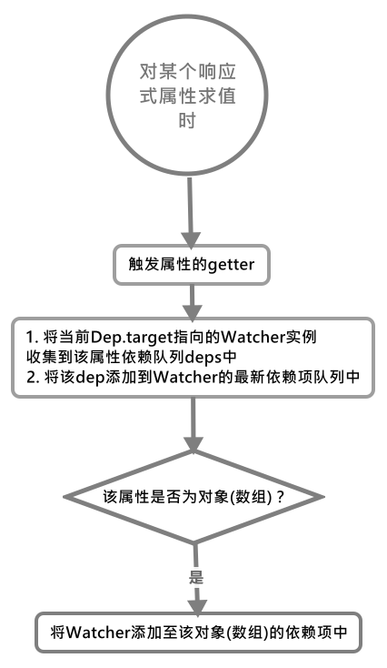

# Dep 依赖项

在看这个之前，我们需要知道它用来解决一个什么问题：**它用来在某个被观察的值更新时，对其依赖于该值的对象进行局部更新，而不是每次都对对象的全部属性进行更新一次(即使某些属性未变更)**。

`Dep`对象实现比较简单，就是一个观察者队列

```js
class Dep {
    // 当前指向的Watcher实例
    static target: ?Watcher;

    // 唯一的dep id
    id: number;

    // Watcher实例队列，用于该Dep所代表值更新时通知的对象
    subs: Array<Watcher>;

    constructor() {
        this.id = uid++;
        this.subs = [];
    }

    removeSub(sub: Watcher) {
        remove(this.subs, sub);
    }

    notify() {
        // stabilize the subscriber list first
        const subs = this.subs.slice();
        if (process.env.NODE_ENV !== 'production' && !config.async) {
            // subs aren't sorted in scheduler if not running async
            // we need to sort them now to make sure they fire in correct
            // order
            // 在异步时需要对sub进行排序, 因为它们会乱序
            subs.sort((a, b) => a.id - b.id);
        }
        for (let i = 0, l = subs.length; i < l; i++) {
            subs[i].update();
        }
    }

    // 其余实例方法会在用到时再做解释
}

// The current target watcher being evaluated.
// This is globally unique because only one watcher
// can be evaluated at a time.
Dep.target = null;
const targetStack = [];
```

## 什么时候与怎么进行依赖收集？

那么什么时候，会开始进行依赖收集呢？当我们第一次获取通过的函数[defineReactive()](../Observer观察者对象/#defineReactive)定义响应式属性的值时，会将目前`Dep.target`指向的`Watcher`添加到这个属性的依赖`deps`数组中，同时也会将该`dep`对象添加到`Dep.target`所指向的`Watcher`对象实例中去。

具体的收集过程一切还要从取值函数开始说起，具体过程如下：

```js
// 截取主要的代码
get: function reactiveGetter() {

    const value = getter ? getter.call(obj) : val;

    // 将Dep.target指向的Watcher添加到当前deps队列中
    if (Dep.target) {

        // 如果是新的依赖项则将Dep.target所指向的Watcher添加到deps队列中，同时要将该依赖项添加到Watcher的最新依赖项队列中。
        dep.depend();

        // 当该属性是对象时，还要将Watcher添加到该对象的deps队列中，为了监听对象属性的增加和删除，还有数组的变化。
        if (childOb) {

            // 将Watcher添加到该对象的deps队列中
            childOb.dep.depend();
            if (Array.isArray(value)) {
                dependArray(value);
            }
        }
    }
    return value;
},
```

在上述过程中，当我们取某个响应式属性值时，在`Dep.target`指向有效`Watcher`对象时，则会先触发`dep.depend()`, 该函数如下:

```js
// 在该Watcher对象中添加该依赖项，如果是新的依赖项，还要在该依赖项的deps中添加该Watcher
Dep.prototype.depend() {
    if (Dep.target) {

        // 调用Watcher的addDep()方法，并将该依赖项dep对象作为参数
        Dep.target.addDep(this);
    }
}
```

`watcher.addDep()`函数的作用是给`Watcher`的`newDeps`属性中添加所有的依赖项，如果该依赖是新的，则还要**将`Watcher`添加到该依赖项的`deps`队列中**。

```js
Watcher.prototype.addDep(dep: Dep) {

    // 获取该依赖项id
    const id = dep.id;

    // 将所有的dep项添加到Watcher的新deps队列中
    if (!this.newDepIds.has(id)) {
        this.newDepIds.add(id);
        this.newDeps.push(dep);

        // 如果是新的依赖项，还需要将该Watcher添加到依赖项的deps队列中
        if (!this.depIds.has(id)) {
            dep.addSub(this)
        }
    }
}
```

这里简单贴以下 dep.addSub()代码,看一眼就会：

```js
Dep.prototype.addSub(sub: Watcher) {

    // 将该Watcher添加到dep.subs队列中
    this.subs.push(sub);
}
```

之后，如果当前`getter`取值是对象或数组时，还有将`Watcher`添加到该对象或数组的`deps`队列中。

如果该属性是对象是数组, 则还需要给数组中的对象或数组添加该`Watcher`：

```js
function dependArray(value: Array<any>) {
    for (let e, i = 0, l = value.length; i < l; i++) {
        e = value[i];
        e && e.__ob__ && e.__ob__.dep.depend();
        if (Array.isArray(e)) {
            dependArray(e);
        }
    }
}
```

整个过程用图来总结：


## 如何触发依赖更新

当我们某个响应式属性的值改变时，就会通过其值定义的`setter`函数中的`dep.notify()`通知其挂载其下`(deps.subs)`数组下的全部`Wachter`对象对旧值进行更新。

> Dep.prototype.notify()用于分别给 deps 中所挂载的 Watcher 触发其 Watcher.prototype.update()方法

改变某个响应式属性的值时：

```js
set: function reactiveSetter(newVal) {
    const value = getter ? getter.call(obj) : val;

    if (newVal === value || (newVal !== newVal && value !== value)) {
        return;
    }

    // 自定义的setter效验器, 不用管，主要用来不允许用户修改某些属性值, 修改时报错(如prop中属性)
    if (process.env.NODE_ENV !== 'production' && customSetter) {
        customSetter();
    }
    // #7981: for accessor properties without setter
    if (getter && !setter) return;
    if (setter) {
        setter.call(obj, newVal);
    } else {
        val = newVal;
    }

    // 如果更新的属性的值为对象或数组时, 继续递归为该属性添加观察者对象(变更为响应式)
    childOb = !shallow && observe(newVal);

    // 更新依赖该值的所以属性
    dep.notify();
}
```

当我们在改变其属性的值后，还需要通知各位监听这个属性的`Watcher`实例们对其进行更新：
```js
Dep.prototype.notify () {

    // stabilize the subscriber list first
    const subs = this.subs.slice()
    if (process.env.NODE_ENV !== 'production' && !config.async) {
      // subs aren't sorted in scheduler if not running async
      // we need to sort them now to make sure they fire in correct
      // order
      // 在异步时需要对sub进行排序, 因为它们会乱序
      subs.sort((a, b) => a.id - b.id)
    }

    // 逐个通知Watcher更新
    for (let i = 0, l = subs.length; i < l; i++) {
      subs[i].update();
    }
}
```

此时会逐个对`dep.subs`队列中的`Watcher`实例调用`update()`方法, 在该方法中，会针对情况进行不同的更新：
```js
Watcher.prototype.update() {

        if (this.lazy) {

            // 计算属性独有属性，值为true时用于更新computed属性
            this.dirty = true;
        } else if (this.sync) {

            // 同步watcher实例，则直接调用回调函数
            this.run();
        } else {

            // watch属性更新的地方
            // 其余情况先放置任务队列中
            queueWatcher(this);
        }
    }
```

当我调用`update()`方法时，就会根据不同的`watcher`来进行更新，大多数情况是通过`queueWatcher()`来更新：

```js

```
