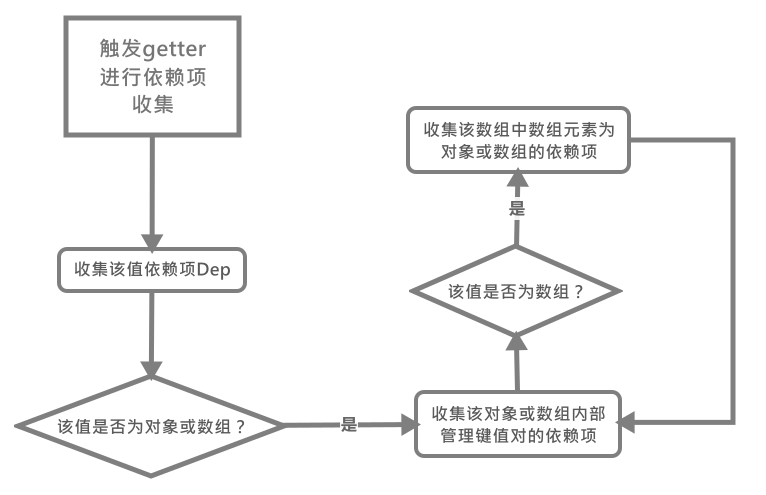

# Dep 依赖项

在之前我们提到，`Dep`作为一个属性值的占位符，代表了该属性值，同时在观察者模式者作为一个主体被其他观察者观察。

不了解观察者模式的同学，我这里解释下它的作用：它用来解决一个什么问题，**它用来在某个被观察的值更新时，对观察该值的观察者们进行通知更新。这样同时也避免了对其他未改变值的更新**。

`Dep`对象实现比较简单，就是一个观察者队列，这里我们只需先了解下其构造函数：

```js
let uid = 0

/**
 * A dep is an observable that can have multiple
 * directives subscribing to it.
 * 一个观察者对象队列, 用于更新watcher
 */
class Dep {
    static target: ? Watcher;

    // 依赖项的uid
    id: number;

    // 观察此依赖项的Watcher们
    subs: Array < Watcher > ;

    constructor() {
        this.id = uid++
        this.subs = []
    }

    addSub(sub: Watcher) {

        // 将观察该依赖项的观察者添加至数组中
        this.subs.push(sub)
    }

    removeSub(sub: Watcher) {

        // 从数组中移除该观察者
        remove(this.subs, sub);
    }

    depend() {

        // 将该依赖项添加到观察者对象的依赖项数组中Watcher的API
        if (Dep.target) {
            Dep.target.addDep(this)
        }
    }

    notify() {

        // stabilize the subscriber list first
        // 浅复制观察者数组，防止影响原数组
        const subs = this.subs.slice()
        if (process.env.NODE_ENV !== 'production' && !config.async) {
            // subs aren't sorted in scheduler if not running async
            // we need to sort them now to make sure they fire in correct
            // order
            // 在异步时需要对sub进行排序, 因为它们会乱序，
            // 要保证它们的更新是从父到子(即Watcher的创建顺序)
            subs.sort((a, b) => a.id - b.id)
        }

        // 通知观察者们更新
        for (let i = 0, l = subs.length; i < l; i++) {
            subs[i].update();
        }
    }
}
```

除此之外，每次进行依赖项收集的`Watcher`都只会有一个，它会被置于`Dep.target`，所以想要收集依赖之前要先设置该属性：

```js
// The current target watcher being evaluated.
// This is globally unique because only one watcher
// can be evaluated at a time.
// 当前进行依赖收集的Watcher
Dep.target = null;
const targetStack = [];

// 将当前Watcher作为依赖项收集目标
function pushTarget(target: ? Watcher) {
    targetStack.push(target);
    Dep.target = target;
}

// 弹出栈中最上层的Watcher
function popTarget() {
    targetStack.pop();
    Dep.target = targetStack[targetStack.length - 1];
}
```

那么我们知道`Dep`要与`Watcher`一起使用，那么我们此时要先学习[`Watcher`的构造函数](../Watcher监听者对象/README.md)，在来解决下面的两个问题：

- [什么时候与怎么进行依赖收集](#%e4%bb%80%e4%b9%88%e6%97%b6%e5%80%99%e4%b8%8e%e6%80%8e%e4%b9%88%e8%bf%9b%e8%a1%8c%e4%be%9d%e8%b5%96%e6%94%b6%e9%9b%86)
- [如何触发依赖更新](#%e5%a6%82%e4%bd%95%e8%a7%a6%e5%8f%91%e4%be%9d%e8%b5%96%e6%9b%b4%e6%96%b0)

## 什么时候与怎么进行依赖收集

那么什么时候，会开始进行依赖收集呢？当我们第一次获取通过的函数`defineReactive()`定义响应式属性的值时，会将目前`Dep.target`指向的`Watcher`添加到这个属性的依赖`deps`数组中，同时也会将该`dep`对象添加到`Dep.target`所指向的`Watcher`对象实例中去。

具体的收集过程一切还要从取值函数开始说起，具体过程如下：

```js
// 截取主要的代码
get: function reactiveGetter() {

    const value = getter ? getter.call(obj) : val;

    // 如果当前Dep.target指向了Watcher，那么帮助其收集依赖项
    if (Dep.target) {

        // 如果是新的依赖项则将Dep.target所指向的Watcher添加到deps队列中，同时要将该依赖项添加到Watcher的最新依赖项队列中。
        dep.depend();

        // 当该属性是对象时，还要将Watcher添加到该对象的deps队列中，为了监听对象属性的增加和删除，还有数组的变化。
        if (childOb) {

            // 将Watcher添加到该对象的deps队列中
            childOb.dep.depend();
            if (Array.isArray(value)) {
                dependArray(value);
            }
        }
    }
    return value;
}
```

在上述过程中，当我们取某个响应式属性值时，如果`Dep.target`指向有效`Watcher`对象时，则会先触发`dep.depend()`进行依赖项收集，该函数，实则为封装的`Watcher.prototype.addDep()`方法，具体如下:

```js
// 在该Watcher对象中依赖项数组中添加该依赖项，
// 如果是新的依赖项，还要在该依赖项的deps中添加该Watcher
Dep.prototype.depend = function () {
    if (Dep.target) {

        // 调用Watcher的addDep()方法，并将该依赖项dep对象作为参数
        Dep.target.addDep(this);
    }
}
```

[`watcher.addDep()`](../Watcher监听者对象/README.md#watcherprototypeadddep%e4%b8%bawatcher%e6%b7%bb%e5%8a%a0%e4%be%9d%e8%b5%96%e9%a1%b9)(点击查看详细)函数的作用是给`watcher.newDeps`属性中添加所有的依赖项，如果该依赖是新的，则还要**将`Watcher`添加到该依赖项的`deps`队列中**。

之后，如果**当前`getter`取值的结果是对象或数组**时，还要将对象和数组的`Watcher`添加到该对象或数组的`dep.subs`(观察者队列)队列中并添加它们的`Dep`依赖项添加至该`Watcher`的依赖项数组中：

```js
// 闭包中的childOb为如下，如果val不为对象则为undefined
let childOb = !shallow && observe(val);

if (childOb) {

    // 将Watcher添加到该对象的deps队列中
    childOb.dep.depend();
    if (Array.isArray(value)) {
        dependArray(value);
    }
}

// 对数组中的对象元素进行依赖项收集
function dependArray(value: Array<any>) {
    for (let e, i = 0, l = value.length; i < l; i++) {
        e = value[i];
        e && e.__ob__ && e.__ob__.dep.depend();

        // 如果该元素依然是数组那么递归直到找到非数组对象来进行依赖项收集
        if (Array.isArray(e)) {
            dependArray(e);
        }
    }
}
```

这里我们可以看到对于一个**对象值**，我们不仅收集了代表这个对象的`Dep`同时也收集了对象内部管理键值对的`Dep`，这是什么目的呢？因为在`Vue`中**对对象的观察体现在以下两个方面**：

- 对象整个是否改变
- 对象中键值对是否新增会减少

对于数组，和对象差不多，唯一有区别的地方就是，对于数组的观察，多了**对数组中元素是对象或数组时，也要对这些数组对象进行依赖收集，并要深度递归观察其中的数组元素，直到观察到非数组值为止**。

整个过程用图来总结：


## 如何触发依赖更新

当我们某个依赖项的值改变时，就会通过其值定义的`reactiveSetter`函数中的`dep.notify()`通知`deps.subs`观察者数组中的全部`wachter`实例对旧值进行更新，具体流程如下：

首先当我们改变某个响应式属性的值时, 触发该属性的`setter`函数，简单的对新值效验后，如果值发生了变化，便通过`dep.notify()`来进行更新：

```js
set: function reactiveSetter(newVal) {
    const value = getter ? getter.call(obj) : val;

    if (newVal === value || (newVal !== newVal && value !== value)) {
        return;
    }

    // 自定义的setter效验器, 不用管，主要用来不允许用户修改某些属性值, 修改时报错(如prop中属性)
    if (process.env.NODE_ENV !== 'production' && customSetter) {
        customSetter();
    }
    // #7981: for accessor properties without setter
    if (getter && !setter) return;
    if (setter) {
        setter.call(obj, newVal);
    } else {
        val = newVal;
    }

    // 如果更新的属性的值为对象或数组时, 继续递归为该属性添加观察者对象(变更为响应式)
    childOb = !shallow && observe(newVal);

    // 更新依赖该值的所有属性
    dep.notify();
}
```

那么需要更新的`dep`依赖项就调用`dep.notify()`函数。该`dep`依赖项会对其观察它的`watcher`进行通知并更新：

```js
Dep.prototype.notify = function () {

    // stabilize the subscriber list first
    // 浅复制观察者数组，防止影响原数组，因为我们下面要进行排序
    const subs = this.subs.slice();
    if (process.env.NODE_ENV !== 'production' && !config.async) {
        // subs aren't sorted in scheduler if not running async
        // we need to sort them now to make sure they fire in correct
        // order
        // 在异步时需要对sub进行排序, 因为它们会乱序，
        // 要保证它们的更新是从父到子(即Watcher的创建顺序)
        subs.sort((a, b) => a.id - b.id)
    }

    // 通知观察者们更新
    for (let i = 0, l = subs.length; i < l; i++) {
        subs[i].update();
    }
}
```

此时会逐个对`dep.subs`队列中依赖该`dep`的`watcher`实例调用`Watcher.prototype.update()`方法进行更新。

在该方法中，会针对`watcher`的配置进行不同的更新，主要分为两种情况：

1. `Computed Watcher`即我们所熟悉的`Computed`属性的`Watcher`
2. 其余`Watcher`

```js
/**
 * Subscriber interface.
 * Will be called when a dependency changes.
 * 订阅者接口，会在依赖项更新时触发
 */
Watcher.prototype.update = function () {

    // 计算属性专属
    if (this.lazy) {
        this.dirty = true;

    // 未知的一个属性，可能用于服务器渲染
    } else if (this.sync) {
        this.run();

    // 渲染Watcher和监听属性的通道
    } else {

        // 加入刷新队列，等待更新
        queueWatcher(this)
    }
}
```

当我调用`watcher.update()`方法时，就会根据不同的`Watcher`来进行更新。`Render Watcher`与`Watch Watcher`都是通过`queueWatcher()`来更新，这里不单独说明`Computed Watcher`如何进行更新了，在`Computed Watcher`板块会讲解。

我们可以看到，但凡有一个`dep`依赖项更新时，就会将调用`queueWatcher()`并传入该`watcher`，之后呢就要待到学习[刷新队列](../../Vue的Watcher更新机制/README.md)这个概念了。
