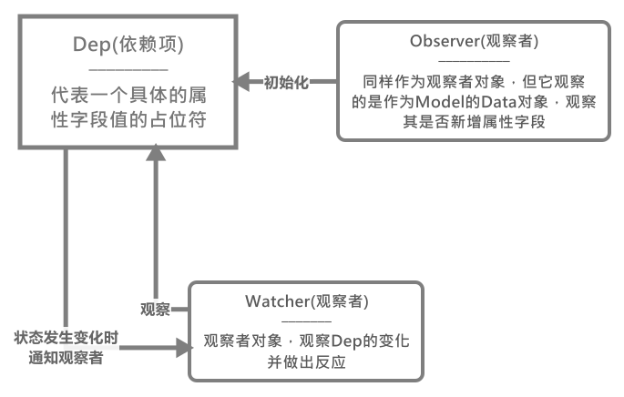

# Vue中的响应式系统

在`Vue`中，响应式系统一共由3个组件组成，它们是：

- `Watcher`(观察者)
- `Observer`(观察者)
- `Dep`(依赖项)

它们之间有这种关系，如图：

这里解读下上图的含义：首先是`Observer`对象，它负责初始化其观察的对象旗下的`Dep`依赖项们，**同时它要对这个被观察对象的属性的增删进行管理**；而`Dep`依赖项则对标一个具体的属性值，**它负责管理这个属性的变更和访问**，这里我们可以将其作为一个主题来看待，所以它可以**被其他`Watcher`观察者观察**。当`Dep`发生改变时，就会通知`Watcher`们进行更新。

那么梳理一下，我们就可以得知在一个`vm`生命周期内，首先是`Observer`最先工作，因为它要辅助初始化和管理`Dep`，那么我们可以看下具体[`class Observer`](./Observer观察者对象/README.md)(点击传送)是如何工作的。

那么接下来就是初始化`Watcher`，各种`Watcher`的初始化顺序按`Computed => Watch => Render`三个顺序初始化，原因很简单，具体我们会在这个`Watcher`的介绍中说明。接下来如果某个`Watcher`在进行求值计算的过程中使用到了某个具有`Dep`依赖项的值，那么就会进行依赖项收集。

初始化任务阶段结束就会开始异步任务阶段，此时倘若某个`Dep`依赖项的值改变了，那么就会通知订阅了它的`Watcher`更新，重新求值(当然不同`Watcher`可能会有其他做法)。当然此时的更新不是单独一个一个的调度的，而是通过一个队列来进行的，这时就涉及到一个**刷新队列**，它负责调度`Watcher`的更新。

那么整体推荐学习的顺序为：

1. [class Observer](./Observer观察者对象/README.md)
2. [class Dep](./Dep依赖项/README.md)
3. [class Watcher](./Watcher监听者对象/README.md)
4. [flushQueue刷新队列](./Vue的Watcher更新机制/README.md)
