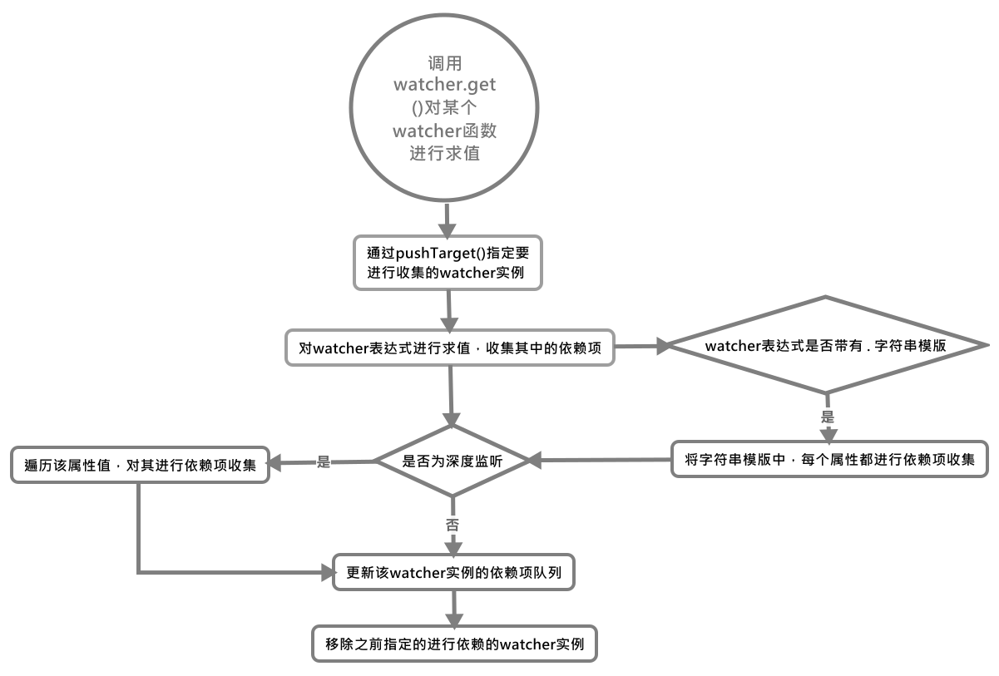

# Watcher监听者对象(主要是区别于另一个观察者对象)

在我们定义的`watch`和`computed`属性时，它们都是依赖于`Watcher`对象来进行对属性的监听。下面我们就来具体学习`class Watcher`。

在初始化`computed`时, 不会对其进行求值与依赖项的收集,只有当真正使用它时才会开始计算。同时我们的模版字符串(也代表一个`Watcher`)中所用的变量，也要被收集在该 `Vue` 实例之下。

`Watcher`具体分为`3`类(括号为它们初始化时的区别)：

1. 渲染`Watcher`(具有`before`属性)
2. 计算属性`Watcher`(`lazy`属性为`true`)
3. 监听函数`Watcher`(`user`属性为`true`)

```js
let uid = 0

/**
 * A watcher parses an expression, collects dependencies,
 * and fires callback when the expression value changes.
 * This is used for both the $watch() api and directives.
 * 一个观察者解析一个表达式，收集依赖项，并在表达式的返回值改变时触发回调函数
 */
class Watcher {
    vm: Component;

    // 当为computed属性时，该值为函数，表示computed的求值表达式
    // 当为watch属性时，该值表示watch的名称字符串
    expression: string;
    cb: Function;
    id: number;

    // watch的特有属性，用于是否深度监听
    deep: boolean;

    // watch的特有属性，用于执行回调函数
    user: boolean;

    // 计算属性特有属性，是否延迟Watcher的求值
    lazy: boolean;
    sync: boolean;

    // 是否允许允许Watcher进行表达式计算
    dirty: boolean;

    // 渲染Watcher的特有属性，表示当前组件是否活跃
    active: boolean;

    // 当前观察者对象依赖的依赖项
    deps: Array < Dep > ;
    newDeps: Array < Dep > ;
    depIds: SimpleSet;
    newDepIds: SimpleSet;

    // 渲染Watcher特有属性，当前Watcher在重新计算(更新)前调用的函数
    before: ? Function;
    getter: Function;
    value: any;

    constructor(
        vm: Component,
        expOrFn: string | Function,
        cb: Function,
        options ? : ? Object,
        isRenderWatcher ? : boolean
    ) {
        this.vm = vm

        // 是否为渲染watcher
        if (isRenderWatcher) {
            vm._watcher = this;
        }

        // 将Watcher加入vm上的_watchers数组
        vm._watchers.push(this);

        // options
        // 初始化配置
        if (options) {
            this.deep = !!options.deep;
            this.user = !!options.user;
            this.lazy = !!options.lazy;
            this.sync = !!options.sync;
            this.before = options.before;
        } else {

            // 未传入时默认为false
            this.deep = this.user = this.lazy = this.sync = false;
        }
        this.cb = cb;
        this.id = ++uid; // uid for batching
        this.active = true;
        this.dirty = this.lazy; // for lazy watchers
        this.deps = [];
        this.newDeps = [];
        this.depIds = new Set();
        this.newDepIds = new Set();
        this.expression = process.env.NODE_ENV !== 'production' ?
            expOrFn.toString() : '';

        // Watcher变动所涉及的函数
        // 这里即渲染Watcher的渲染函数或计算属性的计算函数
        if (typeof expOrFn === 'function') {
            this.getter = expOrFn;
        } else {

            // 当Watcher名为字符串时, 可以是.运算符指定对象的某个属性
            // getter为一个函数, 返回watch名所对应的属性(即监听函数)
            this.getter = parsePath(expOrFn);

            // 当存在不规范的定义时会报错
            if (!this.getter) {
                this.getter = noop
                process.env.NODE_ENV !== 'production' && warn(
                    `Failed watching path: "${expOrFn}" ` +
                    'Watcher only accepts simple dot-delimited paths. ' +
                    'For full control, use a function instead.',
                    vm
                )
            }
        }

        // 当前Watcher的值，当是computed时，延迟求值(即本次不求值)
        this.value = this.lazy ?
            undefined :
            this.get();
    }
}
```

那么这里我们按照不同的`Watcher`分别来进行学习。

在我们设置一个`watch`监听函数时，可能设置的是一个对象中的某个属性，那么此时，该函数就会解析这个字符串，返回那个对应的属性

## Watcher.prototype.evaluate()——计算Watcher的值(lazy Watcher专属)

该方法为`Computed Watcher`计算属性的专用方法，用于对`Watcher`求值，并更新其允许求值属性(`dirty`)

```js
/**
 * Evaluate the value of the watcher.
 * This only gets called for lazy watchers.
 * 计算Watcher的值，仅会被lazy Watcher调用
 */
evaluate() {
    this.value = this.get();
    this.dirty = false;
}
```

## Watcher.prototype.get()——计算Watcher的值

该方法用来触发`Watcher`的`getter`函数，对其进行求值，并收集依赖项, 并按以下的顺序：

1. 首先通过`pushTarget()`指定要进行收集依赖项的`Watcher`
2. 对`Watcher`函数进行求值，收集依赖项(注意有`.`运算符的路径时的特殊性情况)
3. 如果是深度监听`(deep = true)`，则还要遍历整个求值结果(是对象的其他下)，进行依赖项收集
4. 通过`cleanupDeps()`替换`Watcher`中的新旧`deps`列队，并根据是否还存在这个`dep`依赖项，来决定是否移除该`Watcher`。
5. 通过`popTarget()`移除当前指定的`watcher`

具体过程为：

```js
  /**
   * Evaluate the getter, and re-collect dependencies.
   */
get () {

    // 将当前watcher实例作为依赖的目标watcher实例
    pushTarget(this);
    let value;
    const vm = this.vm;
    try {

        // 调用cmoputed/watch函数的getter函数直接收集依赖，将当前的watcher实例收集到响应式属性value的deps依赖项中, 并将这些dep添加到watcher的newDeps队列中
        value = this.getter.call(vm, vm);
    } catch (e) {

        // 如果是用户定义的watcher则提示表达式错误
        if (this.user) {
            handleError(e, vm, `getter for watcher "${this.expression}"`)
        } else {
            throw e
        }
    } finally {

        // "touch" every property so they are all tracked as
        // dependencies for deep watching
        // 在用户定义watch时使用深度监听——deep属性时调用
        // 当为深度监听时, 遍历监听的属性, 将其所有属性的依赖项添加到当前watcher中
        if (this.deep) {
          traverse(value);
        }

        // 移除当前Dep.target指向的watcher
        popTarget();

        // 更新当前watcher的依赖项
        this.cleanupDeps()
    }
    return value
}
```

其中，当我们深度监听对象时，会调用以下函数：

### traverse(value)——遍历 value，将其所有属性的依赖添加到当前 watcher

该函数的目的有两个：

1. 添加每个属性的依赖项
2. 当属性值为对象或数组时，还要添加其自身的`dep`依赖项(用于对象或数组的增加或删除元素)

```js
// 生成一个Set数组，防止重复添加dep依赖项(防止循环引用)
const seenObjects = new Set();

function traverse(val: any) {
    _traverse(val, seenObjects);

    // 清空所有depid
    seenObjects.clear();
}

function _traverse(val: any, seen: SimpleSet) {
    let i, keys;
    const isA = Array.isArray(val);

    // 非对象或数组或冻结属性或Vnode时直接返回
    if (
        (!isA && !isObject(val)) ||
        Object.isFrozen(val) ||
        val instanceof VNode
    ) {
        return;
    }

    // 直接取出对象或数组上的观察者的depid，添加至Set数组中
    if (val.__ob__) {
        const depId = val.__ob__.dep.id;
        if (seen.has(depId)) {
            return;
        }

        seen.add(depId);
    }

    // 遍历数组和对象，将其对象或数组元素自身的depid添加至set数组中
    if (isA) {
        i = val.length;
        while (i--) _traverse(val[i], seen);
    } else {
        keys = Object.keys(val);
        i = keys.length;
        while (i--) _traverse(val[keys[i]], seen);
    }
}
```

最后，我们需要对该`watcher`依赖项队列的变更，进行整理，具体过程如下：

### Watcher.prototype.cleanupDeps()——清除已不存在依赖项，交替依赖项

整个过程做了两件事：

1. 如果该`watcher`某些旧的`dep`依赖项已不存在最新的队列中，则移除旧的`dep`依赖项的该`watcher`
2. 替换新旧`deps`依赖项队列，并清空新的依赖项队列。

```js
    cleanupDeps() {
        let i = this.deps.length

        // 如果该旧的dep依赖项已不存在于新的deps队列，则要从旧的dep依赖项中移除该watcher
        while (i--) {

            // 取出旧的依赖项
            const dep = this.deps[i];

            // 当最新的依赖项队列已不存在该旧依赖项时，从该旧的依赖项移除该watcher
            if (!this.newDepIds.has(dep.id)) {
                dep.removeSub(this);
            }
        }

        // 替换新旧依赖项队列
        let tmp = this.depIds;
        this.depIds = this.newDepIds;

        // 赋值后又情况了新的deps队列，这里是什么骚操作，没看懂
        this.newDepIds = tmp;
        this.newDepIds.clear();
        tmp = this.deps;

        // 这里又是什么骚操作，没看懂
        this.deps = this.newDeps;
        this.newDeps = tmp;
        this.newDeps.length = 0;
    }
```

至此，就是watcher函数全部的求值过程，用一张图来总结一下一个watcher的具体求值过程：


### Watcher.ptototype.update()——更新 watcher

```js
update() {
    if (this.lazy) {
        this.dirty = true
    } else if (this.sync) {
        this.run()
    } else {
        queueWatcher(this)
    }
}
```

