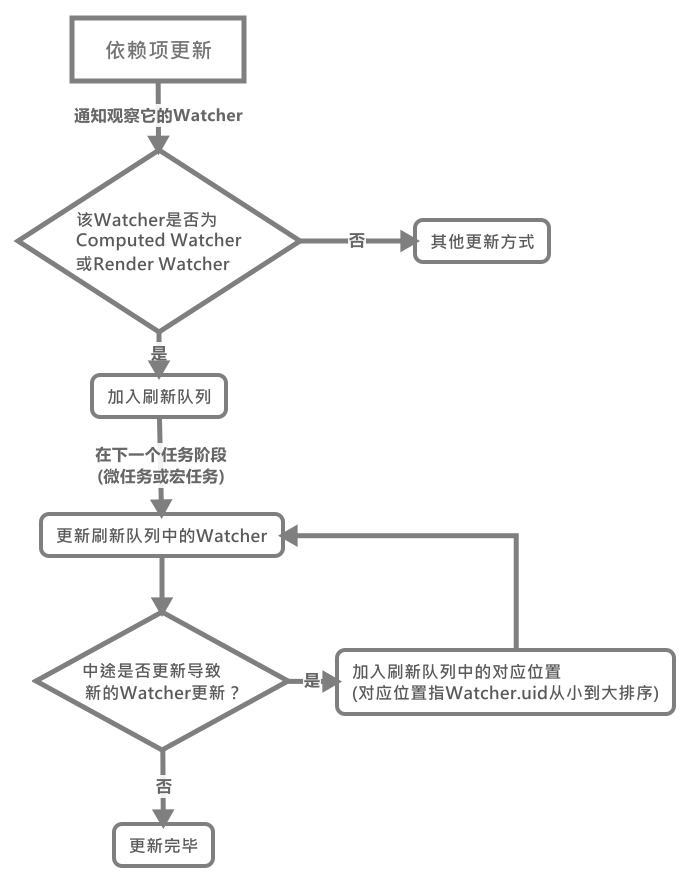
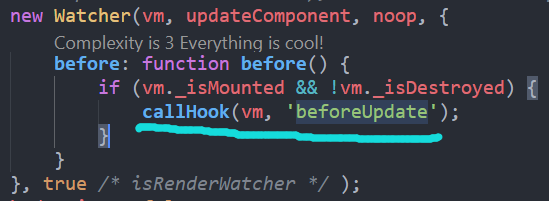

# Vue的Watcher更新机制(flushQueue刷新队列)

如果你对`class Watcher`有了解(或你是从我之前的响应式系统文章中看过来的)，那么你应该知道在`Render Watcher`和`Watch Watcher`更新时，它们会被加入一个刷新队列中去进行处理。这里我们将对这个队列进行系统的学习，这里我们先用一个流程图让大家了解下这个总体的流程：



那么我们现在按图上的流程一个一个来进行学习！(依然首先公布大纲)

## 依赖项触发更新

那么这一切都要从~~一只蝙蝠🦇~~一个[依赖项的更新](../Vue中的响应式系统/Dep依赖项/README.md#%e5%a6%82%e4%bd%95%e8%a7%a6%e5%8f%91%e4%be%9d%e8%b5%96%e6%9b%b4%e6%96%b0)(点击查看起因)说起。

那么从上面我们已经知道，调用了`queueWatch(watcher)`函数，在了解该函数前，我们先看一些有关的变量代表的含义：

```js
// 待更新的watcher队列，即刷新队列
const queue = [];

// 同一时间中，已加入过但未刷新的watcher的id hashmap
let has = {};

// 一个状态，表示当前是否已启动更新任务，
// 该变量会在本次刷新任务开始时变为true
// 该变量会在本次刷新队列更新完成后变为false
let waiting = false;

// 一个状态：表示当前刷新队列是否在进行更新watcher
let flushing = false;

// 当前刷新队列中进行刷新的watcher的下标
let index = 0;

// 一个watcher的最大更新次数限制
const MAX_UPDATE_COUNT = 100;

// 用于存储watcher更新次数的对象
let circular: {
    [key: number]: number
} = {};

// 解决渲染函数中元素复用时事件处理错误的问题(这里可以不用关心)
let currentFlushTimestamp = 0
```

### queueWatch()——加入刷新队列

按处于事件循环的时间不同，加入刷新队列有两种情况，那么按照先后顺序：

- [当前事件循环阶段(宏任务)加入](#%e5%bd%93%e5%89%8d%e4%ba%8b%e4%bb%b6%e5%be%aa%e7%8e%af%e9%98%b6%e6%ae%b5%e5%ae%8f%e4%bb%bb%e5%8a%a1%e5%8a%a0%e5%85%a5)

#### 当前事件循环阶段(宏任务)加入

在依赖项变更后具体到`watcher`的**更新前**这段时间，`Vue`通过该函数来将这些**将要更新的`watcher`放置到一个`queue`队列中**并按其`id`进行从小到大的排序按其生成顺序来进行更新。

>在这部分未涉及的地方，代码我直接删除了

```js
/**
 * Push a watcher into the watcher queue.
 * Jobs with duplicate IDs will be skipped unless it's
 * pushed when the queue is being flushed.
 * 将一个watcher实例推入这个观察者队列中。
 * 重复的watcher会跳过除非该watcher已经进行了处理
 */
function queueWatcher(watcher: Watcher) {
    const id = watcher.id;

    // 只存储一次，防止多次更新同一个依赖项而多次触发watcher更新
    if (has[id] == null) {
        has[id] = true;

        // 未对队列进行刷新时，直接将watcher加入队列中
        if (!flushing) {
            queue.push(watcher);
        }

        // queue the flush
        // 在下一次event loop时进行队列刷新
        if (!waiting) {
            waiting = true;

            if (process.env.NODE_ENV !== 'production' && !config.async) {
                flushSchedulerQueue()
                return
            }

            // 调用该函数进行队列刷新
            nextTick(flushSchedulerQueue);
        }
    }
}
```

在该函数的第一次执行时，还会调用一次`nextTick(flushSchedulerQueue)`函数，之后在本次刷新队列更新时，就不会再执行该函数了。

>上面的`nextTick(flushSchedulerQueue)`之所以在一开始就调用，是因为其模拟了异步任务(微任务或宏任务)，所以其传入的回调函数在当前`eventloop`的现阶段是不会调用的，这里我们就暂时不管它。

#### 下一个事件循环阶段(或微任务)加入

那么如果在刷新队列更新时如果有依赖项更新导致`watcher`的加入，那么此时的`queueWatch()`函数如下：

```js
function queueWatcher(watcher: Watcher) {
    const id = watcher.id;

    // 只存储一次，防止多次更新同一个依赖项而多次触发watcher更新
    if (has[id] == null) {
        has[id] = true;

        // 未对队列进行刷新时，直接将watcher加入队列中
        if (!flushing) {

            // if already flushing, splice the watcher based on its id
            // if already past its id, it will be run next immediately.
            // 如果已经处于更新时，有新的watcher加入，
            // 则将当前watcher加入到整个队列中，id按小到大排序的对应位置
            let i = queue.length - 1;
            while (i > index && queue[i].id > watcher.id) {
                i--;
            }
            queue.splice(i + 1, 0, watcher);
        }
    }
}
```

我们可以看到此时，新加入的`watcher`会被加入到当前剩余的未刷新队列的`watcher.id`从小到大的对应位置。因为此时刷新队列正在更新，所以等会就会进行更新。它会被添加到**还未更新的`watcher`中的对应的有序位置**，如我们此时有这样一个`watcher`队列(id表示):

```js
// 总队列为
const queue = [1, 3, 5, 6, 8, 9];

// 已更新的队列为
[1, 3];

// 剩余的队列为
[5, 6, 7, 8, 9];

// 此时
index = 2;
```

那么如果在更新5时，添加了一个`id`为2的`watcher`进来，那么此时：

```js
// 已更新的队列为
[1, 3];

// 剩余的队列为
[5, 2, 6, 7, 8, 9];

// 此时5未更新完，所以
index = 2;
```

### flushSchedulerQueue()——刷新队列的调度更新

待我们上面讲述讲述的`queueWatch()`第一个阶段的`watcher`全部添加后，就会通过之前调用`nextTick()`在下一轮微任务(或宏任务)时调用`flushSchedulerQueue()`函数，来更新队列中的`watcher`。

>关于[`nextTick()`](./Vue异步更新的模拟/README.MD)函数的了解请移步前往

那么在下一个事件循环阶段，就开始调用`flushSchedulerQueue()`更新`watcher`队列的，那么总结下它干了什么：

1. 排序`queue`中的`watcher`按`id`，保证组件**更新按父=>子的顺序**

2. 更新`queue`队列中的`watcher`，直到队列中最后一个：
   1. 仅`Render Watcher`更新时，先触发其`beforeUpdate`函数
   2. 调用`watcher.run()`对`watcher`重新求值与依赖项收集(如果这个过程中又有新的依赖项变动，则重复依赖更新加入刷新队列流程，不同的是`queueWatcher()`中分支进入的选择不同[参考上面的第二种加入方式](#%e4%b8%8b%e4%b8%80%e4%b8%aa%e4%ba%8b%e4%bb%b6%e5%be%aa%e7%8e%af%e9%98%b6%e6%ae%b5%e6%88%96%e5%be%ae%e4%bb%bb%e5%8a%a1%e5%8a%a0%e5%85%a5))
   3. 另外，如果同一个`watcher`在一次`eventloop`中更新次数过多，则可能存在无尽的循环，则在报错

3. 重置从`queueWatcher()`开始用到的一些全局状态变量。

```js
// 存储keep-alive中组件的watcher，需要额外帮它们触发钩子函数
const activatedChildren = [];

function flushSchedulerQueue() {

    // 获取当前更新的时间(该时间用于处理BUG)
    currentFlushTimestamp = getNow();

    // 更新刷新队列的状态为正在更新
    flushing = true;
    let watcher, id

    // Sort queue before flush.
    // This ensures that:
    // 1. Components are updated from parent to child. (because parent is always
    //    created before the child)
    // 组件按父——>子的顺序更新
    // 2. A component's user watchers are run before its render watcher (because
    //    user watchers are created before the render watcher)
    // 用户自定义的watch会在渲染watcher调用
    // 3. If a component is destroyed during a parent component's watcher run,
    //    its watchers can be skipped.
    // 当一个组件在其父级watcher运行时销毁了，那么直接跳过
    queue.sort((a, b) => a.id - b.id)

    // do not cache length because more watchers might be pushed
    // as we run existing watchers
    // 动态计算队列长度，因为可能会有新的watcher在更新时加入
    for (index = 0; index < queue.length; index++) {
        watcher = queue[index];

        // 触发渲染函数的beforeUpdate回调函数
        if (watcher.before) {
            watcher.before()
        }
        id = watcher.id;

        // 清楚状态，允许当前Watcher再次加入更新队列
        has[id] = null;

        // 更新watcher
        watcher.run();

        // in dev build, check and stop circular updates.
        // 一个组件过量的更新，发出可能存在无尽循环的警告
        if (process.env.NODE_ENV !== 'production' && has[id] != null) {
            circular[id] = (circular[id] || 0) + 1
            if (circular[id] > MAX_UPDATE_COUNT) {
                warn(
                    'You may have an infinite update loop ' + (
                        watcher.user ?
                        `in watcher with expression "${watcher.expression}"` :
                        `in a component render function.`
                    ),
                    watcher.vm
                )
                break
            }
        }
    }

    // keep copies of post queues before resetting state
    const activatedQueue = activatedChildren.slice()
    const updatedQueue = queue.slice()

    // 重置更新队列状态
    resetSchedulerState()

    // call component updated and activated hooks
    // 调用组件的updated和activated钩子函数
    callActivatedHooks(activatedQueue)
    callUpdatedHooks(updatedQueue)

    // devtool hook
    // 触发devtool的更新
    if (devtools && config.devtools) {
        devtools.emit('flush')
    }
}
```

这个函数有点长，但是比较简单，首先呢，对`queue`排序，然后依次(从父组件到子组件)更新`watcher`：

在更新`watcher`前，如果是渲染`Render Watcher`则会触发其组件的`beforeUpdate()`钩子函数：



之后通过[`watcher.run()`](../Vue中的响应式系统/Watcher监听者对象#watcherprototyperun%e9%87%8d%e6%96%b0%e6%94%b6%e9%9b%86%e4%be%9d%e8%b5%96%e9%a1%b9%e5%b9%b6%e8%a7%a6%e5%8f%91%e5%9b%9e%e8%b0%83/README.md)来对各个各种`watcher`进行更新处理。

待`queue`刷新队列中的全部`watcher`更新完毕后，依次调用`callActivatedHooks()`和`callUpdatedHooks()`函数触发它们的`activated()`与`updated()`钩子函数(注意可以看到是按**子组件到父组件**的顺序触发的)：

```js
function callUpdatedHooks(queue) {
    let i = queue.length

    // 可以看到是按照子——>父的顺序触发的
    while (i--) {
        const watcher = queue[i]
        const vm = watcher.vm;
        if (vm._watcher === watcher && vm._isMounted && !vm._isDestroyed) {
            callHook(vm, 'updated')
        }
    }
}
function callActivatedHooks(queue) {

    // 这里依然是父->子组件顺序
    for (let i = 0; i < queue.length; i++) {
        queue[i]._inactive = true
        activateChildComponent(queue[i], true /* true */ )
    }
}
```

最后通过`resetSchedulerState()`来重置更新调度刷新队列的状态, 具体状态的含义在上面有描述，这里就不标记注释了。

```js
function resetSchedulerState() {
    index = queue.length = activatedChildren.length = 0;
    has = {};
    if (process.env.NODE_ENV !== 'production') {
        circular = {};
    }
    waiting = flushing = false;
}
```

### beforeUpdate/activated与update构造函数调用的顺序

由上面的代码我们可以总结出：

- `beforeUpdate/activated`函数在组件中的调用顺序是由**父->子** 并是在渲染`watcher`更新前调用。
- `update`函数在组件中的调用顺序是由**子->父**的顺序调用，并是在所有的`watcher`更新完后调用。

```js
// 原因
let i = queue.length;
while (i--) {
    callHook('update');
}

for (index = 0; index < queue.length; index++) {
    callHook('beforeUpdate');
}
```
