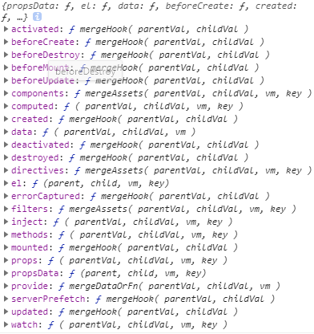

# 属性合并策略

Vue 针对不同的属性的合并的方式是不同的，一共分为以下 6 种：


这些策略在 Vue 构造函数初始化之前就开始初始化，它的位置处于 Vue 的`config.optionMergeStrategies`之中

```js
// 重写策略是用来合并父与子options来变为一个最终的配置, 初始为空对象
const strats = config.optionMergeStrategies;
```

目录：
  - [data & provide](./data策略)
  - [el & propsData](#el--propsdata)
  - [hook——生命周期钩子](#hook%e7%94%9f%e5%91%bd%e5%91%a8%e6%9c%9f%e9%92%a9%e5%ad%90)
  - [assets——资产类型策略](#assets%e8%b5%84%e4%ba%a7%e7%b1%bb%e5%9e%8b%e7%ad%96%e7%95%a5)
  - [watch——监听函数策略](#watch%e7%9b%91%e5%90%ac%e5%87%bd%e6%95%b0%e7%ad%96%e7%95%a5)
  - [props/methods/inject/computed——共同的策略](#propsmethodsinjectcomputed%e5%85%b1%e5%90%8c%e7%9a%84%e7%ad%96%e7%95%a5)

在没有策略时，会调用默认策略：

```js
// 默认策略, 返回两者中存在的一方，优先返回childVal
const defaultStrat = function (parentVal: any, childVal: any): any {
    return (childVal === undefined ?)
        parentVal :
        childVal;
}
```

## el & propsData

```js
/**
 * Options with restrictions
 * 限制el/propsData属性, 只能于实例化中使用, 实际使用默认策略
 */
if (process.env.NODE_ENV !== 'production') {
    strats.el = strats.propsData = function(parent, child, vm, key) {
        if (!vm) {
            warn(
                `option "${key}" can only be used during instance ` +
                    'creation with the `new` keyword.'
            );
        }
        return defaultStrat(parent, child);
    };
}
```

## hook——生命周期钩子

```js
const LIFECYCLE_HOOKS = [
    'beforeCreate',
    'created',
    'beforeMount',
    'mounted',
    'beforeUpdate',
    'updated',
    'beforeDestroy',
    'destroyed',
    'activated',
    'deactivated',
    'errorCaptured',
    'serverPrefetch'
];
LIFECYCLE_HOOKS.forEach(hook => {
    strats[hook] = mergeHook;
});

function mergeHook(
    parentVal: ?Array<Function>,
    childVal: ?Function | ?Array<Function>
): ?Array<Function> {
    /**
     * 三种情况：
     * 1. 不存在childVal时， 直接返回parentVal
     * 2. 两者都存在时，返回两者数组合并的结果
     * 3. 不存在parentVal时，将childVal处理后作为数组返回
     */
    const res = childVal
        ? parentVal
            ? parentVal.concat(childVal)
            : Array.isArray(childVal)
            ? childVal
            : [childVal]
        : parentVal;

    // res数组去重
    return res ? dedupeHooks(res) : res;
}

function dedupeHooks(hooks) {
    // 将hooks添加至res，不添加重复的
    const res = [];
    for (let i = 0; i < hooks.length; i++) {
        if (res.indexOf(hooks[i]) === -1) {
            res.push(hooks[i]);
        }
    }
    return res;
}
```

## assets——资产类型策略

```js
const ASSET_TYPES = ['component', 'directive', 'filter'];
ASSET_TYPES.forEach(function(type) {
    strats[type + 's'] = mergeAssets;
});

function mergeAssets(
    parentVal: ?Object,
    childVal: ?Object,
    vm?: Component,
    key: string
): Object {
    // 将parentVal作为原型对象，childVal作为实例属性返回
    const res = Object.create(parentVal || null);
    if (childVal) {
        process.env.NODE_ENV !== 'production' &&
            assertObjectType(key, childVal, vm);
        return extend(res, childVal);
    } else {
        return res;
    }
}
```

## watch——监听函数策略

```js
// Firefox has a "watch" function on Object.prototype...
const nativeWatch = {}.watch;

/**
 * Watchers.
 *
 * Watchers hashes should not overwrite one
 * another, so we merge them as arrays.
 * 两者不应该重写对方，所以将两者添加进数组
 */
strats.watch = function(
    parentVal: ?Object,
    childVal: ?Object,
    vm?: Component,
    key: string
): ?Object {
    // work around Firefox's Object.prototype.watch...
    if (parentVal === nativeWatch) parentVal = undefined;
    if (childVal === nativeWatch) childVal = undefined;

    if (!childVal) return Object.create(parentVal || null);
    if (process.env.NODE_ENV !== 'production') {
        assertObjectType(key, childVal, vm);
    }
    if (!parentVal) return childVal;
    const ret = {};

    // 两者都存在时, 向ret的每个属性格式化为数组并合并child和parent的属性
    extend(ret, parentVal);
    for (const key in childVal) {
        let parent = ret[key];
        const child = childVal[key];
        if (parent && !Array.isArray(parent)) {
            parent = [parent];
        }
        ret[key] = parent
            ? parent.concat(child)
            : Array.isArray(child)
            ? child
            : [child];
    }
    return ret;
};
```

## props/methods/inject/computed——共同的策略

这个策略其实和`assets`的策略类似，两者都存在时都是`parentVal`作为原型对象属性，`childVal`作为子属性。

```js
/**
 * Other object hashes.
 */
strats.props = strats.methods = strats.inject = strats.computed = function(
    parentVal: ?Object,
    childVal: ?Object,
    vm?: Component,
    key: string
): ?Object {
    if (childVal && process.env.NODE_ENV !== 'production') {
        assertObjectType(key, childVal, vm);
    }
    if (!parentVal) return childVal;
    const ret = Object.create(null);
    extend(ret, parentVal);
    if (childVal) extend(ret, childVal);
    return ret;
};
```
