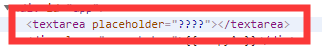
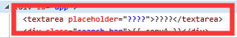

# parseHTML

咂一看这个函数，那是真的复杂，绝对看得你头昏烟瘴，先简单浏览一下这个函数的结构。

```js
function parseHTML(html, options) {
    const stack = [];
    const expectHTML = options.expectHTML;
    const isUnaryTag = options.isUnaryTag || no;
    const canBeLeftOpenTag = options.canBeLeftOpenTag || no;

    // 一个指针，表示当前解析到原始模版的具体位置
    let index = 0;

    // 解析前模版
    let last,

        // 表示栈中最后一个标签
        lastTag;
    while (html) {

        // 存储解析前的模版
        last = html;

        // Make sure we're not in a plaintext content element like script/style
        // 确保我们不在script/style元素中
        if (!lastTag || !isPlainTextElement(lastTag)) {
            let textEnd = html.indexOf('<');

            // 当前截取的模版起始为<(无空格换行符等等)
            // 第一个位置匹配到<无非是5种情况
            // 1. <div>头标签
            // 2. <!-->普通注释
            // 3. <![]>条件注释
            // 4. </div>闭合标签
            // 5. <doctype>文档类型定义
            if (textEnd === 0) {
                // Comment:
                if (comment.test(html)) {
                    const commentEnd = html.indexOf('-->');

                    // 是个注释结点嘚
                    if (commentEnd >= 0) {

                        // 如果设置要保存注释结点，那么将注释结点化为AST并挂载在当前父节点下（没有父节点就算了）
                        if (options.shouldKeepComment) {
                            options.comment(html.substring(4, commentEnd), index, index + commentEnd + 3)
                        }

                        advance(commentEnd + 3);
                        continue;
                    }
                }

                // http://en.wikipedia.org/wiki/Conditional_comment#Downlevel-revealed_conditional_comment
                // 如果当前为条件注释，则直接前进，不进行保存
                if (conditionalComment.test(html)) {
                    const conditionalEnd = html.indexOf(']>')

                    if (conditionalEnd >= 0) {
                        advance(conditionalEnd + 2)
                        continue
                    }
                }

                // Doctype:
                // 是否为doctype标签
                const doctypeMatch = html.match(doctype)
                if (doctypeMatch) {
                    advance(doctypeMatch[0].length)
                    continue
                }

                // End tag:
                // 是否为一个闭合标签, 如果是则截取模版，然后将
                const endTagMatch = html.match(endTag);
                if (endTagMatch) {
                    const curIndex = index;
                    advance(endTagMatch[0].length);
                    parseEndTag(endTagMatch[1], curIndex, index)
                    continue;
                }

                // Start tag:
                // 解析头标签，生成ast对象
                const startTagMatch = parseStartTag();

                if (startTagMatch) {

                    // 处理元素ast对象的各种属性
                    handleStartTag(startTagMatch);
                    if (shouldIgnoreFirstNewline(startTagMatch.tagName, html)) {
                        advance(1);
                    }
                    continue;
                }
            }

            // 当前模版前存在空格时
            let text, rest, next;
            if (textEnd >= 0) {
                rest = html.slice(textEnd);

                // 当不为标签，为文本时
                while (
                    !endTag.test(rest) &&
                    !startTagOpen.test(rest) &&
                    !comment.test(rest) &&
                    !conditionalComment.test(rest)
                ) {
                    // < in plain text, be forgiving and treat it as text
                    next = rest.indexOf('<', 1)
                    if (next < 0) break
                    textEnd += next;
                    rest = html.slice(textEnd);
                }
                text = html.substring(0, textEnd);
            }

            // 未找到 < 时，视为全部为文本
            if (textEnd < 0) {
                text = html
            }

            // 截取更新模版和指针
            if (text) {
                advance(text.length)
            }

            // 生成文本ast对象
            if (options.chars && text) {
                options.chars(text, index - text.length, index)
            }
        } else {
            let endTagLength = 0
            const stackedTag = lastTag.toLowerCase()
            const reStackedTag = reCache[stackedTag] || (reCache[stackedTag] = new RegExp('([\\s\\S]*?)(</' + stackedTag + '[^>]*>)', 'i'))
            const rest = html.replace(reStackedTag, function (all, text, endTag) {
                endTagLength = endTag.length
                if (!isPlainTextElement(stackedTag) && stackedTag !== 'noscript') {
                    text = text
                        .replace(/<!\--([\s\S]*?)-->/g, '$1') // #7298
                        .replace(/<!\[CDATA\[([\s\S]*?)]]>/g, '$1')
                }
                if (shouldIgnoreFirstNewline(stackedTag, text)) {
                    text = text.slice(1)
                }
                if (options.chars) {
                    options.chars(text)
                }
                return ''
            });
            index += html.length - rest.length;
            html = rest;

            // 解析并闭合当前标签。
            parseEndTag(stackedTag, index - endTagLength, index);
        }

        // 一次解析后模版未变，则视为之后所有的内容为文本
        if (html === last) {
            options.chars && options.chars(html)
            if (process.env.NODE_ENV !== 'production' && !stack.length && options.warn) {
                options.warn(`Mal-formatted tag at end of template: "${html}"`, {
                    start: index + html.length
                })
            }
            break;
        }
    }

    // Clean up any remaining tags
    parseEndTag()
}
```

一眼观察过来，整个解析字符串过程全是在`while`循环中完成的。

首先在`while`循环内部，大致按情况会进行两个操作

```js
const isPlainTextElement = makeMap('script,style,textarea', true);

// 简化的代码
while (html) {
    last = html;

    // 一般情况，只要是个非文本域类型的标签
    if (!lastTag || !isPlainTextElement(lastTag)) {
        // ...

    // 特殊标签的处理
    } else {
        // ...
    }

    // 处理完后模版字符串无变化的情况
    if (html === last) { /* ... */ }
}
```

接下来开始对第一种情况，进行深入了解，下面先看一下简化后的代码：

```js
// 情况一：找到第一个 < 的位置
let textEnd = html.indexOf('<');
if (textEnd === 0) { /**/ }

let text, rest, next;

// 情况二：截取<前文本内容
if (textEnd >= 0) { /**/ }

// 情况三：剩余全为文本
if (textEnd < 0) { /**/ }

// 存在文本内容，则生成文本的ast对象
if (text) { /**/ }
if (options.chars && text) { /**/ }
```

## 解析标签——当前模版首位为<

首先我们对`<`字符进行了一次查找，因为之前调用`parse()`传入模版时，对模版进行了`template.trim()`处理，所以第一次找到的位置一定是0。

当我们找到`<`字符时，无非就是有6种情况涉及该字符：

- `<div>`头标签
- `<!-->`普通注释
- `<![]>`条件注释
- `</div>`闭合标签
- `<doctype>`文档类型定义
- 普通的字符

但由于处于位置的问题，它第一次一定不是第6种情况。(因为我们最初取的是元素的`outerHTML`，而且第六种情况被归并到上面第二种情况中了)，首先看一个`advance()`方法，用于更新当前模版：

```js
// 截取剩下的模版字符串， 移动当前指针的下标
function advance(n) {

    // 移动当前模版起始指针位置
    index += n;

    // 截取剩下未解析的模版
    html = html.substring(n);
}
```

具体看下源码怎么进行处理的：

```js
// 普通注释
const comment = /^<!\--/;

// 条件注释
const conditionalComment = /^<!\[/;

// 匹配文档类型定义
const doctype = /^<!DOCTYPE [^>]+>/i;

if (textEnd === 0) {

    // Comment: 处理普通注释，满足注释节点开头的匹配 <--
    if (comment.test(html)) {

        // 注释结束的地方
        const commentEnd = html.indexOf('-->');

        // 有注释的闭合存在，没有可能就是普通的内容信息了
        if (commentEnd >= 0) {

            // 如果设置要在渲染后保存注释结点信息，那就生成一个AST节点并挂载在当前父节点的子节点数组中(没有父节点则不做处理)
            if (options.shouldKeepComment) {

                // 传入的参数为具体的注释段，与注释在模版中的位置信息
                options.comment(html.substring(4, commentEnd), index, index + commentEnd + 3)
            }

            //  更新模版，进行下一次检测
            advance(commentEnd + 3);
            continue;
        }
    }

    // http://en.wikipedia.org/wiki/Conditional_comment#Downlevel-revealed_conditional_comment
    // 如果当前为条件注释，则直接跳过，然后更新模版
    if (conditionalComment.test(html)) {
        const conditionalEnd = html.indexOf(']>');

        if (conditionalEnd >= 0) {
            advance(conditionalEnd + 2);
            continue;
        }
    }

    // Doctype:
    // 为文档类型定义内容时，也是直接跳过，不做任何处理
    const doctypeMatch = html.match(doctype);
    if (doctypeMatch) {
        advance(doctypeMatch[0].length)
        continue
    }

    // End tag:
    // 当为一个标签的结束标签时
    const endTagMatch = html.match(endTag);
    if (endTagMatch) {

        // 记录当前在原始模版中的位置
        const curIndex = index;

        // 更新模版和指针
        advance(endTagMatch[0].length);
        parseEndTag(endTagMatch[1], curIndex, index);
        continue;
    }

    // Start tag:
    // 解析头标签的标签和其上属性，生成未处理的ast对象
    const startTagMatch = parseStartTag();

    if (startTagMatch) {

        // 处理元素ast对象的各种属性
        handleStartTag(startTagMatch);
        if (shouldIgnoreFirstNewline(startTagMatch.tagName, html)) {
            advance(1);
        }
        continue;
    }
}
```

下面我们将具体多这几种情况进行研究：

- [解析头标签](#%e8%a7%a3%e6%9e%90%e5%a4%b4%e6%a0%87%e7%ad%be)
- [解析尾标签](#%e8%a7%a3%e6%9e%90%e5%b0%be%e6%a0%87%e7%ad%be)
- [解析注释标签](#%e8%a7%a3%e6%9e%90%e6%b3%a8%e9%87%8a%e6%a0%87%e7%ad%be)
- [解析文档类型标签](#%e8%a7%a3%e6%9e%90%e6%96%87%e6%a1%a3%e7%b1%bb%e5%9e%8b%e6%a0%87%e7%ad%be)

### 解析头标签

篇幅过多，单独写一篇来处理[前往](./处理头标签/README.md)

### 解析尾标签

篇幅过多，单独写一篇来处理[前往](./处理尾标签/README.md)

### 解析注释标签

很轻松的，我们可以看出，就是根据用户配置来决定是否保存注释，如果保存就将当前注释调用`options.comment()`方法创建个AST对象挂载到当前父元素的子数组中；而对于条件注释，简直无情，直接忽略。

上面使用到的`options.comment()`方法是用来处理注释节点的，生成一个注释节点的AST对象：

```js
comment(text: string, start, end) {
    // adding anyting as a sibling to the root node is forbidden
    // comments should still be allowed, but ignored
    // 有父节点，就挂载在父节点的子数组中，标记该注释节点在原始模版中的位置信息
    if (currentParent) {
        const child: ASTText = {
            type: 3,
            text,
            isComment: true
        }

        // 开发模式下记录位置信息
        if (process.env.NODE_ENV !== 'production' && options.outputSourceRange) {
            child.start = start
            child.end = end
        }

        currentParent.children.push(child);
    }
}
```

### 解析文档类型标签

对于文档注释标签，Vue也选择忽略的方式，不进行处理。

## 解析文本——当前<不在首位

你现在应该知道，每解析一段模版，就会去掉解析过的该段字符串，然后取剩下的模版，所以当现在这个模版的下一个`<`出现在大于0的位置时，那么它位置之前的肯定为文本。(**这里经常出现一个情况就是，我们的标签换行那一段空白**)

那么它之后的是否为文本呢，请先自己看看代码理解下：

```js
// 模版第一位为<或<前存在其他字符
if (textEnd >= 0) {

    // 取首个<后的模版(即已经截取了确认为文本的部分)
    rest = html.slice(textEnd);

    // 从当前<开始不能组成一个标签时，取下一个<直至解析到标签或头标签前部分
    // 简单说就是取到下一个疑是标签的<为止
    while (
        !endTag.test(rest) &&

        // 这里匹配开标签前部分
        !startTagOpen.test(rest) &&
        !comment.test(rest) &&
        !conditionalComment.test(rest)
    ) {
        // < in plain text, be forgiving and treat it as text
        // 说明当前<是字符串，那么再取下一个<的位置
        next = rest.indexOf('<', 1);

        // 说明没有标签了，剩下全为文本
        if (next < 0) break;

        // 将下个< 之前的文本追加上去
        textEnd += next;

        // 继续截取模版，取最新<后的模版
        rest = html.slice(textEnd);
    }

    // 截取模版开始到下一个<之间的文本
    text = html.substring(0, textEnd);
}
```

从代码我们可以看出`Vue`首先用`rest`保留了当前模版最新的`<`之后的文本(即已经截去了**确认为文本**部分)，然后通过一个`while`循环来查看下一个`<`是否**疑是**一个标签：如果疑是，则更新`rest`为最新这个`<`之后的模版内容，并更新`textEnd`的值；如果不是则什么都不做。最后更新**确认的文本**内容至`text`。

之后便是我们熟悉的更新模版和指针，创建文本的`ast`对象环节：

```js
if (text) {
    // 存在文本时，更新模版
    advance(text.length);
}

// 创建文本的ast对象
if (options.chars && text) {
    options.chars(text, index - text.length, index);
}
```

### options.chars()——解析文本

该方法用于解析文本来生成一个文本`ast`对象，具体代码如下：

```js
function isTextTag(el) {
    return el.tag === 'script' || el.tag === 'style';
}

// 用于解除转义的函数，大家不妨自己动手试试，自己在html中写个<，然后从innerHTML与innerText看取出来的是什么
var he = {
    decode: function decode(html) {
        decoder = decoder || document.createElement('div');
        decoder.innerHTML = html;
        return decoder.textContent;
    }
};

chars(text: string, start: number, end: number) {

    // 没有父元素时，报错
    if (!currentParent) {
        if (process.env.NODE_ENV !== 'production') {

            // 是否模版为纯文本
            if (text === template) {
                warnOnce(
                    'Component template requires a root element, rather than just text.', {
                        start
                    }
                )

            // 将文本写在根元素外
            } else if ((text = text.trim())) {
                warnOnce(
                    `text "${text}" outside root element will be ignored.`, {
                        start
                    }
                )
            }
        }
        return
    }

    // IE textarea placeholder bug
    // 处理IE textarea placeholder 的bug
    // IE中的placeholder中内容会出现在元素中
    if (isIE &&
        currentParent.tag === 'textarea' &&
        currentParent.attrsMap.placeholder === text
    ) {
        return;
    }
    const children = currentParent.children;

    // 如果目前为pre元素的内容或非空文本
    if (inPre || text.trim()) {

        // 根据父元素是否为style或script标签，决定是否要解除文本的转义
        text = isTextTag(currentParent) ? text : decodeHTMLCached(text)

    // 子节点数组只存在一个空文本节点，则移除空文本（实际浏览器并不会移除）
    } else if (!children.length) {
        // remove the whitespace-only node right after an opening tag
        text = ''

    // 默认为undefined
    } else if (whitespaceOption) {

        // 压缩模式下，如果该空格字符串包含换行符，则清空为空字符串，否则转换为单独的空格字符串
        if (whitespaceOption === 'condense') {
            // in condense mode, remove the whitespace node if it contains
            // line break, otherwise condense to a single space
            text = lineBreakRE.test(text) ? '' : ' '
        } else {
            text = ' '
        }

    // 其余多个空格一路替换为一个空格
    } else {

        // 默认为true
        text = preserveWhitespace ? ' ' : ''
    }

    // 如果还存在文本
    if (text) {

        // 在非pre元素外的其他文本，在压缩模式下，文本中空格最大长度不超过1
        if (!inPre && whitespaceOption === 'condense') {
            // condense consecutive whitespaces into single space
            text = text.replace(whitespaceRE, ' ')
        }
        let res
        let child: ? ASTNode

        // 非v-pre且非空元素，解析字符串表达式后，生成属性节点ast对象，则里会解析是否为Vue语法，是的化则为属性节点
        if (!inVPre && text !== ' ' && (res = parseText(text, delimiters))) {

            // 属性节点，DOM4级中已废弃
            child = {
                type: 2,
                expression: res.expression,
                tokens: res.tokens,
                text
            }

        // 文本不为空或父节点只存在这一个文本子节点或子节点最后一个不为空格节点
        } else if (text !== ' ' || !children.length || children[children.length - 1].text !== ' ') {

            // 文本节点
            child = {
                type: 3,
                text
            }
        }

        // 将该ast对象加入父级的子节点数组
        if (child) {
            if (process.env.NODE_ENV !== 'production' && options.outputSourceRange) {
                child.start = start
                child.end = end
            }
            children.push(child);
        }
    }
}
```

咋一看解析一个文本居然这么复杂，里面首先处理了`IE`浏览器`textarea`元素在设置`placeholder`时的`bug`，如图：

正常的`textarea`：

`IE`下的`textarea`：


之后对文本的内容进行了处理，一般的非空格文本，都会保留下来；而对于只存在一个空文本子节点的元素，其中的空格会被全部清空；其他情况下默认会将多个空格合并为一个空格；最后通过文本中是否包含`Vue`的插值表达式来决定生成何种节点：

- 有：生成元素的属性节点
- 无：生成普通的文本节点

值得注意的是这里有个`decodeHTMLCached()`函数，用`dom`来进行转义和反转义，这里总结下：

1. `dom`中通过`innerHTML`或`outerHTML`取出的字符串中字符是转义的
2. `dom`中通过`innerText`或`textContent`取出的字符串中字符是未转义的

[parseText()过程](../一群工具方法/解析属性/README.md#parsetext%e8%a7%a3%e6%9e%90%e6%96%87%e6%9c%ac)

## 解析文本——当前未找到<

这个很好理解，如果未找到该符号，说明剩下的模版全为文本字符串

```js
// 未找到 < 时，视为全部为文本
if (textEnd < 0) {
    text = html;
}
```

这个时候肯定有人会问了，假如有一种这个情况的模版字符串该怎么解析`<div> <asd<asd < sd </div>`，这种特殊情况[等会](#%e8%a7%a3%e6%9e%90%e5%90%8e%e7%9a%84%e6%a3%80%e6%9f%a5)会解释到。

___

现在来看一下第二种情况，即对`textarea`、`style`、`script`三个元素的处理

## 单独解析的特殊元素

目前我知道的三个特殊情况的标签为上面三个，`Vue`会单独对其进行处理，直接截取其中间的文本生成`ast`对象，然后调用[`parseEndTag()`](../一群工具方法/解析属性/README.md#parseendtag%e9%97%ad%e5%90%88%e8%af%a5%e6%a0%87%e7%ad%be%e4%b8%8e%e4%b9%8b%e5%86%85%e7%9a%84%e6%89%80%e6%9c%89%e6%a0%87%e7%ad%be)将其闭合。

## 解析后的检查

每次`Vue`解析完一轮后，就会对解析前模版和解析后模版进行对比，如果一样说明Vue解析失败了，那么会直接将剩余的模版全部视为字符串调用[`options.chars()`](#optionschars%e8%a7%a3%e6%9e%90%e6%96%87%e6%9c%ac)进行解析，这也是我们刚刚说的特殊情况的解析结果。

最后的最后，再次调用[`parseEndTag()`](../一群工具方法/解析属性/README.md#parseendtag%e9%97%ad%e5%90%88%e8%af%a5%e6%a0%87%e7%ad%be%e4%b8%8e%e4%b9%8b%e5%86%85%e7%9a%84%e6%89%80%e6%9c%89%e6%a0%87%e7%ad%be)将`stack`中的剩余标签全部丢弃，这样模版就解析完成了。

## 总结

现在来战术总结下，`Vue`模版解析为`token`的过程：

1. 每次解析会按以下顺序搜寻：
   1. `<!-->`普通注释
   2. `<![]>`条件注释
   3. `<doctype>`文档类型定义
   4. `</div>`闭合标签
   5. `<div>`头标签
   6. 文本
   7. 无法解析时，剩下的所有模版当作文本解析
2. 每次解析到一个头标签，在解析完它的部分属性后，会将其存入一个栈中，待模版解析到对应的闭合标签时，会将对应的闭合标签从栈中删除，然后解析完剩下的属性。
3. 每次解析`1`中某个部分时，都会去掉模版中该部分，取剩下的部分作为新的模版进行下一次解析。
4. 每次解析的结果为一个`AST`对象，上面有具体解析的属性。
5. 最后返回模版解析的根节点
