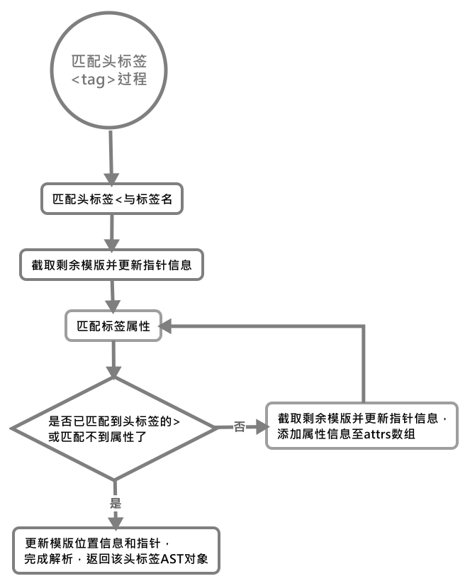
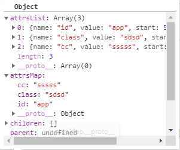
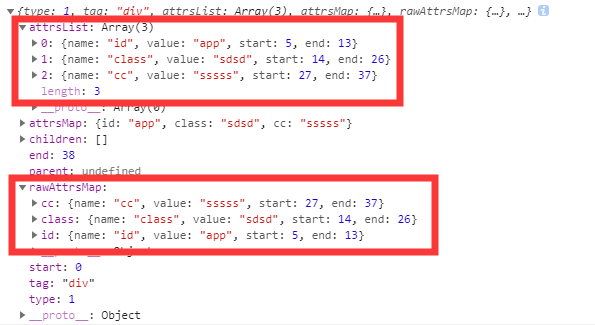

# 处理头标签
我们知道当匹配到`<`时，有一种情况就是头标签，此时就会对头标签进行处理，具体的处理过程我们来详细看一下：

```js
// 解析头标签的标签和其上属性，生成未处理的原始匹配对象
const startTagMatch = parseStartTag();

if (startTagMatch) {

    // 处理元素对象的各种属性
    handleStartTag(startTagMatch);
    if (shouldIgnoreFirstNewline(startTagMatch.tagName, html)) {
        advance(1);
    }
    continue;
}
```

我们先从`parseStartTag()`函数看起

## parseStartTag()——简单解释头标签信息

这个函数用来为标签头部生成原始的匹配对象信息，会记录标签在原模版的位置信息和标签属性的具体信息。

下面是具体匹配标签的正则表达式，了解下就行了

```js
// 匹配以字母或_开头的字符串，unicodeRegExp是匹配任何字符的一个Regexp
const ncname = `[a-zA-Z_][\\-\\.0-9_a-zA-Z${unicodeRegExp.source}]*`;

// 匹配 xxx:xxx 或 xxx
const qnameCapture = `((?:${ncname}\\:)?${ncname})`;

// 以头标签<tagName开头的
const startTagOpen = new RegExp(`^<${qnameCapture}`);

// 头标签闭合部分(只匹配以>或 >开头的, 注意这里有空格)
const startTagClose = /^\s*(\/?)>/;

// Regular Expressions for parsing tags and attributes
// 匹配用户定义的属性，匹配时还会匹配上一个属性到现在这个属性之间的空格
const attribute = /^\s*([^\s"'<>\/=]+)(?:\s*(=)\s*(?:"([^"]*)"+|'([^']*)'+|([^\s"'=<>`]+)))?/;
const dynamicArgAttribute = /^\s*((?:v-[\w-]+:|@|:|#)\[[^=]+\][^\s"'<>\/=]*)(?:\s*(=)\s*(?:"([^"]*)"+|'([^']*)'+|([^\s"'=<>`]+)))?/;
```

下面是具体的解析过程，会从模版当前头开始匹配，先匹配前括号加标签名，之后便是一个属性一个匹配，每次匹配后都会截取模版与指针，直到匹配到头标签的后尖括号：

```js
function parseStartTag() {

    // 匹配头标签信息，这里只包括 <tagName 这部分
    const start = html.match(startTagOpen);

    // 如果匹配到了头标签
    if (start) {

        // 为匹配的标签名创建一个匹配对象
        const match = {
            tagName: start[1],
            attrs: [],
            start: index
        };

        // 截取剩下的模版，并移动当前指针
        advance(start[0].length);

        // 匹配标签上的属性
        // 一次循环提取一个标签的属性，并移动指针，直到当前指针指向标签的>
        let end,  // 头标签的尾号，只匹配以>或 >开头(前面有个空格)
            attr; // 当前匹配到的属性，一次匹配一个
        while (!(end = html.match(startTagClose)) && (attr = html.matc(dynamicArgAttribute) || html.match(attribute))) {

            // 此时匹配的start包括属性上的空格
            attr.start = index;

            // 每匹配到一个属性便截取次模版并更新当前的指针，然后更新该属性在原始模版中的位置信息
            advance(attr[0].length);
            attr.end = index;

            // 将当前属性的匹配完成后，将其信息数组放入匹配对象的attrs数组中
            match.attrs.push(attr);
        }

        // 匹配到头标签的>时，这个标签的属性信息就解析完成了，更新下该标签在原始模版中位置信息，并截取模版
        if (end) {

            // 头标签最后的/，自闭和标签就有，比如input元素
            match.unarySlash = end[1];
            advance(end[0].length);
            match.end = index;
            return match;
        }
    }
}
```

匹配完后，返回当前原始的匹配对象，整个流程图大致如下：


接下来如果顺利匹配获取了匹配对象，那么就会调用`handleStartTag()`对标签的位置信息进行处理。

## handleStartTag()——处理标签DOM位置信息、属性信息

该方法首先用来处理了头标签的一些特殊的情况，如`<p>`标签不能包含块级元素，自闭合标签不能嵌套自身等问题，之后便根据匹配对象上原始的属性数组简单处理下便挂载在新的标签对象中，根据标签具体的位置和自身情况（是否为一元标签），将标签的信息所代表的对象加入到了栈中，之后对标签上的属性全部进行处理。

>加入栈中这个情况很好理解，因为如果你不是一元标签，那么说明当前标签还处于开起状态，待里面内容处理完成后才能对其进行闭合。

具体的代码如下：

```js
    function handleStartTag(match) {

        // 标签名
        const tagName = match.tagName;

        // 是否为一元标签
        const unarySlash = match.unarySlash;

        // 处理两种特殊情况
        if (expectHTML) {

            // 如果上一个未闭合的元素是p时，则其中不能包含块级元素，要手动闭合p元素
            if (lastTag === 'p' && isNonPhrasingTag(tagName)) {
                parseEndTag(lastTag);
            }

            // 如果上一个未闭合的元素和现在的标签是同一标签，且为自闭和标签，那么要闭合当前标签
            if (canBeLeftOpenTag(tagName) && lastTag === tagName) {
                parseEndTag(tagName);
            }
        }

        // 是否为一元标签，头标签自带/ 或符合以下的原生标签
        const unary = isUnaryTag(tagName) || !!unarySlash;

        // 将attrs中的各个属性进一步转换为对象形式，然后用新数组承载
        const l = match.attrs.length;
        const attrs = new Array(l);
        for (let i = 0; i < l; i++) {
            const args = match.attrs[i];
            const value = args[3] || args[4] || args[5] || '';

            // 是否需要解码换行符(兼容浏览器)
            const shouldDecodeNewlines = tagName === 'a' && args[1] === 'href' ?
                options.shouldDecodeNewlinesForHref :
                options.shouldDecodeNewlines;

            // 对应模版中属性的位置
            attrs[i] = {
                name: args[1],
                value: decodeAttr(value, shouldDecodeNewlines)
            };

            // 开发模式下记录属性的在原始模版中的具体位置信息
            if (process.env.NODE_ENV !== 'production' && options.outputSourceRange) {

                // 因为之前匹配的属性条时，可能前面包含空格，所以要加上空格的长度
                attrs[i].start = args.start + args[0].match(/^\s*/).length;
                attrs[i].end = args.end;
            }
        }

        // 非一元标签时，说明其为一个前面打开的标签，后面还需一个闭合标签，所以将其存入栈中暂存
        if (!unary) {
            stack.push({
                tag: tagName,
                lowerCasedTag: tagName.toLowerCase(),
                attrs: attrs,
                start: match.start,
                end: match.end
            });

            // 此时更新当前标签为上一个处理的标签
            lastTag = tagName;
        }

        if (options.start) {
            options.start(tagName, attrs, unary, match.start, match.end)
        }
    }
```

上述处理过程中，我们**并未对标签的匹配对象进行修改**，而是对原属性数组进行处理后，生成新的`attrs`数组来存放这份信息，该信息被挂载在`stack`数组中代表当前头标签的对象中。

其实上面的文字描述过程中，我还没有具体提到`options.start()`，因为比较复杂，我们现在来看一下，它开始正式对对象的属性进行处理：
(先初略看一下，下面我会根据代码一个一个解释)

```js
start(tag, attrs, unary, start, end) {

    // check namespace.
    // inherit parent ns if there is one
    // 检查是否有命名空间，有就继承父级的命名空间
    const ns = (currentParent && currentParent.ns) || platformGetTagNamespace(tag)

    // handle IE svg bug
    // 处理IE浏览器svg的bug
    if (isIE && ns === 'svg') {
        attrs = guardIESVGBug(attrs)
    }

    // 创建元素的AST对象
    let element: ASTElement = createASTElement(tag, attrs, currentParent);

    // 有命名空间就挂载该属性
    if (ns) {
        element.ns = ns
    }


    if (process.env.NODE_ENV !== 'production') {
        if (options.outputSourceRange) {

            // 添加该元素在原始模版中的位置信息
            element.start = start;
            element.end = end;

            // 将原始匹配对象由数组形式转换为对象形式
            element.rawAttrsMap = element.attrsList.reduce((cumulated, attr) => {
                cumulated[attr.name] = attr;
                return cumulated;
            }, {});
        }

        // 检测属性名中是否含有非法符号
        attrs.forEach(attr => {
            if (invalidAttributeRE.test(attr.name)) {
                warn(
                    `Invalid dynamic argument expression: attribute names cannot contain ` +
                    `spaces, quotes, <, >, / or =.`, {
                        start: attr.start + attr.name.indexOf(`[`),
                        end: attr.start + attr.name.length
                    }
                )
            }
        });
    }

    // 使用了禁止的标签时报错(script或style)
    if (isForbiddenTag(element) && !isServerRendering()) {
        element.forbidden = true
        process.env.NODE_ENV !== 'production' && warn(
            'Templates should only be responsible for mapping the state to the ' +
            'UI. Avoid placing tags with side-effects in your templates, such as ' +
            `<${tag}>` + ', as they will not be parsed.', {
                start: element.start
            }
        )
    }

    // apply pre-transforms
    // 如果是input标签且定义有v-model属性时，才会对其进行一次预处理
    for (let i = 0; i < preTransforms.length; i++) {
        element = preTransforms[i](element, options) || element;
    }

    // 默认标签不做v-pre处理
    if (!inVPre) {

        // 移除AST attr中v-pre属性，并给元素添加pre属性作为标记
        processPre(element);

        // 检测元素是否具有标记
        if (element.pre) {
            inVPre = true;
        }
    }

    // 该元素是否为pre元素
    if (platformIsPreTag(element.tag)) {
        inPre = true;
    }

    // 如果具有v-pre属性，则直接将属性配置到attrs属性中
    if (inVPre) {
        processRawAttrs(element);

    // 如果元素还未完全处理完毕时
    } else if (!element.processed) {
        // structural directives

        // 处理v-for属性
        processFor(element);

        // 处理v-if v-else v-else-if属性
        processIf(element);

        // 处理v-once属性
        processOnce(element);
    }

    // 如果还未确定根元素时，使当前元素为根元素
    if (!root) {
        root = element;

        // 检查根节点是否可能不为一个元素
        if (process.env.NODE_ENV !== 'production') {
            checkRootConstraints(root);
        }
    }

    // 如果不是一元元素，那么替换父元素为当前元素，并推入栈中等待闭合
    if (!unary) {
        currentParent = element;
        stack.push(element);
    } else {

        // 为一元元素时，直接闭合
        closeElement(element);
    }
},
```

首先我们可以看到该函数处理下标签命名空间兼容性问题后，便通过`createASTElement()`方法生成了代表元素的AST对象，传入的参数`attrs`是我们在[`handleStartTag()`](#handlestarttag%e5%a4%84%e7%90%86%e6%a0%87%e7%ad%bedom%e4%bd%8d%e7%bd%ae%e4%bf%a1%e6%81%af%e5%b1%9e%e6%80%a7%e4%bf%a1%e6%81%af)时，生成的新的属性数组。

生成的AST对象的`attrsMap`属性，即，将`attrs`由数组形式转化为对应属性名键值形式，放个图大家感受下：



下面是代码：

```js
function createASTElement(
    tag: string,

    // 新的简单处理的属性数组
    attrs: Array < ASTAttr > ,
    parent: ASTElement | void
): ASTElement {
    return {
        type: 1,
        tag,

        // 原始匹配对象上简单处理后的属性数组
        attrsList: attrs,

        // 将属性按键值形式添加至对象中
        attrsMap: makeAttrsMap(attrs),
        rawAttrsMap: {},
        parent,
        children: []
    }
}

function makeAttrsMap(attrs: Array < Object > ): Object {
    const map = {};

    // 将属性按键值形式添加至对象中
    for (let i = 0, l = attrs.length; i < l; i++) {

        // 属性重复时，提示用户(对这种情况就是你写在模版里面时会出现)，此时新值会覆盖旧值
        if (
            process.env.NODE_ENV !== 'production' &&
            map[attrs[i].name] && !isIE && !isEdge
        ) {
            warn('duplicate attribute: ' + attrs[i].name, attrs[i])
        }
        map[attrs[i].name] = attrs[i].value
    }
    return map;
}
```

之后便是对AST元素对象的位置信息进行补充，然后又对AST对象上的`rawAttrsMap`属性进行更新，这个属性其实就是`attrs`数组转换为对象的形式：属性名做键名，之前的数组元素做值，还是放张图：


之后便是调用`preTransforms`数组中的方法，对ast元素对象上一些属性进行预处理；`preTransforms`数组中仅存在一个方法即`preTransformNode()`，该方法只是针对`<input>`元素来做单独的处理的。

能被做处理的`input`元素还应该满足两个条件：

1. 具有`v-model`属性
2. 动态定义了`type`属性

具体[preTransformNode()](../../一群工具方法/README.md#pretransformnode%e5%a4%84%e7%90%86%e5%8f%8c%e5%90%91%e7%bb%91%e5%ae%9a%e7%9a%84input%e5%85%83%e7%b4%a0)