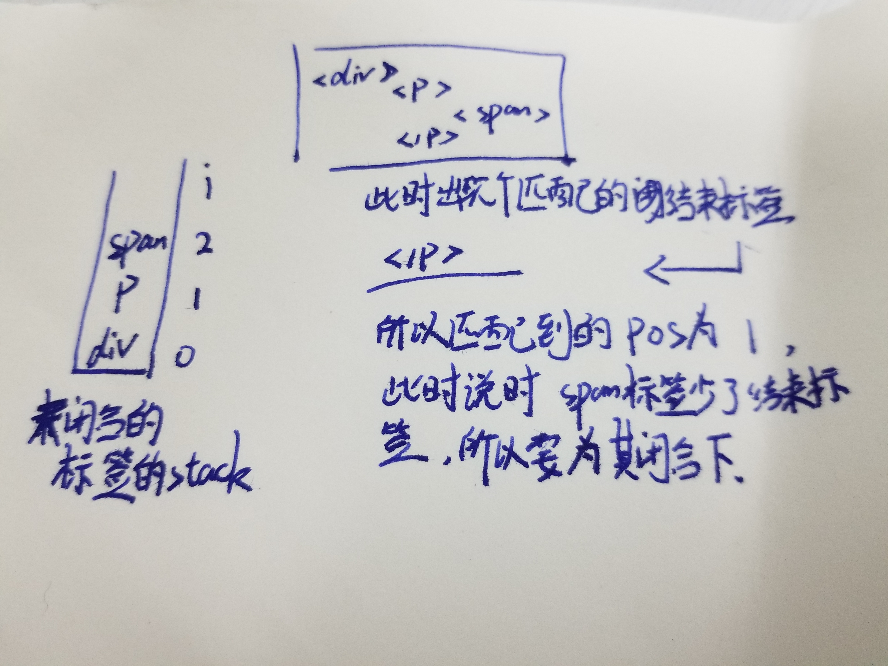

# 处理尾标签

现在我们可以来了解一下是怎么处理尾标签的了：

```js
// End tag:
// 当为一个标签的结束标签时
const endTagMatch = html.match(endTag);
if (endTagMatch) {

    // 记录尾标签开始位置
    const curIndex = index;

    // 更新模版和指针
    advance(endTagMatch[0].length);

    // index-curIndex就为尾标签长度
    parseEndTag(endTagMatch[1], curIndex, index);
    continue;
}
```

从上面可以知道，获取到匹配标签后，直接调用`advance()`方法，截取模版去掉了尾标签所在部分，并更新了指针，这一部分没什么好说的，具体看下怎么解析结束标签的：

## parseEndTag()——闭合该标签与之内的所有标签

该函数用于来处理尾标签，它将闭合该标签以及其内的所有标签，代码如下：

```js
function parseEndTag(tagName, start, end) {
    let pos, lowerCasedTagName;

    // 未传入结束位置时，手动获取下
    if (start == null) start = index;
    if (end == null) end = index

    // Find the closest opened tag of the same type
    // 找到最近的同类型且未闭合的标签，未找到则pos为-1
    if (tagName) {
        lowerCasedTagName = tagName.toLowerCase();

        // 取出存放入栈中的未闭合标签，一个个匹配
        for (pos = stack.length - 1; pos >= 0; pos--) {

            // 匹配标签名时，赶紧退出，保留pos信息
            if (stack[pos].lowerCasedTag === lowerCasedTagName) {
                break;
            }
        }
    } else {
        // If no tag name is provided, clean shop
        // 未提供标签名时，清空栈中所有标签
        pos = 0;
    }

    // 通过上面，我们可以知道未匹配到对应标签时，pos的值为-1
    // 此时找到对应标签的情况时
    if (pos >= 0) {

        // Close all the open elements, up the stack
        // 闭合所有匹配位置后的开启的标签
        for (let i = stack.length - 1; i >= pos; i--) {
            if (process.env.NODE_ENV !== 'production' &&

                // 正常情况下，结束标签应该匹配栈中最后个开启的标签，不然就说明中间有无闭合标签的标签
                (i > pos || !tagName) &&
                options.warn
            ) {
                options.warn(
                    `tag <${stack[i].tag}> has no matching end tag.`, {
                        start: stack[i].start,
                        end: stack[i].end
                    }
                )
            }

            // 手动帮你闭合所有应该闭合的标签，参数为在原始模版中的位置
            if (options.end) {
                options.end(stack[i].tag, start, end);
            }
        }

        // Remove the open elements from the stack
        // 移除上面for循环中已闭合的标签
        stack.length = pos;
        lastTag = pos && stack[pos - 1].tag;

    // 全部栈中都未匹配到头标签时，两种情况，自闭和标签或br标签
    } else if (lowerCasedTagName === 'br') {
        if (options.start) {

            // 生成个新的br标签对象
            options.start(tagName, [], true, start, end)
        }
    } else if (lowerCasedTagName === 'p') {
        if (options.start) {

            // 生成个新的p标签ast对象
            options.start(tagName, [], false, start, end)
        }
        if (options.end) {
            options.end(tagName, start, end)
        }
    }
}
```

还记得`stack`用来做什么吗，它用来存放那些还未闭合的头部标签，它是一个**栈**；一个开标签应该对应一个闭标签，每当有一个开标签时，我们会将它暂时存入栈底，待遇到其闭合标签时，再将其取出；所以正常情况下，如果我们遇到一个闭合标签，那么栈口一定是它的头标签，基于这个原理，于是就有了下面这个代码：

```js
lowerCasedTagName = tagName.toLowerCase();

// 取出存放入栈中的未闭合标签，一个个匹配
for (pos = stack.length - 1; pos >= 0; pos--) {

    // 匹配标签名时，赶紧退出，保留pos信息
    if (stack[pos].lowerCasedTag === lowerCasedTagName) {
        break;
    }
}
```

一次循环下来，如果有和闭合标签同名的头标签，则说明匹配成功，此时的`pos`正是头标签在`stack`栈中的位置。

### 存在闭合标签

那么找到后，就会从栈口开始闭合到`pos`位置的所有标签，为什么呢？因为正常情况，`pos`就应该为栈口位置，但如果不是，那么就说明中间有没有闭合标签的头标签存在，所以都要进行闭合，下面提供图片：


闭合完毕后，便更新一下栈。

### 不存在闭合标签

并非所有的标签都有闭合标签，未找到时，这里有两种特殊的情况：

- 自闭和标签`p`
- 换行标签`br`

#### p标签的情况

是什么情况能单独留一个`</p>`标签呢，也有两种情况：

- 有意为之，用户自己写的
- `</p>`标签嵌套自己

因为之前说过，`</p>`标签为自闭和标签，不能嵌套自己及块级元素，像这种情况就会被当成3个`</p>`解析

```html
<p>
    <p></p>
</p>
<!-- 等价于 -->
<p></p>
    <p></p>
<p></p>
```

### 传入无标签名标签

目的就是为了清空`stack`(`parseHTML`)，一般会在模版解析完后清洗一次。
___

所有的情况最后，都是调用`options.end()`来进行标签的闭合，现在我们就来看看！

## options.end()——闭合元素

闭合当前标签，并处理其剩余的属性。

```js
end(tag, start, end) {

    // 下面这两步操作统称pop()
    // 该元素头标签的ast对象
    const element = stack[stack.length - 1];
    // pop stack
    stack.length -= 1;

    // 确定父元素
    currentParent = stack[stack.length - 1];
    if (process.env.NODE_ENV !== 'production' && options.outputSourceRange) {
        element.end = end
    }
    closeElement(element);
}
```

首先这里每闭合一个元素，都会将栈中的对应头标签删除，然后调用[`closeElement()`](../处理头标签/README.md#closeelementelement%e9%97%ad%e5%90%88%e5%85%83%e7%b4%a0)处理元素剩余的属性并建立和父元素的关系，元素的闭合就完成了。

但是我们刚刚在[外层函数](#parseendtag%e9%97%ad%e5%90%88%e8%af%a5%e6%a0%87%e7%ad%be%e4%b8%8e%e4%b9%8b%e5%86%85%e7%9a%84%e6%89%80%e6%9c%89%e6%a0%87%e7%ad%be)可以看见在闭合完标签后，又清空了一次`stack`，其实在编译中有两个`stack`，分别在[`parseHTML()`](../README.md)与[`parse()`](../../README.md)函数中，这里可以把前者中的`stack`理解为后者的复制版本，只用于之后闭合标签时的查找；而大多数处理是后者的`stack`。