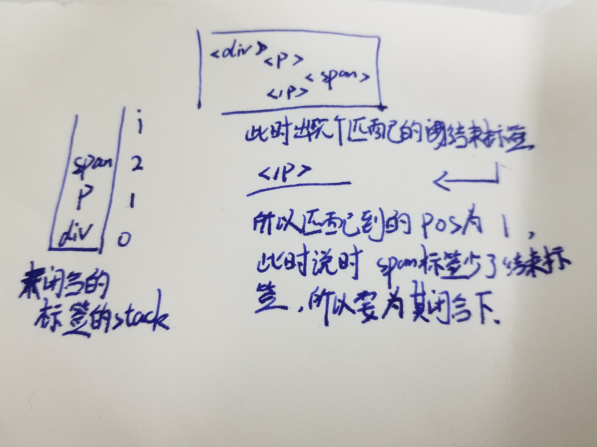

# parse——解析函数

目录：

- [parseFilters()——解析过滤器](#parsefilters%e8%a7%a3%e6%9e%90%e8%bf%87%e6%bb%a4%e5%99%a8)
- [parseText()——解析过滤器](#parsetext%e8%a7%a3%e6%9e%90%e6%96%87%e6%9c%ac)
- [parseStyleText()——解析静态style字符串](#parsestyletext%e8%a7%a3%e6%9e%90%e9%9d%99%e6%80%81style%e5%ad%97%e7%ac%a6%e4%b8%b2)
- [parseModifiers()——解析.修饰符](#parsemodifiers%e8%a7%a3%e6%9e%90%e4%bf%ae%e9%a5%b0%e7%ac%a6)
- [parseFor()——解析v-for](#parsefor%e8%a7%a3%e6%9e%90v-for)
- [parseModel()——解析对象](#parsemodel%e8%a7%a3%e6%9e%90%e5%af%b9%e8%b1%a1)
- [parseString()——是否为引号](#parsestring%e6%98%af%e5%90%a6%e4%b8%ba%e5%bc%95%e5%8f%b7)
- [parseEndTag()——闭合该标签与之内的所有标签](#parseendtag%e9%97%ad%e5%90%88%e8%af%a5%e6%a0%87%e7%ad%be%e4%b8%8e%e4%b9%8b%e5%86%85%e7%9a%84%e6%89%80%e6%9c%89%e6%a0%87%e7%ad%be)

## parseFilters()——解析过滤器

该函数用于解析模版字符串中的过滤器表达式，还是遵循从左到右对字符串进行解析，在解析的过程中，会匹配符号，但凡符号不能成对匹配，就会出错，当然这只是初步匹配，如果你要专空子，那也是可以匹配成功的；具体匹配如下：

```js
const validDivisionCharRE = /[\w).+\-_$\]]/;

function parseFilters(exp: string): string {

    // 是否在单引号中
    let inSingle = false;

    // 是否在双引号中
    let inDouble = false;

    // 模版字符串
    let inTemplateString = false;

    // 正则表达式
    let inRegex = false;

    // 特殊括号的栈
    let curly = 0;
    let square = 0;
    let paren = 0;

    // 上一个管道符的后一个字符的位置
    let lastFilterIndex = 0;
    let c, prev, i, expression, filters;

    for (i = 0; i < exp.length; i++) {

        // 上一个字符的ascii🐎
        prev = c;

        // 当前字符的ascii🐎
        c = exp.charCodeAt(i);

        // 留个问题，这里为什么要用十六进制
        // 为什么有些JS和CSS里面的中文字符要转成十六进制的？

        if (inSingle) {

            // c为 , prev 不为 \
            if (c === 0x27 && prev !== 0x5C) inSingle = false;
        } else if (inDouble) {

            // c 为 " ,prev 不为 \
            if (c === 0x22 && prev !== 0x5C) inDouble = false;
        } else if (inTemplateString) {

            // c 为 `,prev不为\
            if (c === 0x60 && prev !== 0x5C) inTemplateString = false;
        } else if (inRegex) {

            // c 为 / ,prev不为\
            if (c === 0x2f && prev !== 0x5C) inRegex = false;
        } else if (

            // c为 |(管道符), 而c前后的字符不为管道符，且无任何括号符号时
            c === 0x7C && // pipe
            exp.charCodeAt(i + 1) !== 0x7C &&
            exp.charCodeAt(i - 1) !== 0x7C &&
            !curly && !square && !paren
        ) {
            // 第一次遇到|时，创建新的管道符表达式
            if (expression === undefined) {

                // first filter, end of expression
                // 最后一个管道符号的位置的后一个符号
                lastFilterIndex = i + 1;

                // 截取管道符左侧的表达式
                expression = exp.slice(0, i).trim()
            } else {

                // 已存在时, 更新lastFilterIndex，然后将新的表达式加入队列中
                pushFilter()
            }
        } else {

            // 处理其他情况
            switch (c) {
                case 0x22:
                    inDouble = true;
                    break // "
                case 0x27:
                    inSingle = true;
                    break // '
                case 0x60:
                    inTemplateString = true;
                    break // `
                case 0x28:
                    paren++;
                    break // (
                case 0x29:
                    paren--;
                    break // )
                case 0x5B:
                    square++;
                    break // [
                case 0x5D:
                    square--;
                    break // ]
                case 0x7B:
                    curly++;
                    break // {
                case 0x7D:
                    curly--;
                    break // }
            }

            if (c === 0x2f) { // /
                let j = i - 1;
                let p;

                // find first non-whitespace prev char
                // 找到前面第一个非空格字符
                for (; j >= 0; j--) {
                    p = exp.charAt(j);
                    if (p !== ' ') break
                }

                // 未找到p或不匹配任何字符符号时
                if (!p || !validDivisionCharRE.test(p)) {

                    // 正则表达式
                    inRegex = true;
                }
            }
        }
    }

    // 未有表达式时，则整个字符串就是表达式
    if (expression === undefined) {
        expression = exp.slice(0, i).trim();

    // 之前有表达式，所以最后还要截取下最后的表达式
    } else if (lastFilterIndex !== 0) {
        pushFilter()
    }

    function pushFilter() {

        // 取当上一个管道符到现在管道符直接的表达式
        (filters || (filters = [])).push(exp.slice(lastFilterIndex, i).trim());
        lastFilterIndex = i + 1;
    }

    // 多个表达式时，逐个包装表达式
    if (filters) {
        for (i = 0; i < filters.length; i++) {
            expression = wrapFilter(expression, filters[i])
        }
    }

    // 最后结果为 _fn("fnName")(arguments)
    return expression;
}

function wrapFilter(exp: string, filter: string): string {
    const i = filter.indexOf('(');

    // 存入表达式不存在()时，直接包装返回
    if (i < 0) {
        // _f: resolveFilter
        return `_f("${filter}")(${exp})`

    // 存入表达式存在()，即也是个函数调用时
    } else {

        // 函数名
        const name = filter.slice(0, i);

        // 函数有参数时，为 arg) 没有时就为 )
        const args = filter.slice(i + 1);

        // 将exp作为参数拼接在后面
        return `_f("${name}")(${exp}${args !== ')' ? ',' + args : args}`
    }
}
```

从上面我们可以看出匹配时，对于括号会进行计数，唯有前后括号抵消后，才能算一个匹配合格的匹配项；如果没有`|`符号在表达式中，那么只会算一个表达式；如果出现`|`符号，那么每个`|`符号左右都会为一个匹配项，但凡出现`|`符号，就会用`_f()`函数进行包装。

举个例子：
```js
// 转换前                        转换后
'acscsa'                =>          'absdsad'

// 转换前                              转换后
'a|fn1(arg1)|b|fn2(arg2)'  =>     '_f("fn2")(arg2)'
```

由之前的代码可以知道，`expression`为`a`，然后按`filters`数组顺序`[fn1(arg1), b, fn2(arg2)]`处理分别为`_f("fn1")(a,arg1)` => `_f("b")(_f("fn1")(a,arg1))` => `_f("fn2")(_f("b")(_f("fn1")(a,arg1)),arg2)`。

## parseText()——解析文本

该函数用于将一串包含插值表达式的字符串解析为一个词元对象(`tokens`)

>首先它使用正则表达式从字符串的头开始匹配，分别使用两个指针，一个表示当前匹配到的插值表达式的起始位置(`index`)，另一个表示上一次匹配到的插值表达式的位置(`lastIndex`)。

每次匹配到插值表达式时，会截取匹配到的值，然后更新`lastIndex`；如果在一次匹配中 `index > lastIndex` 就说明在这两个匹配项之间还存在普通的字符串，就先截取这些普通的字符串在存放现在这个匹配项的值；在匹配结束后，如果`index`与`lastIndex`不等，则又说明最后次匹配后，后面存在普通的字符串，还要做一次截取操作。

```js
// 默认插值表达式为{{}}
const defaultTagRE = /\{\{((?:.|\r?\n)+?)\}\}/g;
const regexEscapeRE = /[-.*+?^${}()|[\]\/\\]/g;

const buildRegex = cached(delimiters => {

    // $&表示与正则表达式相匹配的子串
    // 所以这里的意思就是给我们自定义的符号加上\转移符
    const open = delimiters[0].replace(regexEscapeRE, '\\$&')
    const close = delimiters[1].replace(regexEscapeRE, '\\$&')
    return new RegExp(open + '((?:.|\\n)+?)' + close, 'g')
});

function parseText(
    text: string,
    delimiters ? : [string, string]
): TextParseResult | void {

    // 根据用户是否自定义插入符来获取插值表达式的正则表达式
    const tagRE = delimiters ? buildRegex(delimiters) : defaultTagRE;

    // 没有关于插值表达式的内容，则不用解析直接返回
    if (!tagRE.test(text)) {
        return
    }
    const tokens = [];
    const rawTokens = [];

    // 上次匹配到的位置
    let lastIndex = tagRE.lastIndex = 0;
    let match, index, tokenValue;
    while ((match = tagRE.exec(text))) {

        // 当前匹配的插值表达式的起始位置
        index = match.index;

        /**
         * push text token
         * 如果当前下标大于上个匹配位下标， 说明中间有字符不匹配， 是普通的字符串，
         * 那么将这些字符串加入tokens中
         */
        if (index > lastIndex) {
            rawTokens.push(tokenValue = text.slice(lastIndex, index))
            tokens.push(JSON.stringify(tokenValue))
        }

        // tag token
        // 解析插值括号中的字符串表达式，存放至token中
        const exp = parseFilters(match[1].trim());
        tokens.push(`_s(${exp})`);
        rawTokens.push({
            '@binding': exp
        });

        // 跟随正则表达式，更新lastIndex位置为当前匹配到的字符串的之后的位置
        lastIndex = index + match[0].length
    }

    // 如果匹配结束后，上次匹配到的地方不是字符串最后，
    // 则说明后面还有一部分是普通的字符串，那么要将它们存入tokens中
    if (lastIndex < text.length) {
        rawTokens.push(tokenValue = text.slice(lastIndex))
        tokens.push(JSON.stringify(tokenValue))
    }

    // 返回解析结果
    return {
        expression: tokens.join('+'),
        tokens: rawTokens
    }
}
```

## parseStyleText()——解析静态style字符串

该函数将静态内联`style`字符串解析为对象键值对形式

```js
const parseStyleText = cached(function (cssText) {
    const res = {};

    // 匹配;但后面最近的地方不能单独出现未闭合的)，举个例子;())匹配成功，但;)不行
    // 不匹配 ; xxx) ，但匹配; (xxxxxx)
    const listDelimiter = /;(?![^(]*\))/g;

    // 匹配属性值  即 : xxx ，$1 中存放匹配到的属性值
    const propertyDelimiter = /:(.+)/;
    cssText.split(listDelimiter).forEach(function (item) {
        if (item) {
            const tmp = item.split(propertyDelimiter)

            // 按键值方式存放至res对象中
            tmp.length > 1 && (res[tmp[0].trim()] = tmp[1].trim());
        }
    })
    return res;
});
```

## parseModifiers()——解析.修饰符

该函数用于来解析模版字符串中的`.`修饰符，会返回一个对象，对象中有这些修饰符作为字段。

```js
// 解析标识符
function parseModifiers(name: string): Object | void {

    // 匹配修饰符
    const match = name.match(modifierRE);
    if (match) {

        // 将修饰符提取为对象属性
        const ret = {};
        match.forEach(m => {
            ret[m.slice(1)] = true;
        });

        // 返回该修饰符对象
        return ret;
    }
}
```

## parseFor()——解析v-for

该函数用于解析`v-for`语法中，返回一个关于该语法中的变量对象。

```js
function parseFor(exp: string): ? ForParseResult {

    // 以下会以一个例子举例解释，当然最好的方式还是自己debugger
    // 匹配 v-for中的两个别名  如   (val, index) in values
    const inMatch = exp.match(forAliasRE);
    if (!inMatch) return;
    const res = {};

    // 匹配数据来源   匹配values
    res.for = inMatch[2].trim();

    // 匹配用户定义的单个值  匹配 val,index
    const alias = inMatch[1].trim().replace(stripParensRE, '');

    // 匹配 ,index
    const iteratorMatch = alias.match(forIteratorRE);
    if (iteratorMatch) {

        // 匹配第一个值 val
        res.alias = alias.replace(forIteratorRE, '').trim();

        // 匹配第二个值 index
        res.iterator1 = iteratorMatch[1].trim();

        // 如果还有第三个值是，存放第三个值
        if (iteratorMatch[2]) {
            res.iterator2 = iteratorMatch[2].trim()
        }

    // 仅一个值情况，即 val in values  这种情况
    } else {
        res.alias = alias;
    }
    return res;
}
```

## parseModel()——解析对象

该函数用于解析双向绑定语法绑定的值，支持.和[]运算符，该函数用于将对象属性查找语法解析为一个路径和最后一个键名的形式，举个例子：

```js
test[a][b]   =>  {
    exp: test[a],
    key: "b"
}

test[a[b]]   =>  {
    exp: test,
    key: "a[b]"
}

test[a].b    => {
    exp: test[a],
    key: ""b""
}

// 没有这种语法，但是解析完是这样的
test.[sada]   => {
    exp: test,
    key: "[sada]"
}
```

```js
let len, str,

// 当前解析到的字符
chr,

// 当前指针所在位置，表示解析到字符的位置
index,

// 当前匹配的前括号[位置(这个位置只会在完成配对后，下一次再遇到[时更新)
expressionPos,

// 当前于[括号匹配的]的位置
expressionEndPos;

// 解析下一个字符串的下一个字符，并更新指针
function next(): number {
    return str.charCodeAt(++index)
}

// 是否解析完毕
function eof(): boolean {
    return index >= len
}

function parseModel(val: string): ModelParseResult {

    // Fix https://github.com/vuejs/vue/pull/7730
    // allow v-model="obj.val " (trailing whitespace)
    // 处理上面那个bug，防止用户脑子发热添加空格
    val = val.trim();

    // 解析的字符串表达式长度
    len = val.length;

    // 不存在[]，或存在[]之后还存在其他字符时
    if (val.indexOf('[') < 0 || val.lastIndexOf(']') < len - 1) {
        index = val.lastIndexOf('.');

        // ]存在且存在.操作符时，提取.后面的键值为key
        if (index > -1) {
            return {
                exp: val.slice(0, index),
                key: '"' + val.slice(index + 1) + '"'
            }
        } else {

            // 不存在任何操作符时
            return {
                exp: val,
                key: null
            }
        }
    }

    // 以[]结尾的字符串表达式
    str = val;
    index = expressionPos = expressionEndPos = 0

    while (!eof()) {

        // 下一个字符
        chr = next();

        // 如果当前字符为单引号或双引号，解析到下一个同样引号为止
        if (isStringStart(chr)) {
            parseString(chr);

        // 当前为[时，解析到与当前[配对的]位置
        } else if (chr === 0x5B) {
            parseBracket(chr)
        }
    }

    return {

        // []前的字符串表达式
        exp: val.slice(0, expressionPos),

        // []内的字符串表达式
        key: val.slice(expressionPos + 1, expressionEndPos)
    }
}
```

说一下大致的流程吧：

1. 首先对字符串前后的空格进行简单的处理
2. 然后查看字符串是否以`[]`结尾
   1. 如果是，则提取与结尾处`]`匹配的`[`中间的内容作为`key`值，之前的内容作为`exp`。
   2. 不是，则查看是否有.操作符
      1. 有，则取.操作符后的表达式作为`key`值，之前的作为`exp`
      2. 没有，`key`值为空，取整个表达式作为`exp`

总结一下就是三点：

1. 无操符则`key`为`null`
2. 有操作符时，取最后一个完整的操作符里的内容作为`key`值

## parseString()——是否为引号

该函数用于判断当前字符是否为引号：

```js
function parseString(chr: number): void {
    const stringQuote = chr;

    // 因为当前为引号，所以一直解析到另一个同样的引号未知
    while (!eof()) {
        chr = next();
        if (chr === stringQuote) {
            break
        }
    }
}
```

## parseEndTag()——闭合该标签与之内的所有标签

该函数用于来处理尾标签，它将闭合该标签以及其内的所有标签，代码如下：

```js
function parseEndTag(tagName, start, end) {
    let pos, lowerCasedTagName;

    // 未传入结束位置时，手动获取下
    if (start == null) start = index;
    if (end == null) end = index

    // Find the closest opened tag of the same type
    // 找到最近的同类型且未闭合的标签，未找到则pos为-1
    if (tagName) {
        lowerCasedTagName = tagName.toLowerCase();

        // 取出存放入栈中的未闭合标签，一个个匹配
        for (pos = stack.length - 1; pos >= 0; pos--) {

            // 匹配标签名时，赶紧退出，保留pos信息
            if (stack[pos].lowerCasedTag === lowerCasedTagName) {
                break;
            }
        }
    } else {
        // If no tag name is provided, clean shop
        // 未提供标签名时，清空栈中所有标签
        pos = 0;
    }

    // 通过上面，我们可以知道未匹配到对应标签时，pos的值为-1
    // 此时找到对应标签的情况时
    if (pos >= 0) {

        // Close all the open elements, up the stack
        // 闭合所有匹配位置后的开启的标签
        for (let i = stack.length - 1; i >= pos; i--) {
            if (process.env.NODE_ENV !== 'production' &&

                // 正常情况下，结束标签应该匹配栈中最后个开启的标签，不然就说明中间有无闭合标签的标签
                (i > pos || !tagName) &&
                options.warn
            ) {
                options.warn(
                    `tag <${stack[i].tag}> has no matching end tag.`, {
                        start: stack[i].start,
                        end: stack[i].end
                    }
                )
            }

            // 手动帮你闭合所有应该闭合的标签，参数为在原始模版中的位置
            if (options.end) {
                options.end(stack[i].tag, start, end);
            }
        }

        // Remove the open elements from the stack
        // 移除上面for循环中已闭合的标签
        stack.length = pos;
        lastTag = pos && stack[pos - 1].tag;

    // 全部栈中都未匹配到头标签时，两种情况，自闭和标签或br标签
    } else if (lowerCasedTagName === 'br') {
        if (options.start) {

            // 生成个新的br标签对象
            options.start(tagName, [], true, start, end)
        }
    } else if (lowerCasedTagName === 'p') {
        if (options.start) {

            // 生成个新的p标签ast对象
            options.start(tagName, [], false, start, end)
        }
        if (options.end) {
            options.end(tagName, start, end)
        }
    }
}
```

还记得`stack`用来做什么吗，它用来存放那些还未闭合的头部标签，它是一个**栈**；一个开标签应该对应一个闭标签，每当有一个开标签时，我们会将它暂时存入栈底，待遇到其闭合标签时，再将其取出；所以正常情况下，如果我们遇到一个闭合标签，那么栈口一定是它的头标签，基于这个原理，于是就有了下面这个代码：

```js
lowerCasedTagName = tagName.toLowerCase();

// 取出存放入栈中的未闭合标签，一个个匹配
for (pos = stack.length - 1; pos >= 0; pos--) {

    // 匹配标签名时，赶紧退出，保留pos信息
    if (stack[pos].lowerCasedTag === lowerCasedTagName) {
        break;
    }
}
```

一次循环下来，如果有和闭合标签同名的头标签，则说明匹配成功，此时的`pos`正是头标签在`stack`栈中的位置。

### 存在闭合标签

那么找到后，就会从栈口开始闭合到`pos`位置的所有标签，为什么呢？因为正常情况，`pos`就应该为栈口位置，但如果不是，那么就说明中间有没有闭合标签的头标签存在，所以都要进行闭合，下面提供图片：


闭合完毕后，便更新一下栈。

### 不存在闭合标签

并非所有的标签都有闭合标签，未找到时，这里有两种特殊的情况：

- 自闭和标签`p`
- 换行标签`br`

#### p标签的情况

是什么情况能单独留一个`</p>`标签呢，也有两种情况：

- 有意为之，用户自己写的
- `</p>`标签嵌套自己

因为之前说过，`</p>`标签为自闭和标签，不能嵌套自己及块级元素，像这种情况就会被当成3个`</p>`解析

```html
<p>
    <p></p>
</p>
<!-- 等价于 -->
<p></p>
    <p></p>
<p></p>
```

### 传入无标签名标签

目的就是为了清空`stack`(`parseHTML`)，一般会在模版解析完后清洗一次。
___

所有的情况最后，都是调用[`options.end()`](./../../parseHTML/处理尾标签/README.md#optionsend%e9%97%ad%e5%90%88%e5%85%83%e7%b4%a0)来进行标签的闭合，现在我们就来看看！
