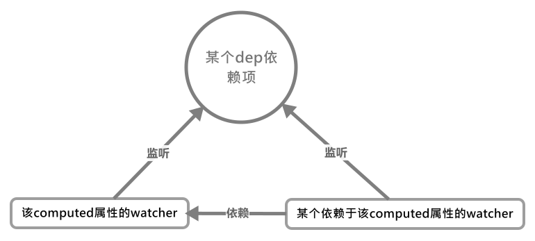

# initComputed()——初始化计算属性

初始化`Computed`属性分为两个阶段：

1. 生成该类型的`Watcher`(观察者对象，但未进行求值与依赖收集)
2. 将该`computed`属性代理到值`vm`实例上

大体的代码如下，里面有注释：

```js
// 计算属性固有配置属性
const computedWatcherOptions = { lazy: true };

function initComputed(vm: Component, computed: Object) {

    // 在当前vm上挂载computed的Watcher
    const watchers = (vm._computedWatchers = Object.create(null));

    // computed properties are just getters during SSR
    // (忽视)计算属性仅作为getter在服务器渲染下
    const isSSR = isServerRendering();

    for (const key in computed) {
        const userDef = computed[key];

        // 取值函数getter
        const getter = typeof userDef === 'function' ? userDef : userDef.get;
        if (process.env.NODE_ENV !== 'production' && getter == null) {
            warn(`Getter is missing for computed property "${key}".`, vm);
        }

        if (!isSSR) {

            // create internal watcher for the computed property.
            // 为计算属性创建一个watcher，用于依赖项与响应式处理
            watchers[key] = new Watcher(
                vm,
                getter || noop,
                noop,
                computedWatcherOptions
            );
        }

        // component-defined computed properties are already defined on the
        // component prototype. We only need to define computed properties defined
        // at instantiation here.
        // 注册computed属性, 这里注意如果与method同名时，根本不会挂载在computed属性在Vue实例上
        if (!(key in vm)) {
            defineComputed(vm, key, userDef);
        } else if (process.env.NODE_ENV !== 'production') {
            if (key in vm.$data) {
                warn(
                    `The computed property "${key}" is already defined in data.`,
                    vm
                );
            } else if (vm.$options.props && key in vm.$options.props) {
                warn(
                    `The computed property "${key}" is already defined as a prop.`,
                    vm
                );
            }
        }
    }
}
```

在上面具体的代码中，这里我们只关注两个点：

- `Watcher`的创建
- `computed`属性的代理

## Watcher的创建

这里`Watcher`的创建暂时不进行介绍，待`initState()`学习完会单独学习所有`Watcher-Dep-Observer`系统。

## computed属性的代理

`computed`属性的代理是通过`defineComputed()`函数来实现的，该函数直接将`vm._computedWatchers`里的`computed`观察者(`Watcher`)直接代理到当前`vm`实例上，所以我们可以直接访问`vm.xx`来访问`xx`这个计算属性。

先了解下这个函数的大致构造：

```js
const sharedPropertyDefinition = {
    enumerable: true,
    configurable: true,
    get: noop,
    set: noop
};

function defineComputed(
    target: any,
    key: string,
    userDef: Object | Function
) {

    // 是否应该缓存，仅在非服务器渲染下缓存
    const shouldCache = !isServerRendering();

    // 根据computed定义的类型来获取对应的getter
    if (typeof userDef === 'function') {
        sharedPropertyDefinition.get = shouldCache ?
            createComputedGetter(key) :

            // 服务器渲染getter(其实就是直接的函数求值)
            createGetterInvoker(userDef)
        sharedPropertyDefinition.set = noop
    } else {

        // 这里同上就不重复了
        sharedPropertyDefinition.get = userDef.get ?
            shouldCache && userDef.cache !== false ?
            createComputedGetter(key) :
            createGetterInvoker(userDef.get) :
            noop
        sharedPropertyDefinition.set = userDef.set || noop
    }

    // 未定义computed属性的setter时，为其定义一个报错setter，
    // 当执行赋值行为时就报错
    if (process.env.NODE_ENV !== 'production' &&
        sharedPropertyDefinition.set === noop) {
        sharedPropertyDefinition.set = function () {
            warn(
                `Computed property "${key}" was assigned to but it has no setter.`,
                this
            )
        }
    }

    // 在target(这里其实就是vm实例)上定义该computed属性的getter(访问器)
    Object.defineProperty(target, key, sharedPropertyDefinition)
}
```

对于非服务器渲染和服务器渲染，计算属性的处理方式是不同的，结合上面的代码，我们可以看到在服务器渲染时，`computed`属性其实是和`data`一样，不会进行缓存，对于**服务器SSR渲染**，访问器`getter`，是`createGetterInvoker()`函数：

```js
function createGetterInvoker(fn) {

    // 封装了原函数，直接的函数求值
    return function computedGetter() {
        return fn.call(this, this)
    }
}
```

可以看出是简单的函数求值，那么**浏览器渲染**是怎样的呢？**浏览器渲染**使用的`createComputedGetter()`函数，该函数实际是返回代表`computed`属性的这个`Watcher`的返回值：

> 在计算属性的`Watcher`中，有一个`dirty`属性用于控制是否允许计算该`computed`属性`getter`的值

```js
function createComputedGetter(key) {
    return function computedGetter() {

        // 取出对应computed属性的watcher对象
        const watcher = this._computedWatchers && this._computedWatchers[key]
        if (watcher) {

            // 第一次或当computed所需的依赖项更新时，重新对computed属性进行求值
            // (这里可以理解为computed收集它所需的dep依赖项)
            if (watcher.dirty) {
                watcher.evaluate();
            }

            // 将计算属性的所依赖的依赖项项添加到所需要这个计算属性的watcher中去
            // (这里可以理解为其他watcher收集computed所依赖的依赖项作为依赖项, 因为我们可以看出来计算属性没有单独的dep依赖项)
            if (Dep.target) {
                watcher.depend();
            }

            // computed属性的缓存值，存储在其Watcher.value中
            return watcher.value;
        }
    }
}
```

## 触发一个computed属性

当我们对一个`computed`属性进行求值时，首先会触发它的`computedGetter()`函数(就在上方)，然后分为以下步骤得出其值：

1. 找到该`computed`属性对应的`watcher`实例
2. `computed`是否有更新？
   1. 有：重新求值，并重新收集依赖项
   2. 无：直接返回旧值

### 何时与怎么进行computed属性更新？

当我们第一次或`computed`的依赖项更新后对`computed`属性进行求值时，就会经历`computedGetter()`函数。而是否能对其进行求值还是取决于其`watcher.dirty`属性的值，该值只会在第一次或计算属性依赖项更新后才会变化为`true`。

>这里只解释依赖项更新时的流程：其按以下步骤

1. 某个所依赖的值发生变化，触发其`dep.notify()`
2. 通过`dep.notify()`通知对应的`watcher`触发`watcher.update()`
3. 在`update()`方法中，`computed`走第一条路线，改变其`watcher.dirty`的值为`true`，其含义为**允许**`computed`重新进行求值和依赖项收集。

```js
Watcher.prototype.update() {
        if (this.lazy) {

        // 会触发这里
        this.dirty = true
    } else ...

    // 后面就略了
}
```

4. 因为`computed`属性所依赖的依赖项是直接和使用`computed`属性的`watcher`挂钩的，所以其依赖项更新时还会触发依赖`computed`属性的值的`watcher`进行更新。在此更新[过程](../../Vue中的响应式属性/Dep依赖项#如何触发依赖更新)中，会重新对`computed`的值进行计算即调用它的`getter`函数——`computedGetter()`
   >这里可能描述得不清晰，用图片描述下：
   
5. 此时再触发`watcher.evaluate()`, 调用[watcher.get()](../../Vue中的响应式属性/Watcher监听者对象#Watcher.prototype.get())函数进行求值和依赖项收集，然后关闭求值的权限

```js
evaluate() {
    // 对computed函数进行取值，依赖项收集
    this.value = this.get();
    this.dirty = false;
}
```

1. 最后将该`computed`所需的依赖项添加到所需的该计算属性的`watcher`中去(有点难理解多看几遍)

```js
if (Dep.target) {
    watcher.depend();
}
// 可以理解为
Dep.target.addDep(...watcher.deps);
```


## computed属性依赖项收集的整理

从上面代码我们看出：`computed`自身无`dep`依赖项，它不作为一个值来进行处理。**此时以computed属性作为依赖项目标的`watcher`将直接观察`computed`所依赖的依赖项**来判断是否对自身进行更新。所以，只要目标`watcher`要重新进行求值计算，无论`computed`属性是否变化都需要重新进行计算(无变化时返回原值即可)