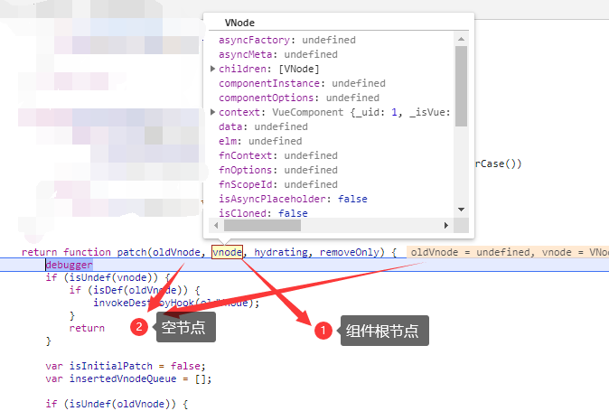

# __patch__()——根据Vnode打补丁生成dom元素

该函数是在最初初始化`Vue`类的时候添加至`Vue.prototype`上的，具体来源于`createPatchFunction({ nodeOps, modules })`，是不是感觉这个套路和之前的`createCompileFunction()`很像，首先，我们先看其传入的两个参数：

- `nodeOps`：[原生操作`DOM`的方法的封装](./封装的dom方法/README.md)。
- `modules`：[`VNode`节点属性的处理方法的封装](./封装的处理节点属性方法/README.md)

现在看看源码(*由于该函数源码过于庞大，主要是其中定义了很多函数，我只搬它的逻辑流程代码，其他的使用时再进行学习*)

```js
const hooks = ['create', 'activate', 'update', 'remove', 'destroy'];

function createPatchFunction(backend) {
    let i, j
    const cbs = {}

    // 取出其中的操作节点与dom的方法
    const {
        modules,
        nodeOps
    } = backend;

    // 遍历钩子函数，为每个钩子函数添加其期间对属性的处理函数
    for (i = 0; i < hooks.length; ++i) {

        // 为每个生命周期初始化一个数组队列
        cbs[hooks[i]] = [];

        // 向该生命周期的任务队列中添加处理该周期内处理属性的方法
        // 只有create/update/destroy三个周期存在
        for (j = 0; j < modules.length; ++j) {
            if (isDef(modules[j][hooks[i]])) {
                cbs[hooks[i]].push(modules[j][hooks[i]]);
            }
        }
    }

    // 声明一个用于记录有多少处于v-pre中的节点
    let creatingElmInVPre = 0;

    // 是否对DOM元素进行注水（修饰）
    let hydrationBailed = false;

    // list of modules that can skip create hook during hydration because they
    // are already rendered on the client or has no need for initialization
    // Note: style is excluded because it relies on initial clone for future
    // deep updates (#7063).
    // 服务器渲染问题：下列属性在注水期间可以跳过上述module中create中的钩子函数，因为它们
    // 已经在客户端渲染过了或没有必要进行初始化。
    // 注意：style属性除外因为它依赖初始化的克隆来进一步的更新
    const isRenderedModule = makeMap('attrs,class,staticClass,staticStyle,key');

    // 返回patch函数
    return function patch () {};
}
```

可以看出，该`patch()`函数是根据是否在浏览器渲染会产生不同的效果的，这里有个名次`hydrate`具体我们会在学习完后来解释；通过该函数我们可以看出它初始化了一些生命周期的钩子函数，然后就返回了一个`patch()`函数，这也就是我们`createCompileFunction()`的返回值了。

那么我们现在具体来看看`patch()`函数具体包含的内容：

```js
function patch(oldVnode, vnode, hydrating, removeOnly) {

    // 如果当前节点已经不存在，则直接销毁旧节点并返回。
    if (isUndef(vnode)) {

        // 如果之前存在节点，那么直接调用该节点及其子节点的destroy()钩子函数
        if (isDef(oldVnode)) invokeDestroyHook(oldVnode);
        return
    }

    // 是否为初始化的打补丁
    let isInitialPatch = false;

    // 待调用insert函数的VNode队列
    const insertedVnodeQueue = [];

    // 之前不存在节点时，即新生成了节点
    if (isUndef(oldVnode)) {

        // empty mount (likely as component), create new root element
        // 凭空挂载，比如创建组件时，直接创建一个根的DOM元素
        // 改进状态为初始化补丁状态。
        isInitialPatch = true;

        // 为VNode创建元素，并创建其所有子元素
        createElm(vnode, insertedVnodeQueue);
    } else {

        // 是否为正的元素(VNode不具有nodeType属性)
        const isRealElement = isDef(oldVnode.nodeType);

        // 当旧节点不为元素时，对比新旧节点其他信息是否相同符合同一节点类型
        if (!isRealElement && sameVnode(oldVnode, vnode)) {

            // patch existing root node
            // 当新旧节点被判定为同一VNode节点时，调用patchVnode更新DOM
            patchVnode(oldVnode, vnode, insertedVnodeQueue, null, null, removeOnly);
        } else {

            // 当旧节点为真实的dom元素时
            if (isRealElement) {

                // mounting to a real element
                // check if this is server-rendered content and if we can perform
                // a successful hydration.
                // 挂载到一个真实的元素上。
                // 检查是否为服务器渲染，来决定我们是否能进行一个成功的hydration行为
                if (oldVnode.nodeType === 1 && oldVnode.hasAttribute(SSR_ATTR)) {
                    oldVnode.removeAttribute(SSR_ATTR);

                    // 确认执行hydration行为
                    hydrating = true;
                }

                // 确认为服务器渲染，可以进行hydrate
                if (isTrue(hydrating)) {
                    if (hydrate(oldVnode, vnode, insertedVnodeQueue)) {
                        invokeInsertHook(vnode, insertedVnodeQueue, true);
                        return oldVnode;
                    } else if (process.env.NODE_ENV !== 'production') {
                        warn(
                            'The client-side rendered virtual DOM tree is not matching ' +
                            'server-rendered content. This is likely caused by incorrect ' +
                            'HTML markup, for example nesting block-level elements inside ' +
                            '<p>, or missing <tbody>. Bailing hydration and performing ' +
                            'full client-side render.'
                        )
                    }
                }

                // either not server-rendered, or hydration failed.
                // create an empty node and replace it
                // 无论是否为服务器渲染或hydration失败，
                // 都创建一个代表该元素的空的VNode节点代替dom元素
                oldVnode = emptyNodeAt(oldVnode);
            }

            // replacing existing element
            // 获取旧节点的DOM元素
            const oldElm = oldVnode.elm;

            // 获取该元素的父节点
            const parentElm = nodeOps.parentNode(oldElm);

            // create new node
            createElm(
                vnode,
                insertedVnodeQueue,
                // extremely rare edge case: do not insert if old element is in a
                // leaving transition. Only happens when combining transition +
                // keep-alive + HOCs. (#4590)
                oldElm._leaveCb ? null : parentElm,
                nodeOps.nextSibling(oldElm)
            );

            // update parent placeholder node element, recursively
            // 递归更新父级的占位符元素节点
            if (isDef(vnode.parent)) {
                let ancestor = vnode.parent;
                const patchable = isPatchable(vnode);
                while (ancestor) {
                    for (let i = 0; i < cbs.destroy.length; ++i) {
                        cbs.destroy[i](ancestor);
                    }
                    ancestor.elm = vnode.elm;
                    if (patchable) {
                        for (let i = 0; i < cbs.create.length; ++i) {
                            cbs.create[i](emptyNode, ancestor);
                        }
                        // #6513
                        // invoke insert hooks that may have been merged by create hooks.
                        // e.g. for directives that uses the "inserted" hook.
                        const insert = ancestor.data.hook.insert;
                        if (insert.merged) {
                            // start at index 1 to avoid re-invoking component mounted hook
                            for (let i = 1; i < insert.fns.length; i++) {
                                insert.fns[i]();
                            }
                        }
                    } else {
                        registerRef(ancestor);
                    }
                    ancestor = ancestor.parent;
                }
            }

            // destroy old node
            // 直接销毁旧元素节点和vnode
            if (isDef(parentElm)) {

                // 移除该元素，并调用其destroy钩子函数
                removeVnodes(parentElm, [oldVnode], 0, 0);

            // 如果未挂载元素，那么直接调用其destroy()钩子函数
            } else if (isDef(oldVnode.tag)) {
                invokeDestroyHook(oldVnode);
            }
        }
    }

    // 为insertedVNodeQueue中的VNode调用其insert周期的函数
    invokeInsertHook(vnode, insertedVnodeQueue, isInitialPatch);

    // 返回根节点的元素
    return vnode.elm;
}
```

整体的`patch()`函数的作用可以分为两种：

- 初始化创建
- `diff`更新

这里我们先说初始化创建的情况

## 初始化创建

初始化创建也分为两种情况：

- [根`vm`实例](#%e9%92%88%e5%af%b9%e6%a0%b9vm%e5%ae%9e%e4%be%8b)
- [组件`vm`实例](#%e7%bb%84%e4%bb%b6vm%e5%ae%9e%e4%be%8b)

按生命周期顺序，首先生成根`vm`实例(与初始化无关的代码，这里一律不谈，根据每步会贴出对应的代码)

### 针对根vm实例

在初始化的创建的过程中，首先从根实例`vm`的开始，会先声明一个`insertedVnodeQueue`队列：

```js
// 待调用insert函数的VNode队列
const insertedVnodeQueue = [];
```

这个队列的作用就是**按序**存储那些需要在`DOM`元素插入文档时执行其`insert()`钩子函数的`VNode`节点，所以这里面的节点为`父 -> 子`，然后我们继续看代码，由于我们的`oldVnode`此时为根元素，但进行`patch()`时，这只是特殊情况，因为它可能也为一个正在的`VNode`节点，所以此处我们要进行一次判断，在其为真实元素我们为其创建新的DOM结构(这里我们不用关心`sameVnode()`)：

```js
// 是否为正的元素(VNode不具有nodeType属性)
const isRealElement = isDef(oldVnode.nodeType);

// 当旧节点不为元素时，对比新旧节点其他信息是否相同符合同一节点类型
if (!isRealElement && sameVnode(oldVnode, vnode)) {}
else {/* 创建新的元素 */}
```

进入这个`else`分支后，首先确认其是否为服务器渲染，因为服务器渲染和客户端渲染两种具有差异，服务器端渲染会有`hydrating`(注水)行为。这里我们仍学习客户端渲染，无论是哪种情况，我们`patch()`对比的应该都是`VNode`，所以我们为根元素创建一个代表它的`VNode`节点赋值给`oldVNode`，并重新将其存放在`oldElm`中(这一步也可以称为标准化，对齐参数)：

```js
oldVnode = emptyNodeAt(oldVnode);
function emptyNodeAt(elm) {

    // 返回一个同挂载元素相同的VNode节点，但无children属性
    return new VNode(nodeOps.tagName(elm).toLowerCase(), {}, [], undefined, elm)
}
// replacing existing element
// 获取旧节点的DOM元素
const oldElm = oldVnode.elm;

// 获取该元素的父节点
const parentElm = nodeOps.parentNode(oldElm);
```

此时我们正式调用[`createElm()`](../生成DOM元素/patch过程中的其他函数/README.md#createele%e5%88%9b%e5%bb%ba%e4%b8%80%e4%b8%aa%e5%85%83%e7%b4%a0%e6%8f%92%e5%85%a5%e7%88%b6%e8%8a%82%e7%82%b9)根据我们`render()`函数生成的`VNode`树生成其`DOM`结构:

```js
// create new node
createElm(
    vnode,
    insertedVnodeQueue,
    // extremely rare edge case: do not insert if old element is in a
    // leaving transition. Only happens when combining transition +
    // keep-alive + HOCs. (#4590)
    oldElm._leaveCb ? null : parentElm,
    nodeOps.nextSibling(oldElm)
);
```

通过该函数，我们将以该`VNode`节点所代表的元素为起点的整个`DOM`片段插入到文档之中，此时我们还未删除老的`DOM`片段


所以我们调用[`removeVnodes()`](../生成DOM元素/patch过程中的其他函数/README.md#removevnodes%e7%a7%bb%e9%99%a4vnode%e5%85%83%e7%b4%a0)函数来将旧的`DOM`片段全部删除。

```js
// destroy old node
// 直接销毁旧元素节点和vnode
if (isDef(parentElm)) {

    // 移除该元素，并调用其destroy钩子函数
    removeVnodes(parentElm, [oldVnode], 0, 0);
}
```

还记得我们之前的队列吗？此时我们要处理这些队列里面的`VNode`节点，调用[`invokeInsertHook()`](./封装的dom方法/README.md#invokedestroyhook%e8%b0%83%e7%94%a8destroy%e9%92%a9%e5%ad%90%e5%87%bd%e6%95%b0)为其中的所有`VNode`调用其`insert()`钩子函数：

```js
// 为insertedVNodeQueue中的VNode调用其insert周期的函数
invokeInsertHook(vnode, insertedVnodeQueue, isInitialPatch);
```

最后返回我们创建的`DOM`片段的根节点，整个渲染过程就结束了。(具体细节请点击其中的链接看，不要跳过！)

### 组件vm实例

组件`vm`实例的创建也大同小异，由于是第一次创建，所以它们并没有进行对比的`oldVnode`(从刚刚创建根`vm`实例可以看到，只有根元素具有其对应的`VNode`节点，并未给其他元素递归创建对应的`VNode`节点)



组件`vm`实例创建时，我们依然为其创建一个`insertedVnodeQueue`队列，用来存放那些要在插入时调用`insert()`钩子函数的`VNode`节点。与根`vm`实例不同的是，这里我们要确认一个`isInitialPatch()`值，它表示我们对其进行初始化`patch()`操作，它表示我们会对`insertedVnodeQueue`中的`VNode`节点进行不同于根`vm`实例的操作(最后会说明，如果你在刚才的根`vm`实例中认真看过，那么你已经知道它的作用了):

```js
// 是否为初始化的打补丁
    let isInitialPatch = false;

    // 待调用insert函数的VNode队列
    const insertedVnodeQueue = [];

// 之前不存在节点时，即新生成了节点
if (isUndef(oldVnode)) {

    // empty mount (likely as component), create new root element
    // 凭空挂载，比如创建组件时，直接创建一个根的DOM元素
    // 改变状态为初始化补丁状态。
    isInitialPatch = true;

    // 为VNode创建元素，并创建其所有子元素
    createElm(vnode, insertedVnodeQueue);
}
```

同样我们调用[`createElm()`](../生成DOM元素/patch过程中的其他函数/README.md#createele%e5%88%9b%e5%bb%ba%e4%b8%80%e4%b8%aa%e5%85%83%e7%b4%a0%e6%8f%92%e5%85%a5%e7%88%b6%e8%8a%82%e7%82%b9)方法为其开始创建等同于组件模版的`DOM`片段。

最后调用[`invokeInsertHook()`](./封装的dom方法/README.md#invokedestroyhook%e8%b0%83%e7%94%a8destroy%e9%92%a9%e5%ad%90%e5%87%bd%e6%95%b0)方法，将我们`insertedVnodeQueue`队列中的`VNode`节点全部挂载到`vnode.parent.data`上，因为我们**不能直接**将`insertedVnodeQueue`返回给根`vm`实例调用的`patch()`函数，所以我们需要使它们之间有一个联系，以便在根`vm`实例调用该方法时能访问到这些`VNode`节点：

```js
// 为insertedVNodeQueue中的VNode调用其insert周期的函数
invokeInsertHook(vnode, insertedVnodeQueue, isInitialPatch);
```

最后返回组件的根元素。

## diff更新

调用`patch()`函数，其传入的`oldVnode`为我们挂载的实际`DOM`元素，这里不为一个`VNode`，第一步，对比新旧两个`VNode`，如果无新的`VNode`，那么直接销毁旧`VNode`:

```js
// 如果当前节点已经不存在，则直接销毁旧节点并返回。
if (isUndef(vnode)) {

    // 如果之前存在节点，那么直接调用该节点及其子节点的destroy()钩子函数
    if (isDef(oldVnode)) invokeDestroyHook(oldVnode);
    return
}
```
