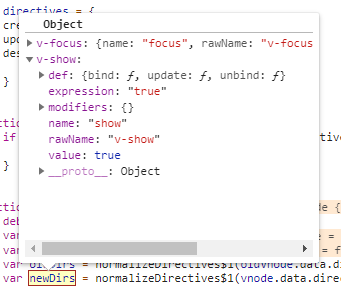
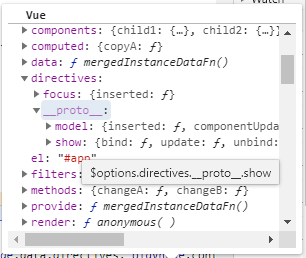

# 更新指令——updateDirectives()

所有`VNode`上的指令都会在这里进行处理，无论是自定义指令还是原生指令。无论是在哪个声明周期更新指令，都是调用下面的函数：

```js
function updateDirectives(oldVnode: VNodeWithData, vnode: VNodeWithData) {

    // VNode节点前后都存在指令对象时
    if (oldVnode.data.directives || vnode.data.directives) {
        _update(oldVnode, vnode);
    }
}
```

那么现在来看看`_update()`函数的具体的更新过程：

```js
function _update(oldVnode, vnode) {

    // 是否为初次创建指令
    const isCreate = oldVnode === emptyNode;

    // 是否为销毁Vnode上的指令
    const isDestroy = vnode === emptyNode;

    // 获取options中定义的指令对象
    const oldDirs = normalizeDirectives(oldVnode.data.directives, oldVnode.context);
    const newDirs = normalizeDirectives(vnode.data.directives, vnode.context);

    // 延迟调用insert函数
    const dirsWithInsert = [];

    // 延迟调用的patch函数
    const dirsWithPostpatch = [];

    let key, oldDir, dir;
    for (key in newDirs) {
        oldDir = oldDirs[key];
        dir = newDirs[key];

        // 如果为新的指令，则执行其中定义的bind回调函数
        if (!oldDir) {

            // new directive, bind
            // 调用其bind函数
            callHook(dir, 'bind', vnode, oldVnode);

            // 是否有inserted函数,如果则占时推入数组
            if (dir.def && dir.def.inserted) {
                dirsWithInsert.push(dir)
            }
        } else {

            // existing directive, update
            // 如果是之前存在的指令，则更新
            dir.oldValue = oldDir.value;
            dir.oldArg = oldDir.arg;

            // 调用update的钩子函数
            callHook(dir, 'update', vnode, oldVnode)

            // 是否定义componentUpdated函数，有则推入postpatch数组
            if (dir.def && dir.def.componentUpdated) {
                dirsWithPostpatch.push(dir)
            }
        }
    }

    if (dirsWithInsert.length) {
        const callInsert = () => {
            for (let i = 0; i < dirsWithInsert.length; i++) {
                callHook(dirsWithInsert[i], 'inserted', vnode, oldVnode)
            }
        };

        // 初次渲染时
        if (isCreate) {

            // 将所有的insert函数，混入VNode生命周期钩子的insert中，待插入节点时调用。
            mergeVNodeHook(vnode, 'insert', callInsert);

        // 如果不是初次渲染则直接调用这些insert钩子函数
        } else {
            callInsert();
        }
    }

    if (dirsWithPostpatch.length) {

        // 将这些组件更新钩子函数，混入组件声明周期的postpatch中
        mergeVNodeHook(vnode, 'postpatch', () => {
            for (let i = 0; i < dirsWithPostpatch.length; i++) {
                callHook(dirsWithPostpatch[i], 'componentUpdated', vnode, oldVnode)
            }
        })
    }

    // 当该指令已经不存在于最新的节点时，调用unbind钩子函数
    if (!isCreate) {
        for (key in oldDirs) {
            if (!newDirs[key]) {

                // no longer present, unbind
                callHook(oldDirs[key], 'unbind', oldVnode, oldVnode, isDestroy)
            }
        }
    }
}
```

首先要判断本次更新的性质是什么，因为在初始化渲染师，有一些钩子函数是不会调用的。在初始化渲染时，`oldVNode`会为一个空节点；同样在组件销毁时，新的`VNode`也会为一个空节点。

接下来便是调用`normalizeDirectives()`函数对我们编码时定义的对应指令对象钩子函数的提取：

## normalizeDirectives()——提取options中的对应指令对象

该函数将查找我们定义在模版中元素上的指令，然后在去对应`vm`实例中，查找我们定义的该指令的对象。最后按键值对的形式，整理出来返回一个对象。

```js
const emptyModifiers = Object.create(null);

function normalizeDirectives(
    dirs: ? Array < VNodeDirective > ,
    vm : Component
): {
    [key: string]: VNodeDirective
} {
    const res = Object.create(null)
    if (!dirs) {
        return res
    }

    let i, dir;

    // 对所有的指令查询其options中定义的对象
    for (i = 0; i < dirs.length; i++) {
        dir = dirs[i];

        // 是否有修饰符，没有则挂载一个空的修饰符对象
        if (!dir.modifiers) {

            dir.modifiers = emptyModifiers
        }

        // 获取指令未处理前名称
        res[getRawDirName(dir)] = dir;

        // 获取该vm组件中的指令对象(即我们自己定义的那一坨)
        dir.def = resolveAsset(vm.$options, 'directives', dir.name, true)
    }

    // 返回处理后的指令对象map
    return res;
}

function getRawDirName(dir: VNodeDirective): string {

    // 获取用户定义在模版中的指令的原名称(有修饰符时还要将修饰符添加进去)
    return dir.rawName || `${dir.name}.${Object.keys(dir.modifiers || {}).join('.')}`;
}
```

函数非常的简单，它会将我们定义在模版的指令，按最初的指令名称为键名，标准化之前的数组形式的指令对象。

在这其中，查找`options`中的指令对象用的是[`resolveAsset()`](../../../其他工具方法/README.md#resolveasset%e8%8e%b7%e5%8f%96%e6%8c%87%e5%ae%9a%e5%af%b9%e8%b1%a1%e4%b8%8a%e7%9a%84%e8%b5%84%e6%ba%90)函数，相信你还有印象，它会返回传入参数的返回值，如`vm.$options.directives[dir.name]`，你可以将这个表达式理解为它的浓缩版本。



最后这些我们定义的指令对象会挂载到原来解析出的指令的对象的`.def`属性上。
____
之后便是正式开始处理这些指令中定义的各种函数，对其进行调用。首先对于新增的指令(即之前没有的)，每个指令都会调用一次其中的`bind()`钩子函数，如果有`insert()`函数，那么会暂时存放在`dirsWithInsert`数组中；对于前后没有变化的指令，它会对其调用`update`钩子函数，如果定义有`componentUpdated()`函数，那么会暂时存在在另一个数组`dirsWithPostpatch`中。

接下来便是对`dirsWithInsert`与`dirsWithPostpatch`数组中的各个钩子函数的处理。当然它们不是都会立即调用。

首先是`dirsWithInsert`数组中的`insert()`钩子函数，如果是第一次渲染，那么其不会理解调用，而是会等到元素被插入`DOM`时，在调用该函数；而如果不是第一次渲染，那么就会立即进行调用。

其次是`dirsWithPostpatch`数组中的函数，它们全部会被加入组件的`postpatch`钩子函数数组中去，待组件更新后再调用。

最后在该节点销毁时，还会调用所有的`unbind()`钩子函数

顺带一提，这里调用函数都是用的`callHook()`函数统一调用：

```js
function callHook(dir, hook, vnode, oldVnode, isDestroy) {

    // 获取对应hook的函数
    const fn = dir.def && dir.def[hook];

    // 如果存在，则调用，传入5个参数
    if (fn) {
        try {
            fn(vnode.elm, dir, vnode, oldVnode, isDestroy);
        } catch (e) {

            // 发生错误处理报错
            handleError(e, vnode.context, `directive ${dir.name} ${hook} hook`)
        }
    }
}
```

有看出每个钩子函数调用时，其实都会传入5个参数，分别为绑定的元素，指令对象，和当前元素绑定的`VNode`节点，还有之前的`VNode`节点。其中在第二个参数`dir`属性中，我们可以访问该指令的有关信息。

## 原生指令

我们可以看到，原生指令也会经过这里进行处理，而我们并没有对其进行定义。其实它在之前合并`directive`属性时，已经混入到其原型对象上了：



现在我们看看其是如何进行实现的：

### v-show

该指令我想即使不用内部提供，我们也可以仿照写一个，只需要在`update`中判断`Vue`中某个变量然后设置样式即可。现在我们来看看内部实现：

#### v-show——bind()

首先为其`bind()`函数：

```js
function bind(el: any, {

        // 注意这里的value，解构赋值
        value
    }: VNodeDirective, vnode: VNodeWithData) {

        // 找到真实的元素(组件则为其第一个具体的顶层节点)
        vnode = locateNode(vnode);

        // 获取VNode节点的transition属性
        const transition = vnode.data && vnode.data.transition;

        // 存储元素原始的display属性
        const originalDisplay = el.__vOriginalDisplay =
            (el.style.display === 'none' ? '' : el.style.display);

        // 通过过渡动画的形式显示
        if (value && transition) {

            // 标记transition的根元素的show属性为true，即此处已经通过v-show启动了过渡
            vnode.data.show = true;

            // 执行进入过渡动画
            enter(vnode, () => {
                el.style.display = originalDisplay
            });

        // 普通的元素节点按v-show的值直接执行样式上的切换
        } else {
            el.style.display = (value ? originalDisplay : 'none');
        }
    },
```

首先，要执行`v-show`指令必须要一个真实的元素才行，所以我们要去查找该`VNode`节点的真实元素，比如如果是组件，我们就要取其最顶层的真实元素(`transition`也为一个抽象组件)。

```js
// recursively search for possible transition defined inside the component root
// 找到transition组件中的真实根节点
function locateNode(vnode: VNode): VNodeWithData {
    return vnode.componentInstance && (!vnode.data || !vnode.data.transition) ?

        // 查询该组件的根节点(不一定为具体的元素)
        locateNode(vnode.componentInstance._vnode) : vnode;
}
```

这里的`_vnode`就表示该组件实例的占位符，即根`VNode`节点(无论是不是组件)
____
找到该`VNode`节点后，就分为两种情况了：

1. 如果该节点为`<transition>`所包裹的子节点，那么我们会通过过渡动画的形式来进行显示
2. 普通的元素节点，进行单纯的样式切换

在通过过渡动画执行显示时，可见得其直接就调用`enter()`函数进行过渡，还记录了`.show`标记位。这也为我们之前该值是什么的问题做出了解答。

#### v-show——update()

知道了`bind()`其实也就知道了`update()`了，唯一可能不同的地方，可能是在过渡时，会存在离开过渡的情况。

```js
function update(el: any, {
        value,
        oldValue
    }: VNodeDirective, vnode: VNodeWithData) {

        // 当值未发生变化时，不进行更新
        if (!value === !oldValue) return;

        // 找到真实的元素(组件则为其第一个具体的顶层节点)
        vnode = locateNode(vnode);
        const transition = vnode.data && vnode.data.transition;

        // 根据情况执行对应的过渡动画
        if (transition) {
            vnode.data.show = true
            if (value) {
                enter(vnode, () => {
                    el.style.display = el.__vOriginalDisplay
                })
            } else {
                leave(vnode, () => {
                    el.style.display = 'none'
                })
            }
        } else {
            el.style.display = value ? el.__vOriginalDisplay : 'none'
        }
    }
```

#### v-show——unbind()

解除指令时的情况很普通，就是返还以前的初始`display`值即可：

```js
function unbind(
        el: any,
        binding: VNodeDirective,
        vnode: VNodeWithData,
        oldVnode: VNodeWithData,
        isDestroy: boolean
    ) {

        // 取消此指令绑定时，还原其属性
        if (!isDestroy) {
            el.style.display = el.__vOriginalDisplay
        }
    }
```

[v-show 代码文件](../../../../../vueSourceCode/src/platforms/web/runtime/directives/show.js)

### v-model

`v-model`只存在`insert`和`componentUpdated`两个阶段的钩子函数

#### v-model——inserted()

在插入该`v-model`元素阶段，需要针对`select`类型的`v-model`进行特殊的处理，第一种处理是针对第一插入的`select`元素，它要在组件更新时调用这里的`componentUpdated()`函数来对`select`的一个问题进行修复；第二个种处理比较简单，只会为它们选择`v-model`绑定值的对应的`option`选项。

对于普通的文本框类型的`v-model`，在非`.lazy`模式下，它会为其添加复合事件来更好的处理输入问题。

```js
const isTextInputType = makeMap('text,number,password,search,email,tel,url');
function inserted(el, binding, vnode, oldVnode) {

        // 处理select标签bug
        if (vnode.tag === 'select') {

            // #6903
            if (oldVnode.elm && !oldVnode.elm._vOptions) {

                // 之前的该元素不为select元素时，手动向新的VNode节点添加该组件更新后的钩子函数
                mergeVNodeHook(vnode, 'postpatch', () => {
                    directive.componentUpdated(el, binding, vnode)
                });

            // 同一元素时，检查v-model绑定值，然后设置选中项
            } else {
                setSelected(el, binding, vnode.context)
            }

            // 遍历所有的options，并对其调用getValue函数，获取它们的值
            el._vOptions = [].map.call(el.options, getValue);

        // 文本框类型的元素时
        } else if (vnode.tag === 'textarea' || isTextInputType(el.type)) {
            el._vModifiers = binding.modifiers;

            // 在非change模式下，为其绑定复合事件
            if (!binding.modifiers.lazy) {
                el.addEventListener('compositionstart', onCompositionStart);
                el.addEventListener('compositionend', onCompositionEnd);
                // Safari < 10.2 & UIWebView doesn't fire compositionend when
                // switching focus before confirming composition choice
                // this also fixes the issue where some browsers e.g. iOS Chrome
                // fires "change" instead of "input" on autocomplete.
                el.addEventListener('change', onCompositionEnd);

                if (isIE9) {
                    el.vmodel = true
                }
            }
        }
    }
```

这里我们只说明多次插入的`select`元素，因为初始插入时在之后会有说明。多次插入时，仅调用了`setSelected()`函数来设置选中项，该函数会根据`v-model`的值，来将相等的值的`options`全部选中。

```js
function setSelected(el, binding, vm) {

    // 根据v-model值设置选中项
    actuallySetSelected(el, binding, vm)

    // IE中在设置一次(可能是某个bug)
    if (isIE || isEdge) {
        setTimeout(() => {
            actuallySetSelected(el, binding, vm);
        }, 0);
    }
}

function actuallySetSelected(el, binding, vm) {
    const value = binding.value;
    const isMultiple = el.multiple;

    // 当前为多选，但v-model绑定的不是数组时，报错
    if (isMultiple && !Array.isArray(value)) {
        process.env.NODE_ENV !== 'production' && warn(
            `<select multiple v-model="${binding.expression}"> ` +
            `expects an Array value for its binding, but got ${
        Object.prototype.toString.call(value).slice(8, -1)
      }`,
            vm
        )
        return;
    }
    let selected, option;
    for (let i = 0, l = el.options.length; i < l; i++) {
        option = el.options[i];
        if (isMultiple) {

            // 当前v-model的值是否与当前的option值相等，相等则应该为被选中的option
            selected = looseIndexOf(value, getValue(option)) > -1;

            // 如果当前option与v-model指定值得出结果不同，则更新
            if (option.selected !== selected) {
                option.selected = selected
            }
        } else {

            // 单个时，找到第一个等于v-model值的options并选中，然后退出
            if (looseEqual(getValue(option), value)) {
                if (el.selectedIndex !== i) {
                    el.selectedIndex = i
                }
                return;
            }
        }
    }

    // 不为多选的其他情况，则取消所有的选中
    if (!isMultiple) {
        el.selectedIndex = -1
    }
}
```

这里主要其作用的是`actuallySetSelected()`函数，在多选模式下，它会通过为每个值等于`v-model`的`option`设置它们的`.selected`属性来达到选择；在单个值的情况下，它会调用[`looseEqual()`](../工具方法/README.md#looseequal%e6%9d%be%e6%95%a3%e7%9b%b8%e7%ad%89)来将第一个与`v-model`值相等的`option`选中。

最后其将本次`options`中的所有值存放在元素的`._vOptions`属性中。

```js
// 获取options的值
function getValue(option) {
    return '_value' in option ?
        option._value :
        option.value
}
```

#### 文本框的复合事件

这里我们可以看到，针对文本框的`v-model`，Vue为其绑定了复合事件来处理输入法的输入，那么我们看看其具体是怎么来截断input的输入的：

```js
el.addEventListener('compositionstart', onCompositionStart);
el.addEventListener('compositionend', onCompositionEnd);
// Safari < 10.2 & UIWebView doesn't fire compositionend when
// switching focus before confirming composition choice
// this also fixes the issue where some browsers e.g. iOS Chrome
// fires "change" instead of "input" on autocomplete.
el.addEventListener('change', onCompositionEnd);

function onCompositionStart(e) {

    // 复合时间开始时，标记composing为true，使input事件无效
    e.target.composing = true
}

function onCompositionEnd(e) {

    // prevent triggering an input event for no reason
    // 防止触发input事件
    if (!e.target.composing) return;

    // 结束复合事件
    e.target.composing = false;

    // 触发目标元素的input事件，更新value
    trigger(e.target, 'input')
}
```

### v-model——componentUpdated()

组件更新时调用的函数，还是用于处理`select`元素。原注释为：如果通过`v-for`渲染的`options`发生了变化，那么渲染的`options`的`value`可能会不同步。此时我们需要判断这种情况，然后过滤掉那些已经不在`dom`中的值。那么具体的过程为：

```js
function componentUpdated(el, binding, vnode) {

        // 处理selected元素
        if (vnode.tag === 'select') {

            // 同样，选择最新v-model值的option
            setSelected(el, binding, vnode.context);

            // in case the options rendered by v-for have changed,
            // it's possible that the value is out-of-sync with the rendered options.
            // detect such cases and filter out values that no longer has a matching
            // option in the DOM.
            // 如果通过v-for渲染的options发生了变化，那么渲染的options的value可能会不同步
            // 此时我们需要判断这种情况，然后过滤掉那些已经不在dom中的值

            // 获取之前options中的全部值
            const prevOptions = el._vOptions;

            // 获取最新的options中的全部值的数组
            const curOptions = el._vOptions = [].map.call(el.options, getValue);

            // 前后两者是否在对应下标下存在不同的值
            if (curOptions.some((o, i) => !looseEqual(o, prevOptions[i]))) {

                // trigger change event if
                // no matching option found for at least one value
                // 触发change事件即使仅存在一个option的值不等
                // 是否需要重新
                const needReset = el.multiple ?

                    // 只要有binding.value中存在一个值与curOptions中的任何值不等，则返回true
                    binding.value.some(v => hasNoMatchingOption(v, curOptions)) :

                    // v-model绑定的值发生变化时，如果v-model新值不与任何options中值相等
                    binding.value !== binding.oldValue && hasNoMatchingOption(binding.value, curOptions)

                // 手动触发该元素的change事件
                if (needReset) {
                    trigger(el, 'change');
                }
            }
        }
    }
```

同样的首先，调用`setSelected()`函数来选择那些与`v-model`匹配的`options`的值。

之后取出之前渲染时的所有`options`的`value`的数组，并获取当前所有`options`的`value`的数组。

```js
// 获取之前options中的全部值
const prevOptions = el._vOptions;

// 获取最新的options中的全部值的数组
const curOptions = el._vOptions = [].map.call(el.options, getValue);

// 前后两者是否在对应下标下存在不同的值
if (curOptions.some((o, i) => !looseEqual(o, prevOptions[i]))) {...}
```

然后对比前后两者之前是否有存在差异的值，即只要对应数组相同坐标中，存在至少一个不同的值时。如果存在差异，至少说明进行了渲染，需要更新。此时我们只需要判断`v-model`绑定的值中，是否存在至少一个值是目前`options`中不存在的，如何符合这个条件，那说明我们有必要重新更新下`v-model`的值了。

```js
// trigger change event if
// no matching option found for at least one value
// 触发change事件即使仅存在一个option的值不等
// 是否需要重新
const needReset = el.multiple ?

// 只要有binding.value中存在一个值与curOptions中的任何值不等，则返回true
binding.value.some(v => hasNoMatchingOption(v, curOptions)) :

// v-model绑定的值发生变化时，如果v-model新值不与任何options中值相等
binding.value !== binding.oldValue && hasNoMatchingOption(binding.value, curOptions)
```

#### hasNoMatchingOption()——当前value无匹配option

上面的`hasNoMatchingOption(v, curOptions)`函数，即我们用来查看`v`是否不存在于`curOptions`中，不存在时就返回`true`。

```js
function hasNoMatchingOption(value, options) {

    // 没有任何值与value相等则返回true，存在至少一个值相等则返回false
    return options.every(o => !looseEqual(o, value));
}
```

同样是调用的`looseEqual()`来进行对比。
____
最后如果存在差异，则调用`trigger()`函数，手动触发`change`事件：

```js
// 触发该元素的change事件
function trigger(el, type) {
    const e = document.createEvent('HTMLEvents')
    e.initEvent(type, true, true);
    el.dispatchEvent(e);
}
```

这个函数里面的东西，我还有点蒙逼，去查一下。
