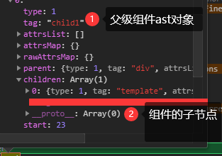

# 插槽在Vue整个生命周期的处理过程

这里我们会说明组件在整个`Vue`实例生命周期是怎么处理，生成的，具体过程以举例说明。

一个插槽的解析会经历个地方：

- `ast`对象解析生成
- `VNode`节点生成
- `DOM`节点生成

这里按上面的顺序，学习在各处的处理情况：

## ast对象解析生成时

首先我们要知道，只有标签在闭合时，才开始处理其中插槽属性，所以其子节点的插槽属性是优先于父组件处理的。而处理插槽的方法一共两个：`processSlotOutlet()`与`processSlotContent()`前者用于处理`slot`元素，后者用于处理我们组件标签中的内容。(具体内容麻烦点进去自己看)

对于一个组件标签里面插入内容而言，此时处理后的结果就有两种情况：

- 第一种：直接挂载到组件`AST`对象的子`AST`数组中，比如：

```js
<component>
    <template>
        <div></div>
    <template>
</component>
```

第一种情况出现的情况只有一种，不使用任何插槽语法。(`v-slot`)，这种情况下调用`processSlotContent()`不做任何处理。

- 第二种：使用`v-slot`语法

这种情况下也有两种情况，但两种情况的处理其实就是在像一种情况靠拢，这两种情况就是以`v-slot`定义的地方区别：

1. `v-slot`定义在`template`标签上，这种情况下，会在`template`元素的`ast`对象上定义三个属性：

```js
template.slotTarget = name; // 插槽名称
template.slotTargetDynamic = dynamic; // 插槽名称是否为动态语法
template.slotScope = slotBinding.value || emptySlotScopeToken; // 插槽作用域，即v-slot后面那个取值
```

2. `v-slot`直接 定义在组件上。此时，它会生成一个`tempalte`元素子`AST`对象，然后同样的将上面的那些属性增加以到这个`template`的`ast`对象上，而组件的`ast`上会增加一个`scopedSlots`属性来存放这个`template`的AST对象：

```js
template.slotTarget = name; // 插槽名称
template.slotTargetDynamic = dynamic; // 插槽名称是否为动态语法
template.slotScope = slotBinding.value || emptySlotScopeToken; // 插槽作用域，即v-slot后面那个取值

// 在组件的ast对象的scopedSlots对象中，按该插槽名称，将生成的模版元素ast对象挂载在其上
component.scopedSlots[name] = template;
```

增加了新的`template`元素后，我们还需要将原组件中的子元素转义到`template`的子元素中，这个转移过程中，我们要过滤掉定义多个`v-slot`的情况：

```js
slotContainer.children = component.children.filter(function (c) {

    // 去掉那些使用了v-slot的template
    if (!c.slotScope) {
        c.parent = slotContainer;
        return true
    }
});

// 直接清空组件的子节点ast对象数组
component.children = [];
```

在这个过滤过程中，其实是防止这种嵌套`v-slot`的用法，这种写法是错误的，但`Vue`内部帮用户规避掉了：

```html
<com v-slot="a">
    <template v-slot="b">

    </template>
</com>
```

所以一旦使用了在组件上定义`v-slot`的语法，组件中的其他`v-slot`作用域都将无效

很明显1种语法中，`Vue`还没有做转移子节点这个操作。为什么不当时就做这个操作呢？这主要是因为下面这段代码的最后两句，因为如果我们当时就执行这个操作那么我们要重复判断一次这个`template`元素是否具有`if`语句块且任何元素，都会有确认父元素和加入父元素子数组这个操作，总结下就是，**会产生多余的代码**。所以，闭合标签时，我们判断下当前闭合的标签`ast`对象是否有`.slotScope`这个属性，如果有那么：

```js
if (element.elseif || element.else) {
    //...............................
} else {
    // 处理template元素上的v-slot作用域
    if (element.slotScope) {
        // scoped slot
        // keep it in the children list so that v-else(-if) conditions can
        // find it as the prev node.
        var name = element.slotTarget || '"default"';

        // 将该template元素挂载到组件的scopedSlots[name]中
        (currentParent.scopedSlots || (currentParent.scopedSlots = {}))[name] = element;
    }

    // 这一步操作和插槽没有什么关系，大家都有
    currentParent.children.push(element);
    element.parent = currentParent;
}
```

到此为止，在`AST`对象中对插槽的处理就结束了，接下来是生成成渲染函数中的处理。

## render()函数的生成

生成渲染函数，对插槽的处理主要是基于`scopedSlots`属性，为如下语句：

```js
// slot target
// only for non-scoped slots
if (el.slotTarget && !el.slotScope) {
    data += "slot:" + (el.slotTarget) + ",";
}
// scoped slots
if (el.scopedSlots) {
    data += (genScopedSlots(el, el.scopedSlots, state)) + ",";
}
```

这里我们只关注`2.6`的语法，所以第一个`if`语句，不会在`2.6`语法任何地方出现。所以这里我们永远只会在第二个`if`语句处理，此时调用`genScopedSlots(el, el.scopedSlots, state)`方法。里面没有特殊的结构处理规矩，它会将传入的作用域插槽先处理为以下形式：

```js
const result = [{
    key: 'default',
    fn: /** 插槽内容的渲染函数 */
},
{
    key: 'slot1',
    fn: /** 插槽内容的渲染函数 */
}];
```

在由其他条件生成一个`scopedSlots`字段，它由一个处理函数包裹：

```js
let result = {
    scopedSlots: _u([ {key:"default",fn: render()} ])
}
```

待`render()`渲染函数调用时，以上的属性就会被处理为这样一个字段：

```js
let result = {
    scopedSlots: {
        $stable: true,
        default: renderFunction
    }
};
```

其中`$stable`表示是否不需要强制更新插槽中的子组件，其他字段表示`具名插槽名称-插槽内容的渲染函数`。

但此时还不会对这些属性进行处理，因为我们知道，一个具有作用域的插槽，获取的值是组件中的值，即这些渲染函数要在组件的`vm`实例中去调用。

所以我们直接查看子组件`vm`实例的生命周期，首先由于是2.6的语法所以即使调用`initRender()`方法，这两个值也不会有任何处理：

```js
// 下面两个值实际都为一个空对象
vm.$slots = resolveSlots(options._renderChildren, renderContext);
vm.$scopedSlots = emptyObject;
```

此时我们的组件中肯定会存在一个`<slot>`插槽元素，所以在`AST`对象解析时，它还是被当作普通的元素处理，不过对其上的`name`字段，要提取为`slotName`，接下来便是生成渲染函数的过程，`slot`元素将会被解析为`_t()`函数，它的第一个参数为插槽名称，第二个为其中的子节点数组。

```js
// 举例
_t("default",[_c('div',[_v("默认内容")])]
```

而我们的`_t`函数即`renderSlot()`


## DOM节点的生成

现在我们已经得到了渲染函数的部分，此时我们只需要关注插槽如何生成`DOM`元素即可

## 最简单的情况

首先是最简单的插槽的情况，即不包含任何具名插槽和`prop`属性：

```html
<!-- 父模版 -->
<component1>
    <template>
        <div></div>
    </template>
</component1>

<!-- 子模版 -->
<slot>
    <div>无内容</div>
</slot>
```

### 模版解析

首先在解析模版阶段，首先父模版解析后的结果中，`template`元素会直接挂载到`component1`组件的`ast`对象下：



那么以上是一个什么过程呢？

### 父模版AST对象解析

所以在父模版解析中，仅有`processSlotContent()`的过程，由于该方法对于这种空白模版没有任何的处理，只是单纯的在`template`元素下挂载一个`slotScope: undefined`。

### 子模版AST对象解析

子模版解析时自然会调用`processSlotOutlet()`方法，这个方法没什么特点，只是简单提取下上面的`name`属性，即具名插槽的名称，这里向`slot`元素`ast`对象添加一个`slotName: undefined`属性。