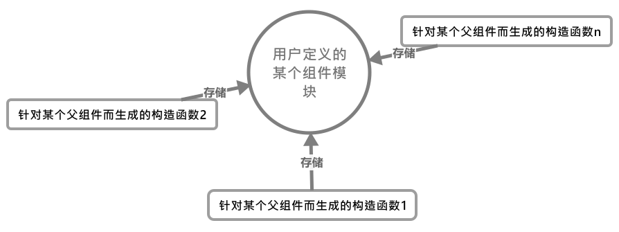

# 组件的构造函数

组件的构造函数在一开始是不会生成的。只有当我们真正使用了组件时，才会开始初始化生成，并且根据不同的配置会基于基础`Vue`构造函数生成不同的构造函数，它来源于`Vue.extend()`：

```js
/**
 * Class inheritance
 */
Vue.extend = function (extendOptions: Object): Function {

    // 接收组件的配置对象
    extendOptions = extendOptions || {};

    // 父级构造函数
    const Super = this;

    // 父级的uuid
    const SuperId = Super.cid;

    // 查看当前组件配置是否已经生成过构造函数(这些构造函数对应对应的父级上下文对象)
    const cachedCtors = extendOptions._Ctor || (extendOptions._Ctor = {});

    // 如果存在，那么直接取出
    if (cachedCtors[SuperId]) {
        return cachedCtors[SuperId]
    }

    // 获取组件名称，没有则沿用父级组件的名称
    const name = extendOptions.name || Super.options.name;
    if (process.env.NODE_ENV !== 'production' && name) {
        validateComponentName(name)
    }

    // 生成子组件的构造函数
    const Sub = function VueComponent(options) {
        this._init(options)
    };

    // 使子组件的构造函数继承父组件构造函数的方法
    Sub.prototype = Object.create(Super.prototype);
    Sub.prototype.constructor = Sub;
    Sub.cid = cid++;

    // 手动合并父组件和子组件的配置对象
    Sub.options = mergeOptions(
        Super.options,
        extendOptions
    );

    Sub['super'] = Super;

    // For props and computed properties, we define the proxy getters on
    // the Vue instances at extension time, on the extended prototype. This
    // avoids Object.defineProperty calls for each instance created.
    // 对于props和computed属性，我们在其扩展期间就定义访问其值的getter，
    // 它避免了在实例被创建时`Object.defineProperty`被调用
    // 在sub.prototype上定义props与computed中的key值访问器
    if (Sub.options.props) {
        initProps(Sub)
    }
    if (Sub.options.computed) {
        initComputed(Sub)
    }

    // allow further extension/mixin/plugin usage
    // 允许进一步的扩展和mixin和组件添加
    Sub.extend = Super.extend
    Sub.mixin = Super.mixin
    Sub.use = Super.use

    // create asset registers, so extended classes
    // can have their private assets too.
    // 为每个构造函数创建私有的属性注册器, component/filter/directive
    ASSET_TYPES.forEach(function (type) {
        Sub[type] = Super[type]
    })

    // enable recursive self-lookup
    // 允许递归使用自己作为组件
    if (name) {

        // 这里相当于自己在自己的子组件选项中注册了自己
        Sub.options.components[name] = Sub
    }

    // keep a reference to the super options at extension time.
    // later at instantiation we can check if Super's options have
    // been updated.
    // 在扩展时间内，保存一个到父级option的引用，之后在实例化时，我们可以由此来确认
    // 父级的options是否更新

    // 父级options
    Sub.superOptions = Super.options;

    // 用户自定义部分的options
    Sub.extendOptions = extendOptions;

    // 混合后的子组件的options
    Sub.sealedOptions = extend({}, Sub.options);

    // cache constructor
    // 在当前组件构造函数中缓存当前vm实例上下文的构造函数
    cachedCtors[SuperId] = Sub;
    return Sub;
}
```

从这个组件构造函数我们可以看出`Vue`的用心险恶，它为每个组件都会生成一个单独配置的构造函数，但这些构造函数都是围绕着我们最初定义该组件的模块对象；并且如果我们已经在某个上下文环境(`vm`实例中)中使用过某个组件，那么针对于该上下文环境的构造函数就会被缓存在当初定义这个组件的模块对象中。
