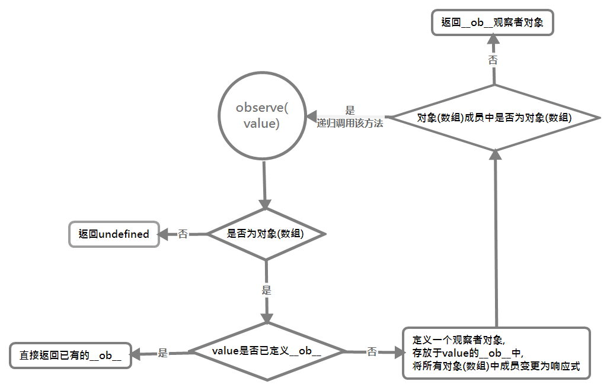

# Observer 观察者对象

`Observer`类主要用来***将对象或数组整体初始化变更为响应式***，并将其内部的属性字段同样进行该处理。

这里我们先暂时不看它，因为它在外部并不是直接被调用的，而是通过`observe()`方法间接调用。在我们之前学习所有`initState()`中，我们可以知道其就是使用`observe()`方法来进行响应化，所以我们首先来学习它。

## observe()——初始化响应式属性

在 `Vue` 中，一个**对象**要变更为响应式都是通过这个函数来启动的，该方法实则为`class Observer`的接口，通过该方法创建一个`Observer`对象用来管理该对象中属性的增删。(最后该`Observer`观察者对象会挂载到该对象的`__ob__`属性上)具体的代码如下：

```js
/**
 * Attempt to create an observer instance for a value,
 * returns the new observer if successfully observed,
 * or the existing observer if the value already has one.
 * 为一个值创建一个观察者实例，如果观察成功则返回一个该观察者否则返回
 * 该值已有的观察者
 */
export function observe(value: any, asRootData: ? boolean): Observer | void {

    // 被设置的值要为对象，但不能为VNode，否则退出
    if (!isObject(value) || value instanceof VNode) {
        return
    }

    // 定义观察对象类型
    let ob: Observer | void;

    // 如果已有观察者对象，则直接使用该对象并返回
    if (hasOwn(value, '__ob__') && value.__ob__ instanceof Observer) {
        ob = value.__ob__;
    } else if (
        shouldObserve &&
        !isServerRendering() &&

        // (这句检测已经是没有必要的，因为在最开始有isObject进行了检查)
        (Array.isArray(value) || isPlainObject(value)) &&
        Object.isExtensible(value) &&

        // 防止给vm添加观察者对象
        !value._isVue
    ) {
        ob = new Observer(value);
    }

    // 如果为根观察者对象，则增加其观察的vm数量值
    if (asRootData && ob) {
        ob.vmCount++
    }
    return ob;
}
```

从上面我们可以看到，观察者对象含有一个`vmCount`属性，它表示该对象被几个`vm`实例共享，(由于它仅在`asRootData`成立的条件下存在，而该条件仅在`vm`实例化`initData()`时出现，所以它仅在`vm.$data`中有效，那么该属性的作用就是用来判断用户是否在`vm.$data`上新增响应式属性)。

另一方面，`observe()`没有直接处理该属性值，而是通过`new Observer(value)`来进行处理，那么此时我们就可以具体来学习下这个构造函数：

```js
/**
 * Observer class that is attached to each observed
 * object. Once attached, the observer converts the target
 * object's property keys into getter/setters that
 * collect dependencies and dispatch updates.
 * Observer会挂载到每一个被观察的对象。一旦挂载，
 * 这个观察者就会将该对象的键值对转化为可以收集和触发依赖项更新的getter/setter
 */
class Observer {
    value: any
    dep: Dep

    // number of vms that have this object as root $data
    // 若为根$data的vm实例的数量
    vmCount: number

    constructor(value: any) {

        // 获取当前值
        this.value = value;

        // 为该对象本身声明一个依赖项，用于检测该对象本身属性的删除或增加
        // 这里我们假定其为#dep1
        this.dep = new Dep();
        this.vmCount = 0;

        // 在该对象的_ob_属性上绑定该观察者对象
        def(value, '__ob__', this);

        // 根据不同类型的对象类型值，分别调用不同方法对其字段进行响应式处理
        if (Array.isArray(value)) {

            // 是否可以只用__proto__属性来访问原型对象
            if (hasProto) {
                // 当浏览器可以使用__proto__属性时, 将value原型指向arrayMethods
                protoAugment(value, arrayMethods)
            } else {

                // 没有该属性时, 直接在value上挂载所有数组方法
                copyAugment(value, arrayMethods, arrayKeys)
            }
            this.observeArray(value)
        } else {
            // 遍历data中属性, 使每一个属性变为响应式并将其添加依赖到对应视图
            this.walk(value)
        }
    }
}

// 封装的defineProperty
function def(obj: Object, key: string, val: any, enumerable?: boolean) {
    Object.defineProperty(obj, key, {
        value: val,
        enumerable: !!enumerable,
        writable: true,
        configurable: true
    });
}
```

在该函数中，我们可以看到作为对象，它也拥有一个属于自己的`Dep`依赖项，这个依赖项主要用于管理该对象中键值对的增删。[之后会解释](#%e4%b8%a4%e4%b8%aa-dep-%e7%9a%84%e5%8c%ba%e5%88%ab)；另外在该函数中，对于对象和数组的响应式处理是不同的，这里分为两个目录分别说明：

- [数组的处理](./数组的处理/README.md)
- [对象的处理](./对象的处理/README.md)

## defineReactive()——将对象属性转化为响应式

无论哪一种的处理，将属性变为响应式都是调用的`defineReactive()`，该方法用于将**对象的属性**转化为响应式，其具体的做法就是重写属性的属性描述符，将属性的访问和设置进行重写，以便能在进行这两个操作时，进行一些相关处理，同时为每一个对象都附加一个`Dep`依赖项。

>具体的键值对处理细节这里就不细说了，注释中有

对于属性值为对象的值，其会递归调用`observe()`函数进行将其转化为响应式。

```js
/**
 * Define a reactive property on an Object.
 * 在一个对象上定义一个响应式属性
 */
export function defineReactive(
    obj: Object,
    key: string,
    val: any,
    customSetter ? : ? Function,

    // 是否深度递归进行响应式处理，默认为false
    shallow ? : boolean
) {
    // 实例化一个该属性的观察者队列
    const dep = new Dep();

    const property = Object.getOwnPropertyDescriptor(obj, key);

    // 如果不可配置则直接返回
    if (property && property.configurable === false) {
        return
    }

    // cater for pre-defined getter/setters
    // 获取用户定义的原始getter/setter
    const getter = property && property.get;
    const setter = property && property.set;

    // 在无getter但有setter时, 通过setter获取一次值作为该属性的原始值
    if ((!getter || setter) && arguments.length === 2) {
        val = obj[key]
    }

    // 递归处理val为对象的值，将其转化为响应式
    let childOb = !shallow && observe(val);
    Object.defineProperty(obj, key, {
        enumerable: true,
        configurable: true,
        get: function reactiveGetter() {
            const value = getter ? getter.call(obj) : val
            if (Dep.target) {

                // 将当前属性添加到对应组件的Dep()对象中去
                dep.depend();
                if (childOb) {
                    childOb.dep.depend()
                    if (Array.isArray(value)) {
                        dependArray(value)
                    }
                }
            }
            return value
        },
        set: function reactiveSetter(newVal) {
            const value = getter ? getter.call(obj) : val

            // 值未变更则直接返回
            if (newVal === value || (newVal !== newVal && value !== value)) {
                return
            }

            // 调用自定义setter，比如_props会添加一个
            if (process.env.NODE_ENV !== 'production' && customSetter) {
                customSetter()
            }
            // #7981: for accessor properties without setter
            // 如果仅有getter却无setter也直接返回
            if (getter && !setter) return

            // 定义setter时，用setter求值
            if (setter) {
                setter.call(obj, newVal);
            } else {

                // 否则直接更新值
                val = newVal
            }

            // 在要深度响应化时，递归进行响应化处理当前对象值
            childOb = !shallow && observe(newVal);

            // 触发更新依赖项
            dep.notify()
        }
    })
}
```

在学习其中定义的`setter/getter`函数之前，我们要先了解[`Dep`依赖项](../Dep依赖项/README.md)这个东西。

____
总体的`observe()`的流程就大致如图：


如我们在定义以下属性：

```js
let data = { a: 1, b: {
    c: 2
}};

// 则运用该函数后, 该对象会成为：
data = {
    a: 1,
    b: {
        c: 2,
        __ob__: {
        // b的Observer对象
        }
    }
    __ob__: {
        // data的Observer对象
    }
}
```


### 两个 dep 的区别

在这里我们可以看见一个情况，那就是上述过程中出现了两个 dep 依赖项对象，一个`#dep1`在`Observer`构造函数创建时，而另一个`#dep2`则存在与某个属性中。

其实它们的功能是不同的：

- `#dep1`用于对象的属性的增加或删除或数组的变换
- `#dep2`用于对象某个属性的变换

> 这么做的原因很简单，因为我们无法得知一个对象或属性在新增或删除某个属性时的变换，就无法进行响应式的更新。

## Observer.prototype.walk——遍历对象将其属性变更响应式

该函数的作用就是遍历对象来将其所有属性变更为响应式

```js
walk (obj: Object) {
  const keys = Object.keys(obj);
  for (let i = 0; i < keys.length; i++) {
    defineReactive(obj, keys[i]);
  }
}
```

简单易懂, [defineReactive()](<./#defineReactive()>)就在上方
