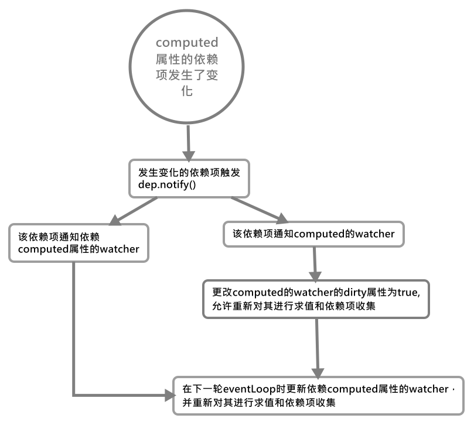

# Computed(计算属性)的 Watcher

这里我们将从计算属性的三个方面来讲解它：

-   [计算属性 Watcher 的初始化](#计算属性-watcher-的初始化)
-   [计算属性的依赖收集](#计算属性的依赖收集)
-   [依赖更新(何时与怎么进行 computed 属性更新？)](#依赖更新何时与怎么进行-computed-属性更新)
-   [计算属性其他需要注意的点](#computed-属性依赖项收集的其他注意事项)

## 计算属性 Watcher 的初始化

在最初创建`Computed`属性的`Watcher`时，其会传入如下的配置：

```js
// 计算属性的基础配置，记住这个lazy
const computedWatcherOptions = {
    lazy: true
}
// create internal watcher for the computed property.
// 为计算属性创建watcher并收集依赖项
watchers[key] = new Watcher(
    vm,

    // 计算属性定义时的函数
    getter || noop,
    noop, // noop表示undefined
    computedWatcherOptions
)
```

所以在初始化`new Watcher()`，它将进行的操作简化下来就为：

```js
this.vm = vm

// 将Watcher加入vm上的_watchers数组
vm._watchers.push(this)

// options
// 初始化配置
this.deep = false
this.user = false

// 惰性求值模式
this.lazy = true

// 是否同步计算
this.sync = false
this.before = undefined

// 仅限watch api使用，它的回调
this.cb = cb
this.id = ++uid // uid for batching

// 激活状态
this.active = true

// 注意这里，第一次求值是允许的
this.dirty = this.lazy // for lazy watchers

this.expression = expOrFn.toString()

// 计算属性的getter
this.getter = expOrFn

// 当前Watcher的值，当是computed时，延迟求值(即本次不求值)
this.value = this.value = this.lazy
    ? undefined
    : // 该函数即调用this.getter()
      this.get()
```

从上述代码可以看到，计算属性基本上就特殊处理了两个属性：

-   `.lazy`：是否启动惰性求值模式
-   `.dirty`：表示是否允许计算回调函数求值。

上述两个属性将会在后面详细理解，这里心里记住它们即可。

## 计算属性的依赖收集

依赖收集的本质，是对对应`Watcher`的回调函数(`getter`)进行求值。既然计算属性的`Watcher`在初始化时根本没有求值，那么它就不会收集依赖项，也就不会更新。

那么它什么时候进行第一次求值计算呢？设想一下既然它是**惰性求值**的，那么即只有当我们使用它时它才进行求值计算。

这里其被使用的情况指起在其他`Watcher`的`getter()`计算中被使用，所以此时我们可以看下计算属性的`getter`：

> 注意第一次初始化`Computed`的`Watcher`时，`dirty = true`

实际在我们使用过程中，我们对于计算属性的访问都是通过`this.x`这种方式来访问的。在`computed`属性初始化时，其会通过`Object.defineProperty`定义在当前的`vm`实例上，此时该属性的`getter()`函数如下：

```js
function computedGetter() {
    // 取出对应computed属性的Watcher对象
    const watcher = this._computedWatchers && this._computedWatchers[key]

    if (watcher) {
        // 如果当前Watcher允许重新求值，那么就对Watcher重新求值
        // 这里的dirty相当于是否允许求值，会在该Watcher的依赖项变更时变为true
        if (watcher.dirty) {
            // 计算原始getter()收集依赖项
            watcher.evaluate()
        }

        // 将计算属性Watcher的依赖项被当前正在使用该计算属性的Watcher收集
        if (Dep.target) {
            watcher.depend()
        }

        // 返回当前Watcher的值
        return watcher.value
    }
}
```

这里我们可以看到，当允许计算时要调用[`Watcher.prototype.evaluate()`](../README.md#watcherprototypeevaluate%e8%ae%a1%e7%ae%97watcher%e7%9a%84%e5%80%bclazy-watcher%e4%b8%93%e5%b1%9e)对`Watcher`进行求值(即调用`Watcher.getter()`函数)，此时计算属性的`watcher`会进行依赖项收集。

> 这里就涉及一个`dirty`字段来对是否可以求值来进行把控，直接说，该值会在**其依赖项更新时将其更新为`dirty = true`并在该计算属性下次被使用时，再次进行求值**。

之后在通过`watcher.depend()`，将当前计算属性`watcher`收集到的依赖项同时让当前正在使用计算属性的`watcher`进行收集。

## 依赖更新(何时与怎么进行 Computed 属性更新？)

知道了`Computed`属性如何收集依赖项后，现在我们要对如何更新进行探讨。上文我们提到每次`Computed`属性的更新都依赖于其`watcher.dirty`属性的取值：该值只会在第一次或计算属性依赖项更新后才会变化为`true`。

> 这里只简单解释依赖项更新时的流程：

1. 某个所依赖项的值发生变化，触发其`dep.notify()`
2. 通过`dep.notify()`通知对应的跟踪它的`watcher`触发`watcher.update()`
3. 在`update()`方法中，`computed`走第一条路线，改变其`watcher.dirty`的值为`true`，其含义为**允许**`computed`重新进行求值和依赖项收集。

```js
Watcher.prototype.update() {
    // computed的watcher在更新时只会更新该值，不会通过刷新队列异步更新
        if (this.lazy) {

        // 会触发这里
        this.dirty = true
    } else ...

    // 后面就略了
}
```

到此为止，该计算属性就开始等待下一个`watcher`使用它，它就能重新开始求值(调用`getter()`)，其他的过程就和依赖项收集中的求值一样了。



## Computed 属性依赖项收集的其他注意事项

从上面描述我们看出：`Computed`自身无`dep`依赖项，它不作为一个响应式的值来进行处理。**此时使用`Computed`属性的`watcher`将直接观察`Computed`所依赖的依赖项**，即这两个`watcher`，都各自收集了一次相同的依赖项。

另一方面，计算属性的依赖项如果触发更新并**不会有刷新队列的参与**，其只会单独的更新当前计算属性的`watcher.dirty = true`，这就保证了在其他地方使用计算属性时，其总能获得正确的值。

---

Last Revise: 2021/10/18
