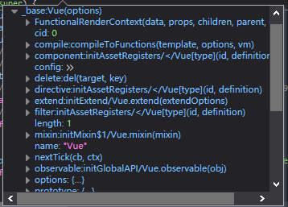
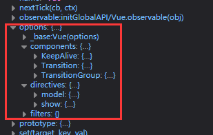

# 初始化Vue构造函数

在最初加载`Vue`类库时，会对`Vue`的构造函数进行一些初始化，向其构造函数的原型对象填充一些方法与属性，最轻易可见的就为：

```js
initMixin(Vue);
stateMixin(Vue);
eventsMixin(Vue);
lifecycleMixin(Vue);
renderMixin(Vue);
```

## 初始化原型对象的属性与API

下面就直接对上面所做的事件进行简单的战术总结：

```js
// initMixin 定义内部_init实例方法
Vue.prototype._init = function () {}

// stateMixin 定义一些内部变量栈属性查询器与两个相关的原型API
// data属性的查询器
const dataDef = {}
dataDef.get = function () {
    return this._data
}

// props属性的查询器
const propsDef = {};
propsDef.get = function () {
    return this._props
}

// 为$data与$props添加setter，不允许用户修改这两个属性
if (process.env.NODE_ENV !== 'production') {
    dataDef.set = function () {
        warn(
            'Avoid replacing instance root $data. ' +
            'Use nested data properties instead.',
            this
        )
    }
    propsDef.set = function () {
        warn(`$props is readonly.`, this)
    }
}

// 定义两个用于查询vm实例data与props的属性
Object.defineProperty(Vue.prototype, '$data', dataDef);
Object.defineProperty(Vue.prototype, '$props', propsDef);

// 定义三个实例API方法
Vue.prototype.$set = set
Vue.prototype.$delete = del
Vue.prototype.$watch = function () {}

// eventMixin 添加4个事件相关的API
Vue.prototype.$on = function () {}
Vue.prototype.$once = function () {}
Vue.prototype.$off = function () {}
Vue.prototype.$emit = function () {}

// lifecycleMixin 添加一个实例API与一个内部方法
// 内部_update方法，用于开始生成DOM结构
Vue.prototype._update = function () {}

// 外部$forceUpdate API，用于强行调度更新，更新视图
Vue.prototype.$forceUpdate = function () {}

// 外部$destroy API，用于主动销毁vm实例
Vue.prototype.$destroy = function () {}

// renderMixin 添加两个用于渲染的
//绑定与渲染函数渲染VNode有关的内部方法
installRenderHelpers(Vue.prototype);

// 外部 $nextTick API 用于在更新队列中添加某些执行回调
Vue.prototype.$nextTick = function () {}

// 内部_render方法，用于根据组件定义的模版或渲染函数生成初始的VNode Tree
Vue.prototype._render = function () {}
```

以上皆为在初始化`Vue`构造函数阶段添加的内部方法与实例方法，其中`installRenderHelpers()`中添加的方法将会在通过`render()`函数(即我们定义的模版生成的渲染函数或直接定义的渲染函数)生成`VNode`时使用到，学习也是到时候的事情了。

### __patch__()补丁函数的添加

在`Vue`构造函数最初初始化时，还向其原型添加了以下函数：

- `__patch__`：给`dom`打补丁，用于更新`dom`
- `$mount`：生成`VNode`与`dom`元素

```js
// install platform patch function
// 初始化平台的补丁函数，用于更新dom
Vue.prototype.__patch__ = inBrowser ? patch : noop

// public mount method
Vue.prototype.$mount = function (
    el ? : string | Element,
    hydrating ? : boolean
): Component {

    // 获取挂载的DOM元素
    el = el && inBrowser ? query(el) : undefined;

    // 解析组件
    return mountComponent(this, el, hydrating)
}
```

这里就简单过目一下，其中`$mount()`函数将会在之后被替换为另一个函数，同样这也是到时候该知道的事情，除此之外还有一些构造函数API。

## 初始化构造函数上的API

在最初初始化`Vue`构造函数时，会调用`initGlobalAPI()`方法来对`Vue`构造函数添加一些属性、API

以下是它的具体代码：

```js
const ASSET_TYPES = [
  'component',
  'directive',
  'filter'
];

function initGlobalAPI(Vue: GlobalAPI) {

    // config Vue的全局配置，配置Vue的一些行为，配置对象仅可查，不可重写
    const configDef = {};
    configDef.get = () => config;
    if (process.env.NODE_ENV !== 'production') {
        configDef.set = () => {
            warn(
                'Do not replace the Vue.config object, set individual fields instead.'
            )
        }
    }
    Object.defineProperty(Vue, 'config', configDef)

    // exposed util methods.
    // NOTE: these are not considered part of the public API - avoid relying on
    // them unless you are aware of the risk.
    // 暴露一些工具方法(非公共API)
    Vue.util = {
        warn,
        extend,
        mergeOptions,
        defineReactive
    };
    Vue.set = set;
    Vue.delete = del;
    Vue.nextTick = nextTick;

    // 2.6 explicit observable API
    // 一个API用于使一个对象变为响应式的
    Vue.observable = obj => {
        observe(obj);
        return obj;
    }

    // 给3个基本组件属性配置一个空对象
    Vue.options = Object.create(null);
    ASSET_TYPES.forEach(type => {
        Vue.options[type + 's'] = Object.create(null)
    })

    // this is used to identify the "base" constructor to extend all plain-object
    // components with in Weex's multi-instance scenarios.
    Vue.options._base = Vue;

    // 将内部组件挂载在全局组件配置上，这里仅keep-alive组件
    extend(Vue.options.components, builtInComponents);

    // 又在Vue上挂载一些API，具体用到时在解释
    initUse(Vue);
    initMixin(Vue);
    initExtend(Vue);
    initAssetRegisters(Vue);
}
```

上述后`4`个方法可以简述为：

```js
// initUse(Vue); 添加一个用于添加插件的API
Vue.use = function () {}

// initMixin(Vue); 添加一个用于改变默认options的API
Vue.mixin = function () {}

// initExtend(Vue); 添加一个用于拓展原始Vue构造函数并生成新的Vue构造函数的API
Vue.extend = function () {}

// initAssetRegisters(Vue); 为component、directive、filter添加查询函数，这些函数用于注册全局的指令和组件。
Vue.component = function () {}
Vue.directive = function () {}
Vue.filter = function () {}
```

### 浏览器平台上的Vue构造函数的API

另外我们还知道内置组件还有两个关于过渡动画的组件，这两个组件必须要在浏览器平台支持下加载，所以被单独分割了出去：

```js
// install platform specific utils
// 安装浏览器平台特殊的工具方法
Vue.config.mustUseProp = mustUseProp
Vue.config.isReservedTag = isReservedTag
Vue.config.isReservedAttr = isReservedAttr
Vue.config.getTagNamespace = getTagNamespace
Vue.config.isUnknownElement = isUnknownElement

// install platform runtime directives & components
// 安装浏览器平台运行时的指令和内部组件(transition/transition-group)
extend(Vue.options.directives, platformDirectives);
extend(Vue.options.components, platformComponents);
```

### extend()——将from对象的属性混入目标对象中

这里出现的`extend()`，相当于我们的浅复制，简单过目即可：

```js
function extend(to: Object, _from: ? Object): Object {
    for (const key in _from) {
        to[key] = _from[key];
    }
    return to;
}
```

### Vue.use()——插件的安装

[查看](./Vue.use/README.md)
___

那么最终的Vue构造函数上为什么样呢？这里截一张图：


其中`options`中包含


如果你写过`Vue`的组件，那么你就会觉得，这不就是组件配置对象吗！没错，你可以假设它为一个全局的组件配置对象，所以我们才能在任何地方使用其中的组件和指令。
