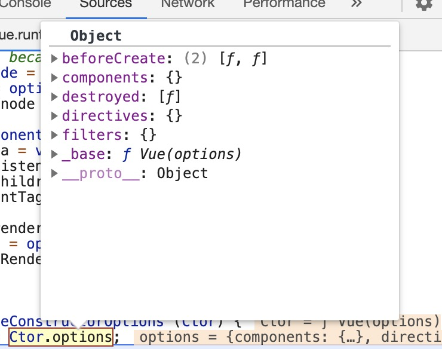

# Vue

现在开始将就算正式学习`Vue`源码, 学习这部分的源码还是以实例化一个`Vue`实例开始。初始化`Vue`实例有两种情况：

- 根`Vue`实例实例化
- 组件`Vue`实例实例化

但在实例化`Vue`实例之前，我们先来看看`Vue`做了哪些准备工作。这里由于篇幅原因，请跳[查看](./初始化Vue构造函数/README.md)。

当然你也可以跳过，现在直接开始！

- [根 Vue 实例实例化函数 - _init()](#根-vue-实例实例化)
- [实例化 - beforeCreate函数调用期间](#beforecreate)
- [beforeCreate - Created函数调用期间](#created)
- [Created - beforeMount函数调用期间](#beforemount)
- [beforeMount - Mounted函数调用期间](#mounted)

## 根 Vue 实例实例化

当我们实例化(`new`)一个根`Vue`实例并将其挂载到一个`DOM`元素上时，一切就开始了。

```js
// 将Vue实例渲染的视图挂载在class为xxx的元素上
new Vue({ el: '.xxx' })

// or
new Vue().$mount('.xxx')
```

从`Vue`的构造函数可以看出，它的实例化源于其自身的`_init()`方法，这个方法是在最初`initMixin()`时注入到`Vue`原型上的方法。

```js
function Vue(options) {
    //只能做构造函数使用
    if (!(this instanceof Vue)) {
        warn('Vue is a constructor and should be called with the `new` keyword')
    }

    //初始化
    this._init(options)
}
```

其`_init()`函数具体的代码为(这里为了阅读流畅，直接将组件实例化相关的代码删除了)：
[下面代码涉及文件](../vueSourceCode/src/core/instance/init.js)

```js
Vue.prototype._init = function (options?: Object) {
    const vm: Component = this

    // a uid 一个唯一标识符
    vm._uid = uid++

    // 一个性能测试功能，可以无视
    let startTag, endTag
    if (process.env.NODE_ENV !== 'production' && config.performance && mark) {
        startTag = `vue-perf-start:${vm._uid}`
        endTag = `vue-perf-end:${vm._uid}`
        mark(startTag)
    }

    // a flag to avoid this being observed
    // 一个避免vm实例对象作为依赖性观察的标记
    vm._isVue = true

    // 对构造函数上的默认配置和用户传入的配置进行合并
    // （这里就会处理你的生命周期函数和data等数据，不同的字段有不同的处理方式）
    vm.$options = mergeOptions(
        // 返回Vue.options，即全局组件配置，如下面图片中所示
        resolveConstructorOptions(vm.constructor),

        // 我们定义的根vm实例的options
        options || {},
        vm
    )

    // 对vm实例进行代理，以便在调用渲染函数render()时直接访问vm实例上属性
    if (process.env.NODE_ENV !== 'production') {
        initProxy(vm)
    } else {
        vm._renderProxy = vm
    }

    vm._self = vm

    // beforeCreate周期阶段，初始化各种函数
    initLifecycle(vm)
    initEvents(vm)
    initRender(vm)
    callHook(vm, 'beforeCreate')

    // created阶段，初始化state
    initInjections(vm) // resolve injections before data/props
    initState(vm)
    initProvide(vm) // resolve provide after data/props
    callHook(vm, 'created')

    // 可以查看初始化该实例时的性能情况
    if (process.env.NODE_ENV !== 'production' && config.performance && mark) {
        vm._name = formatComponentName(vm, false)
        mark(endTag)
        measure(`vue ${vm._name} init`, startTag, endTag)
    }

    // 如果vm实例有el属性，则挂载
    if (vm.$options.el) {
        vm.$mount(vm.$options.el)
    }
}
```



按照注释和方法名称，你应该对这些阶段做的事情有个大致的了解了，那么现在来具体看下它们！

接下来我们会按照`Vue`的**生命周期顺序**来阅读源码。

## beforeCreate

在`beforeCreate`阶段，`Vue`会处理用户传入的`Options`配置[详情](./beforeCreate/合并Options/README.md)，之后便调用各种的初始化函数：

1. [initProxy——初始化 Vue 实例对自身的代理](./beforeCreate/初始化Proxy/README.md)
2. [initLifeCycle——初始化实例自身的一些属性](./beforeCreate/初始化生命周期/README.md)
3. [initEvents——初始化组件的自定义事件](./beforeCreate/初始化Events/README.md)
4. [initRender——初始化模版](./beforeCreate/初始化Render/README.md)

以上的全部操作呢，总结起来就是初始化各种所需的配置属性，还有 vm 实例上的各种属性，当然此时还未对数据进行响应式的处理，只能说是轻微的预备处理。之后便调用了第一个生命周期函数`beforeCreate`。

> 个人感觉这个生命周期钩子函数存在的意义不大。

## created

之后便在`created`这个阶段进行`state`数据的初始化，初始化的数据包括：

1. [initInject——初始化 inject 属性](./create/初始化Inject)
2. [initState——初始化各种属性(重要)](./create/初始化State)
3. [initProvide](./create/初始化Provide)

这些数据也就是我们在组件配置中自定义的各种变量数据。最后触发一下`create`钩子函数，在这个阶段，可以看出，所有的数据都已经准备就绪了，做好了响应式处理。

## beforeMount

这个阶段`Vue`会对用户配置的模版进行解析和编译，生成一个`render`函数，这里必须要求用户在第一个`Vue.options`中挂载一个具体的元素，或则自己稍后手动调用`$mount()`函数挂载，我们直接看正常情况下：

```js
if (vm.$options.el) {
    vm.$mount(vm.$options.el)
}
```

查看[`beforeMount`](./beforeMount/README.md)阶段所作所为

## mounted

在这个阶段`Vue`要根据根实例模版生成的`render()`函数，为其生成一个渲染`Watcher`，然后开始根据`render()`函数生成的`VNode`树(此时仅包含根实例模版的)生成对应的结构，当解析到组件`VNode`时，递归为其创建组件`vm`实例，然后重复根实例的全部生命周期。。。最后将生成的元素根节点挂载到根实例的`$el`上，并返回根实例，到此为止整个初始化过程就结束了。

[mounted 阶段详情](./mounted/README.md)
