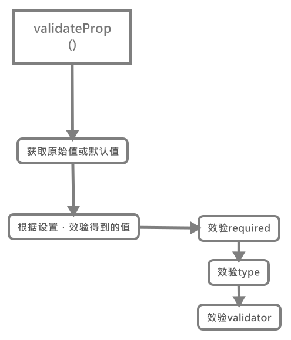

# 验证属性——validateProp()

效验`Props`中属性的值，也即是我们我们定义`Props`属性的最重要的部分。基本上`Props`的功能就集中在效验这一块，那么这里我们来详细说明一下。

首先依然是其的整体函数：

```js
function validateProp(
    key: string,
    propOptions: Object,
    propsData: Object,
    vm ? : Component
): any {

    // 获取当前prop的配置对象
    const prop = propOptions[key];

    // 是否未传入该prop值
    const absent = !hasOwn(propsData, key);

    // 获取传入组件的prop值
    let value = propsData[key];

    // 检查type是否为Boolean类型，并返回其下标(这里主要是针对数组形式的type)
    const booleanIndex = getTypeIndex(Boolean, prop.type);

    // 如果可选type存在Boolean类型，则对其值进行检查
    // 下面的实际上是将其他type的空值都转化为Boolean类型
    if (booleanIndex > -1) {

        // 如果未传入该prop值且未定义默认值时，则赋值为false
        if (absent && !hasOwn(prop, 'default')) {
            value = false;

        // 如果传入空字符串或同键名的字符串值，也认为是有值
        } else if (value === '' || value === hyphenate(key)) {
            // only cast empty string / same name to boolean if
            // boolean has higher priority
            // 两个单独的例子，在空字符串或同名的键值时
            // 如果Boolean类型具有更高的权重，则将其转化为布尔值
            const stringIndex = getTypeIndex(String, prop.type)
            if (stringIndex < 0 || booleanIndex < stringIndex) {
                value = true
            }
        }
    }

    // 检查是否有default默认值, 在该props值为undefined时，用默认值代替它
    // 这里注意是全等undefined！传入null无效
    if (value === undefined) {

        // 获取设置的default默认值
        value = getPropDefaultValue(vm, prop, key)

        // since the default value is a fresh copy,
        // make sure to observe it.
        // 因为默认值为新创建的对象, 所以需要为其转化为响应式
        const prevShouldObserve = shouldObserve;
        toggleObserving(true);

        // 对对象类型的value变更为响应式
        observe(value);
        toggleObserving(prevShouldObserve)
    }

    // 效验设置的prop条件限制
    if (
        process.env.NODE_ENV !== 'production' &&
        // skip validation for weex recycle-list child component props
        !(__WEEX__ && isObject(value) && ('@binding' in value))
    ) {
        // 检测一个prop属性是否合法(包括type、require和valid属性)
        assertProp(prop, key, value, vm, absent)
    }
    return value;
}
```

简看以上效验Prop属性的部分，其实主要做了两件事：

- [获取原值或默认值](#%e8%8e%b7%e5%8f%96%e5%8e%9f%e5%a7%8b%e5%80%bc%e6%88%96%e9%bb%98%e8%ae%a4%e5%80%bc)
- [根据设置，效验得到的值](#%e6%a0%b9%e6%8d%ae%e8%ae%be%e7%bd%ae%e6%95%88%e9%aa%8c%e5%be%97%e5%88%b0%e7%9a%84%e5%80%bc)

## 获取原始值或默认值

那么首先是第一部分，这部分还是比较好理解，一个`prop`属性的值，首先是通过组件传递来获取，其次在其值为`undefined`时，从其设置的`default`函数中获取。**这里要特别强调是prop属性值为undefined时，才会获取默认值，即传入null，是会被作为prop值使用的**

### 特殊值的转换——Boolean

在传入值为`''`(空字符串)或同`prop`属性名一样的值的情况下，如果设置`type: Boolean`或`type: [Boolean, String]`，那么`Vue`会将其转换为`false`。

```js
if (booleanIndex > -1) {

    // 如果未传入该prop值且未定义默认值时，则赋值为false
    if (absent && !hasOwn(prop, 'default')) {
        value = false;

    // 如果传入空字符串或同键名的字符串值，也认为是有值
    } else if (value === '' || value === hyphenate(key)) {
        // only cast empty string / same name to boolean if
        // boolean has higher priority
        // 两个单独的例子，在空字符串或同名的键值时
        // 如果Boolean类型具有更高的权重，则将其转化为布尔值
        const stringIndex = getTypeIndex(String, prop.type)
        if (stringIndex < 0 || booleanIndex < stringIndex) {
            value = true;
        }
    }
}
```

这里表达的意思就是在`Boolean`权重较大时，优先将`''`看做空值处理转化为`false`
___
其中涉及到获取下标的函数，具体查看请自行前往[`getTypeIndex()`](../工具方法/README.md#gettypeindex%e6%a3%80%e6%b5%8b%e4%bc%a0%e5%85%a5%e7%b1%bb%e5%9e%8b%e6%98%af%e5%90%a6%e7%ac%a6%e5%90%88%e6%9f%90%e4%b8%80%e4%b8%aa%e7%b1%bb%e5%9e%8b%e8%a6%81%e6%b1%82)；
`hasOwn()`函数则是`Object.prototype.hasOwnProperty()`的封装。

### 获取默认值

那么在未传递或传递的值为`undefined`(`null`被视为有值)的情况，会优先获取组件该`prop`定义的`default`的返回值来作为默认值。

```js
if (value === undefined) {

    // 获取设置的default默认值
    value = getPropDefaultValue(vm, prop, key)
}
```

这个函数就用来获取default中设置的值，一般情况下它直接获取我们当初定义在组件的值即可，但倘若在新的一次渲染中，该值仍然取默认值，那么则会直接返回上一次渲染获取的值，而避免重新对其进行响应式处理(函数比较简单，直接查看其中的注释即可)：

```js
/**
 * Get the default value of a prop.
 * 获取一个prop属性的默认值
 */
function getPropDefaultValue(vm: ? Component, prop : PropOptions, key: string): any {

    // 未配置默认值时, 返回undefined
    if (!hasOwn(prop, 'default')) {
        return undefined
    }

    const def = prop.default;

    // warn against non-factory defaults for Object & Array
    // 在Object/Array类型时, default必须是工厂函数的形式
    if (process.env.NODE_ENV !== 'production' && isObject(def)) {
        warn(
            'Invalid default value for prop "' + key + '": ' +
            'Props with type Object/Array must use a factory function ' +
            'to return the default value.',
            vm
        )
    }

    // the raw prop value was also undefined from previous render,
    // return previous default value to avoid unnecessary watcher trigger
    // 如果在上次渲染中该prop的值同样为undefined,
    // 那么直接返回上次渲染获取的prop默认值来避免不必要的watcher的触发
    if (vm && vm.$options.propsData &&
        vm.$options.propsData[key] === undefined &&
        vm._props[key] !== undefined
    ) {
        return vm._props[key]
    }

    // call factory function for non-Function types
    // a value is Function if its prototype is function even across different execution context
    return typeof def === 'function' && getType(prop.type) !== 'Function' ?
        def.call(vm) :
        def
}
```

在获取完其值之后呢，如果该值为对象类型的值，那么我们还需要将其进行响应式处理，将对象内的键值对变更为响应式的(这里只让大家清楚有这么一个操作，具体之后会详细介绍这部分)：

```js
// 对对象类型的value变更为响应式
observe(value);
```

___
到此为止，对于`prop`值的获取就处理完了，接下来我们要按照定义在主键上`prop`的各种限制对其进行断言：

```js
// 检测一个prop属性是否合法(包括type、require和valid属性)
assertProp(prop, key, value, vm, absent);
```

## 根据设置，效验得到的值

承接上文，这里我们直接来看assertProp()这个函数。

```js
/**
 * Assert whether a prop is valid.
 * 断言一个prop是否有效
 */
function assertProp(
    prop: PropOptions,
    name: string,
    value: any,
    vm: ? Component,

    // 是否未传入prop值
    absent : boolean
) {

    // 当设置required但未传入值时
    if (prop.required && absent) {
        warn(
            'Missing required prop: "' + name + '"',
            vm
        )
        return;
    }

    // 当设置required时，传入null会直接通过效验
    if (value == null && !prop.required) {
        return
    }
    let type = prop.type;

    // 是否效验通过，当传入非true的type时，一开始是不通过的
    let valid = !type || type === true
    const expectedTypes = [];

    // 格式化type中的类型筛选，将其格式为数组
    if (type) {

        // 首先格式化为数组
        if (!Array.isArray(type)) {
            type = [type]
        }

        // 遍历type中各个类型，看prop值是否符合其中一个类型
        // 这里还有个条件为!valid，所以一旦有一个值效验成功，
        for (let i = 0; i < type.length && !valid; i++) {

            // 断言该type类型，并返回结果
            const assertedType = assertType(value, type[i]);

            // 将定义的type转化为字符串后重新加入expectedTypes
            expectedTypes.push(assertedType.expectedType || '');

            // 变更效验值状态
            valid = assertedType.valid;
        }
    }

    // 如果valid值仍为false，则报错类型检查未通过
    if (!valid) {
        warn(
            getInvalidTypeMessage(name, value, expectedTypes),
            vm
        )
        return
    }

    // 如果用户设置效验器
    const validator = prop.validator;
    if (validator) {

        // 若效验器返回false则说明效验未通过，则报错
        if (!validator(value)) {
            warn(
                'Invalid prop: custom validator check failed for prop "' + name + '".',
                vm
            )
        }
    }
}
```

总结下效验的步骤，本次效验一个效验了三个属性：

- `required`
- `type`
- `validator`

这里我直接简述下三个效验的过程：

首先是`required`函数，只要用户未向组件传入值，则定性为错误；其次是`type`，只要用户传入值或得到的默认值符合`type`数组中任意一个数据类型类，那么则视为有效；最后则是`validator`效验器，只要效验器函数值返回真值，那么则认为其有效。

>这其中断言`type`时，使用的[`assertType()`](../工具方法/README.md#asserttype%e6%96%ad%e8%a8%80value%e6%98%af%e5%90%a6%e4%b8%batype%e7%b1%bb%e5%9e%8b)方法用于确认`value`是否属于`type`的同类别函数。

到此为止，整个效验过程就结束了。


