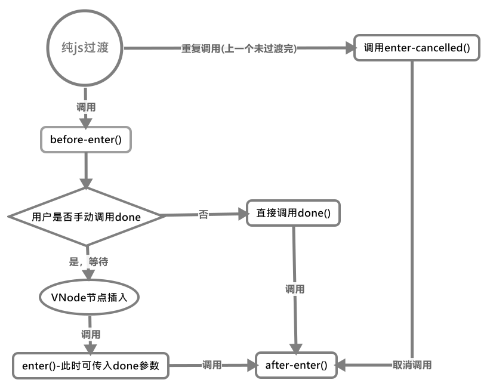

# 入场过渡

首先是入场过渡，它会在元素被添加到`DOM`时开始执行过渡，而元素被添加到`DOM`也有两种方式：

- `activate`：动态组件被激活时
- `created`：`DOM`元素生成时

这两个阶段都是调用的同一个函数`_enter()`:

```js
function _enter(_: any, vnode: VNodeWithData) {

    // 是否通过v-show进行过渡动画，如果是这里就不进行过渡
    if (vnode.data.show !== true) {

        // 调用enter函数，对element进行过渡操作
        enter(vnode);
    }
}
```

该函数在确保元素不是通过`v-show`来进行显示的(`.show !== true`)的情况下调用模块内部的`enter()`方法开始执行一系列的过渡动画操作。因为之后在[更新指令](../../更新指令/README.md)中我们会看到，`v-show`如果是在`transition`组件上，那么是会自己手动调用`transition`过渡动画来过渡的。

## enter()——执行入场动画

该函数集成了所有对动画的处理，所以说比较复杂。用户可以通过`css`或`js`来对`<transition>`所包含的元素进行动画操作，碍于函数的长度，我们通过截取代码片段来学习(即下面这部分代码仅供快速浏览和对比，好来查找之后代码片段具体所在的部分)：

```js
function enter(vnode: VNodeWithData,  : ? () => void) {

    // 获取要进行动画节点的元素
    const el: any = vnode.elm;

    // call leave callback now
    // 是否有离开的回调函数，有则调用
    if (isDef(el._leaveCb)) {
        el._leaveCb.cancelled = true
        el._leaveCb()
    }

    // 获取transition标签上的属性，对其进行处理
    const data = resolveTransition(vnode.data.transition);

    // 如果没有transition属性，则直接返回
    if (isUndef(data)) {
        return
    }

    // 如果有定义进入时的函数，或不为元素节点，则直接退出
    if (isDef(el._enterCb) || el.nodeType !== 1) {
        return;
    }

    // 提取其transition中的具体的属性
    const {
        css,

        // Vue需要监听的过渡类型
        type,
        enterClass,
        enterToClass,
        enterActiveClass,
        appearClass,
        appearToClass,
        appearActiveClass,
        beforeEnter,
        enter,
        afterEnter,
        enterCancelled,
        beforeAppear,
        appear,
        afterAppear,
        appearCancelled,
        duration
    } = data;

    // activeInstance will always be the <transition> component managing this
    // transition. One edge case to check is when the <transition> is placed
    // as the root node of a child component. In that case we need to check
    // <transition>'s parent for appear check.
    // 当前的vm实例总会成了组件来管理<transition>的过渡。一个边缘情况是，当<transition>
    // 作为一个子组件的根VNode节点时，我们需要查找其父节点
    let context = activeInstance;

    // 获取当前vm实例的根节点
    let transitionNode = activeInstance.$vnode;

    // 一直向上查找，直到找到transition所在的上下文vm实例
    while (transitionNode && transitionNode.parent) {
        context = transitionNode.context;
        transitionNode = transitionNode.parent;
    }

    // 是否需要初始化渲染，需要初始化渲染即vm实例还未挂载DOM上或当前动画节点不为根节点
    const isAppear = !context._isMounted || !vnode.isRootInsert;

    // 如果已经显示且未指定在初始渲染时使用过渡或初始渲染函数，则直接返回
    if (isAppear && !appear && appear !== '') {
        return;
    }

    // 仅在需要初始化渲染且存在appear类取用appear类，默认使用css类
    const startClass = isAppear && appearClass ?
        appearClass : enterClass;
    const activeClass = isAppear && appearActiveClass ?
        appearActiveClass : enterActiveClass;
    const toClass = isAppear && appearToClass ?
        appearToClass : enterToClass;

    // 优先取用appear类型的过渡函数，默认使用css类过渡函数
    const beforeEnterHook = isAppear ?
        (beforeAppear || beforeEnter) : beforeEnter;

    // enter函数优先取appear中定义的，没有则取用enter定义的
    const enterHook = isAppear ?
        (typeof appear === 'function' ? appear : enter) : enter;
    const afterEnterHook = isAppear ?
        (afterAppear || afterEnter) : afterEnter;
    const enterCancelledHook = isAppear ?
        (appearCancelled || enterCancelled) : enterCancelled;

    // 计算动画时间(ms)，这里可以为进入动画和离开动画分别指定时间
    const explicitEnterDuration: any = toNumber(
        isObject(duration) ? duration.enter : duration );

    // 检查定义的动画时间间隔是否合法
    if (process.env.NODE_ENV !== 'production' && explicitEnterDuration != null) {
        checkDuration(explicitEnterDuration, 'enter', vnode)
    }

    // 是否使用css动画(指定css为false或IE9时不使用)
    const expectsCSS = (css !== false) && !isIE9;

    // 获取进入时动画的钩子函数的参数数量(大于1个时返回true，即表示用户是否要操作第二个参数done)
    const userWantsControl = getHookArgumentsLength(enterHook);

    // 给元素添加一次性的进入时动画的函数
    const cb = el._enterCb = once(() => {

        // 执行css动画时，移除enter-to与enter-active的class
        if (expectsCSS) {
            removeTransitionClass(el, toClass);
            removeTransitionClass(el, activeClass);
        }

        // 如果该回调被取消，则直接移除enter的class
        if (cb.cancelled) {
            if (expectsCSS) {
                removeTransitionClass(el, startClass)
            }

            // 并执行取消的回调函数
            enterCancelledHook && enterCancelledHook(el)
        } else {

            // 没被取消时，则直接调用after-enter的回调函数
            afterEnterHook && afterEnterHook(el)
        }

        // 清空进入时的回调函数
        el._enterCb = null
    });

    // 节点是否是通过v-show显示，这里是v-show指令的标记(针对transition)
    if (!vnode.data.show) {

        // remove pending leave element on enter by injecting an insert hook
        // 注入一个insert钩子函数来移除准备要在进入动画时移除的元素
        // 想该VNode的hook对象中insert钩子函数中封装并添加一个函数
        mergeVNodeHook(vnode, 'insert', () => {
            const parent = el.parentNode
            const pendingNode = parent && parent._pending && parent._pending[vnode.key]
            if (pendingNode &&
                pendingNode.tag === vnode.tag &&
                pendingNode.elm._leaveCb
            ) {
                pendingNode.elm._leaveCb()
            }
            enterHook && enterHook(el, cb)
        })
    }

    // start enter transition
    // 开始进入的动画，调用用户定义的beforeEnter函数
    beforeEnterHook && beforeEnterHook(el);

    // 根据是否使用css样式来决定之后的操作
    if (expectsCSS) {

        // 添加enter与enter-acitve的class
        addTransitionClass(el, startClass);
        addTransitionClass(el, activeClass);

        // 取消执行进入过渡时，取消执行下面的操作
        nextFrame(() => {
            removeTransitionClass(el, startClass);

            // 如果没有取消，则添加剩余的动画class
            if (!cb.cancelled) {

                // 添加enter-to的class
                addTransitionClass(el, toClass);

                // 此时，如果用户不想操作动画，则在动画执行完的时间间隔后，执行刚才的cb
                if (!userWantsControl) {

                    // 当进入动画指定间隔时间时，在间隔时间后移除enter系列的所有class
                    if (isValidDuration(explicitEnterDuration)) {
                        setTimeout(cb, explicitEnterDuration);

                    // 否则，自动侦测过渡类型并执行动画
                    } else {
                        whenTransitionEnds(el, type, cb)
                    }
                }
            }
        })
    }

    // 如果该VNode节点通过v-show显示，那么还要调用其传入的变更display的函数
    if (vnode.data.show) {
        toggleDisplay && toggleDisplay();

        // 执行进入的钩子函数
        enterHook && enterHook(el, cb);
    }

    // 若不使用css，且用户对js动画函数不进行额外的控制，则直接调用回调，执行之后的回调函数
    if (!expectsCSS && !userWantsControl) {
        cb()
    }
}
```

### 阶段1——处理参数

首先进入动画时，先查看元素是否已经注册了离开的过渡**完成后**的回调函数，如果有则说明该元素正在执行离开的过渡动画但未执行最后的完成回调。此时直接取消原本时间后的回调函数并立刻执行来结束。(`_leaveCb`在过渡的离开阶段才会定义)

```js
// 获取要进行动画节点的元素
const el: any = vnode.elm;

// call leave callback now
// 是否有离开的回调函数，有则调用
if (isDef(el._leaveCb)) {
    el._leaveCb.cancelled = true;
    el._leaveCb()
}
```

之后便是调用[`resolveTransition()`](../工具方法/README.md#resolvetransition%e5%a4%84%e7%90%86%e6%8a%bd%e8%b1%a1%e7%bb%84%e4%bb%b6%e4%b8%ad%e7%9a%84%e5%b1%9e%e6%80%a7)函数来将用户定义在`<transition>`标签上的各种属性处理后整合到一个对象中(这些属性虽然定义在`<transition>`组件上，但会被处理到`<transition>`组件内的非抽象根元素的`.transition`上)

```js
// 获取transition标签上的属性，对其进行处理
const data = resolveTransition(vnode.data.transition);

// 如果没有transition属性，则直接返回
if (isUndef(data)) {
    return
}

// 如果有定义进入时的函数，或不为元素节点，则直接退出
if (isDef(el._enterCb) || el.nodeType !== 1) {
    return;
}
```

若未有任何关于`<transition>`组件的属性，则直接返回，说明没有该组件的参与，同时如果已挂载了`._enterCb`则说明已经调用过该函数，但未处理完，那么直接返回防止重复调用。
____
之后便是对刚刚提取的属性的单独提取：

```js
// 提取其transition中的具体的属性
const {
    css,

    // Vue需要监听的过渡类型
    type,
    enterClass,
    enterToClass,
    enterActiveClass,
    appearClass,
    appearToClass,
    appearActiveClass,
    beforeEnter,
    enter,
    afterEnter,
    enterCancelled,
    beforeAppear,

    // 是否在初始渲染时执行效果，指定函数或布尔值
    appear,
    afterAppear,
    appearCancelled,

    // 动画时间
    duration
} = data;
```

具体属性的函数建议[立即阅读我们的文档.jpg](https://cn.vuejs.org/v2/api/#transition)

之后便是对`<transition>`组件所处的上下文的确认，我们要确保其所在的上下文是否已经在`DOM`中挂载，或需不需要在初始渲染中使用过渡效果。

```js
// activeInstance will always be the <transition> component managing this
// transition. One edge case to check is when the <transition> is placed
// as the root node of a child component. In that case we need to check
// <transition>'s parent for appear check.
// 当前的vm实例总会成了组件来管理<transition>的过渡。一个边缘情况是，当<transition>
// 作为一个子组件的根VNode节点时，我们需要查找其父节点
let context = activeInstance;

// 获取当前vm实例的根节点
let transitionNode = activeInstance.$vnode;

// 一直向上查找，直到找到transition所在的上下文vm实例
while (transitionNode && transitionNode.parent) {
    context = transitionNode.context;
    transitionNode = transitionNode.parent;
}

// 是否需要初始化渲染，需要初始化渲染即vm实例还未挂载DOM上或当前动画节点不为根节点
const isAppear = !context._isMounted || !vnode.isRootInsert;

// 如果已经显示且未指定在初始渲染时使用过渡或初始渲染函数，则直接返回
if (isAppear && !appear && appear !== '') {
    return;
}
```

通过上面这一小截代码我们可以看到，`<transition>`组件会归属到包含其的`vm`实例中管理，且未特殊指明`appear`属性，它不会在初始化渲染时进行过渡时。

接下来便是对`css-class`或`js`回调函数的处理，在同时定义`appear`类型和普通类型的过渡时，优先取用`appear`类型的过渡；优先在初始化渲染时使用`appear`类的`class`

```js
// 仅在需要初始化渲染且存在appear类取用appear类，默认使用css类
const startClass = (isAppear && appearClass) ?
    appearClass : enterClass;
const activeClass = (isAppear && appearActiveClass) ?
    appearActiveClass : enterActiveClass;
const toClass = (isAppear && appearToClass) ?
    appearToClass : enterToClass;

// 优先取用appear类型的过渡函数，默认使用css类过渡函数
const beforeEnterHook = isAppear ?
    (beforeAppear || beforeEnter) : beforeEnter;

    // enter函数优先取appear中定义的，没有则取用enter定义的
const enterHook = isAppear ?
    (typeof appear === 'function' ? appear : enter) : enter;
const afterEnterHook = isAppear ?
    (afterAppear || afterEnter) : afterEnter;
const enterCancelledHook = isAppear ?
    (appearCancelled || enterCancelled) : enterCancelled;

// 计算动画时间(ms)，这里可以为进入动画和离开动画分别指定时间
const explicitEnterDuration: any = toNumber(
    isObject(duration) ? duration.enter : duration );

// 检查定义的动画时间间隔是否合法
if (process.env.NODE_ENV !== 'production' && explicitEnterDuration != null){
    checkDuration(explicitEnterDuration, 'enter', vnode)
}

// 是否使用css动画(指定css为false或IE9时不使用)
const expectsCSS = (css !== false) && !isIE9;
```

对应的类如图：


>这里说个题外话，上面对于css-class的选择，使用的运算符为&&和三元运算符，当两者一起使用时，[&&的优先级大于三元运算符](https://developer.mozilla.org/zh-CN/docs/Web/JavaScript/Reference/Operators/Operator_Precedence)，靠下面这个小例子可以说明:

```js
let a = 'a',
    b = 'b',
    c = undefined,
    d = c && a ? a : b;
// d为'b'，如果三元运算符优先级大于&&则d为undefined
```

____
之后便调用[`getHookArgumentsLength()`](../工具方法/README.md#gethookargumentslength%e8%8e%b7%e5%8f%96%e9%92%a9%e5%ad%90%e5%87%bd%e6%95%b0%e5%8f%82%e6%95%b0%e9%95%bf%e5%ba%a6)函数来确认用户使用的`enter`动画函数的参数，当参数为一个以上时，就会被定为用户要操作其第二个参数`done`，因为该参数为可选的，之后在调用时再来解释`done`的作用。

#### 过渡完成时的回调处理

最后再给元素添加一个一次性的入场动画执行完毕的回调函数：

```js
// 给元素添加一次性的进入时动画的函数
const cb = el._enterCb = once(() => {

    // 执行css动画时，移除enter-to与enter-active的class
    if (expectsCSS) {
        removeTransitionClass(el, toClass);
        removeTransitionClass(el, activeClass);
    }

    // 如果该回调被取消，则直接移除enter的class
    if (cb.cancelled) {
        if (expectsCSS) {
            removeTransitionClass(el, startClass)
        }

        // 并执行取消的回调函数
        enterCancelledHook && enterCancelledHook(el)
    } else {

        // 没被取消时，则直接调用after-enter的回调函数
        afterEnterHook && afterEnterHook(el)
    }

    // 清空进入时的回调函数
    el._enterCb = null
});
```

首先该函数用[`once()`](../工具方法/README.md#once%e5%8f%aa%e6%89%a7%e8%a1%8c%e4%b8%80%e6%ac%a1%e7%9a%84%e5%87%bd%e6%95%b0)函数包装的，使其只能调用一次，之后重复调用不会产生副作用。

如果使用`css-class`那么该函数首先移除`enter-to`与`enter-active`的`class`，它们的移除表示入场过渡动画的结束。之后再调用`after-enter-hook`函数；如果突然取消入场过渡则移除`enter-class`并调用`enter-cancell-hook`。

最后清空元素的`._enterCb`
____
**目前还不需要了解该回调函数的作用**，如果该元素是不是通过`v-show`指令显示，那么还会调用[`mergeVNodeHook()`](../工具方法/README.md#mergevnodehook%e5%90%88%e5%b9%b6vnode%e7%9a%84%e6%9f%90%e4%b8%aa%e9%92%a9%e5%ad%90%e5%87%bd%e6%95%b0)为其`hook.insert`中再添加一个生命周期函数：

```js
// 节点是否是通过v-show显示，这里是v-show指令的标记(针对transition)
if (!vnode.data.show) {

    // remove pending leave element on enter by injecting an insert hook
    // 注入一个insert钩子函数来移除准备要在进入动画时移除的元素
    // 想该VNode的hook对象中insert钩子函数中封装并添加一个函数
    mergeVNodeHook(vnode, 'insert', () => {
        const parent = el.parentNode
        const pendingNode = parent && parent._pending && parent._pending[vnode.key];

        // 优先调用离开的回调函数
        if (pendingNode &&
            pendingNode.tag === vnode.tag &&
            pendingNode.elm._leaveCb
        ) {
            pendingNode.elm._leaveCb()
        };

        // 再调用进入的enterHook
        enterHook && enterHook(el, cb);
    })
}
```

到此为止参数准备阶段就完毕了，开始进入入场过渡动画执行阶段。

### 阶段2——执行过渡

在执行入场过渡的阶段，首先调用`js`的钩子函数`before-enter`函数，此时元素还未挂载至`DOM`中。

```js
// start enter transition
// 开始进入的动画，调用用户定义的beforeEnter函数
beforeEnterHook && beforeEnterHook(el);
```

如果用户没有禁用`css`过渡，那么开始执行`css`的`class`的添加，首先向其元素添加`enter`与`enter-active`两个`class`。此时添加`class`调用的是[`addTransitionClass()`](../工具方法/README.md#addtransitionclass%e5%90%91%e6%8c%87%e5%ae%9a%e5%85%83%e7%b4%a0%e6%b7%bb%e5%8a%a0class)

```js
// 添加enter与enter-acitve的class
addTransitionClass(el, startClass);
addTransitionClass(el, activeClass);
```

那么添加以后就意味着该元素的出现会伴随着过渡效果了，下面继续看：

```js
// 在下一次屏幕刷新时，移除enter的class
nextFrame(() => {
    removeTransitionClass(el, startClass);

    // 取消执行进入过渡时，取消执行下面的操作
    if (!cb.cancelled) {

        // 添加enter-to的class
        addTransitionClass(el, toClass);

        // 此时，如果用户不想操作动画，则在动画执行完的时间间隔后，执行刚才的cb
        if (!userWantsControl) {

            // 当进入动画指定间隔时间时，在间隔时间后移除enter系列的所有class
            if (isValidDuration(explicitEnterDuration)) {
                setTimeout(cb, explicitEnterDuration);

            // 否则，自动侦测过渡类型并执行动画
            } else {
                whenTransitionEnds(el, type, cb)
            }
        }
    }
});

function isValidDuration(val) {
    return typeof val === 'number' && !isNaN(val);
}
```

咋一看这函数怎么才添加`enter`的`class`就移除，而且此时`dom`元素还未挂载。其实不然，调用`nextFrame()`会再下下个宏任务阶段在执行这些函数。所以这个会待到所有`Vue`的工作都完成后，才会执行，但是不妨碍我们看它做了什么。

此时通过[`removeTransitionClass()`](../工具方法/README.md#removetransitionclass%e5%90%91%e6%8c%87%e5%ae%9a%e5%85%83%e7%b4%a0%e7%a7%bb%e9%99%a4%e8%bf%87%e6%b8%a1class)移除了`enter`的`class`，那么意味着关于`enter-class`所涉及的属性的过渡就要开始执行了，理所当然这里就会涉及到一个过渡执行时间的问题，因为大家都知道`Vue`的过渡动画执行完后，元素自身是不会存在任何关于过渡动画的`class`的，那么这个何时去移除`enter-active`这个`class`其实就已经明确了，即过**渡执行时间**。

如果不是取消进入入场过渡动画(且上一次动画还没执行完毕)，那么就要调用`addTransitionClass()`来添加`enter-to`的`class`了，即我们期待的最终的过渡效果。此时如果用户为给`enter()`或`appear()`函数指定第二个参数`done`，那么我们将设置一个定时器在过渡动画执行完毕时，清理那些相关`class`。

再根据用户是否给出动画的执行时间，`Vue`会选择是否来自动判断时间，首先是指定了`duration`时，直接设置定时器在具体事件后执行之前的`cb`(通过`isValidDuration()`来判断时间的合法性)；未指定时，`Vue`会调用[`whenTransitionEnds()`](../工具方法/README.md#whentransitionends%e5%9c%a8%e8%bf%87%e6%b8%a1%e7%bb%93%e6%9d%9f%e6%97%b6%e6%89%a7%e8%a1%8c%e5%9b%9e%e8%b0%83)来查询该元素是否设置相关的`css`属性来提取其中的时间来作为执行回调函数`cb()`的时间。
____
之后，如果该节点是通过`v-show`，那么会首先调用`toggleDisplay()`函数切换元素的`display`值，然后调用`enter()`的`js`函数，并传入一个结束的回调函数供用户结束动画。(因为如果不是通过`v-show`共度，那么上方`mergeVNodeHook()`在节点被插入后是会调用`enter-hook`的)

```js
// 如果该VNode节点通过v-show显示，那么还要调用其传入的变更display的函数
if (vnode.data.show) {
    toggleDisplay && toggleDisplay();

    // 执行enter的钩子函数，传入结束回调作为参数
    enterHook && enterHook(el, cb)
}
```

如果用户不使用`css`过渡效果且不手动执行结束回调`cb()`时，会自动帮用户调用。这里我们可以看出无论谁调用，它都是紧跟在`enter-hook`之后的。

```js
// 若不使用css，且用户对js动画函数不进行额外的控制，则直接调用回调，执行之后的回调函数
if (!expectsCSS && !userWantsControl) {
    cb()
}
```

现在让我们回过头去看看[`cb()`](#%e8%bf%87%e6%b8%a1%e5%ae%8c%e6%88%90%e6%97%b6%e7%9a%84%e5%9b%9e%e8%b0%83%e5%a4%84%e7%90%86)

## 流程总结

### 纯css


(这里对重复调用部分描述有点错误)

### 纯js


