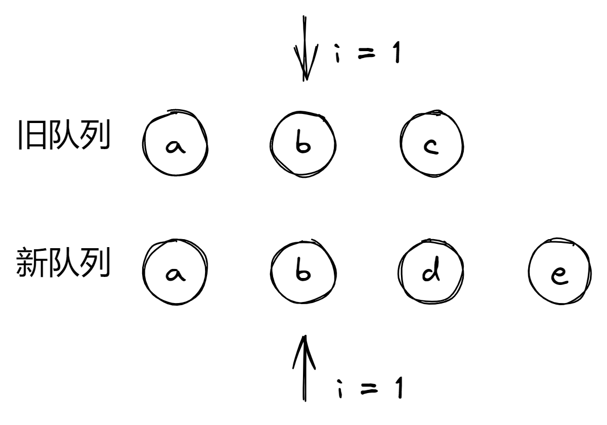

# Diff 更新算法

由于目前`Vue3`对于性能的优化做了很多的处理，所以其在更新时并不会对所有的节点都进行`diff`更新。目前会进行`diff`更新的有以下两种情况：

- `v-for`容器节点
- 自写的`render()`函数

还有一种特殊情况会进行无`diff`的按序更新，这种更新是全替换模式，非常耗时：

- 无`key`值的`v-for`语句，此时会打上`UNKEYED_FRAGMENT`标记

注意，`Vue3`没有主动提供片段这个功能，仅会在出现以下写法时会生成片段：

- 一个组件有多个根节点，会生成一个片段包裹，此时其为稳定片段(`STABLE_FRAGMENT`)
- `v-for`语句，会生成一个片段包裹
- `v-if`语句，有多个子节点或不为单个文本节点，会生成一个片段包裹(`STABLE_FRAGMENT`)

> 本文上述论点都是基于浏览器环境，非*NodeJS*环境(_SSR_)。文中提供的代码进行了**适当的简化**。

在我们使用`template`的情况下，更新基本上会通过`block`进行更新——即节点自更新

## diff 更新

`diff`更新调用的内部的`patchKeyedChildren`方法，其大致流程分为三步：

1. 对比新旧节点头部相同指针的节点，相同则进行`diff`，不同则跳转下一步。
2. 对比新旧节点头部指针指向节点，相同则进行`diff`，不同则跳转下一步。
3. 此时剩余新旧节点，可能存在乱序、已移除或新增的情况，进行特殊处理来更新。

下面是函数最开始做的初始化，其中`c1/c2`分别代表新旧节点的子节点数组；`i`表示两个新旧节点指向同步的指针，它们是同步的；`e1/e2`分别代表指向两个子节点数组尾部的指针：

```js
let i = 0
const l2 = c2.length

// 变更前节点的尾下标
let e1 = c1.length - 1 // prev ending index

// 变更后节点的尾下标
let e2 = l2 - 1 // next ending index
```

其中`patch()`函数用于对节点进行更新，`isSameVNodeType()`函数用于判断两个节点是否具有相同的类型，此时其需要满足类型一样且`key`值相等。

> 这里的类型指，例如组件，则其为组件的配置对象，元素则为元素的标记。

### 1. 对比头部等位指针节点

首先其会从头部指针开始，对比新旧节点是否相同：

```js
// 1. sync from start
// 1. 从开始位置同步
// (a b) c
// (a b) d e
while (i <= e1 && i <= e2) {
  const n1 = c1[i]
  const n2 = c2[i]

  // 节点没有发生变更时，进行patch
  if (isSameVNodeType(n1, n2)) {
    patch(n1, n2)
    // 不同节点时，立刻结束
  } else {
    break
  }
  i++
}
```

注释中给出了一个例子，即如果存在下图的新旧队列：


由于此时两个指针的`VNode`相同，那么可以复用则直接进行`patch()`更新。之后指针向右移动一位，对比两个数组下标为 `1` 的位置：



同样的，节点相同，进行更新然后指针向后移动：


此时两个节点不一样了，那么本次头部对比到此结束。到此我们排除了头部位置可复用的节点，接下来那么肯定是排除尾部位置的可复用节点。

### 2. 对比尾部等位指针节点

尾部的可复用节点检查方法与头部一样，唯一一点不同的是，它们有各自的指针分别指向子节点数组尾部。所以此时要使用两个指针`e1/e2`。

```js
// 2. sync from end
// 2. 从尾部位置开始查找
// a (b c)
// d e (b c)
while (i <= e1 && i <= e2) {
  const n1 = c1[e1]
  const n2 = c2[e2]
  if (isSameVNodeType(n1, n2)) {
    patch(n1, n2)
  } else {
    break
  }
  e1--
  e2--
}
```

这里我就不赘述了，还是按注释中的例子放图：


当前指针指向节点相同，节点可复用，直接更新，同时指针向前一起移动：


当前指针指向节点相同，节点可复用，直接更新，同时指针向前一起移动：


此时，两个指针指向节点不再相同，停止此处的对比。

---

经过前两步的处理，新旧队列已经进一步缩短了，此时剩下的节点就可能存在下面三种情况：

- 有新增的节点
- 有节点被删除了
- 相同的节点，但是移动了位置

在实际的场景中，那么就只能存在下面三种剩余情况：

- 仅有新增的节点(此时一定`i > e1`)
- 仅进行了节点删除(此时一定`i > e2`)
- 乱序的，一定有移动的节点，其中可能包含新增或有删除的节点(此时一定有`i <= e2`且`i <= e1`)

`Vue`按处理的简易程度，`Vue`先对前两种情况进行了单独的处理，再对三种混有的情况进行了处理。

### 3.1 处理新增的节点的单独情况

判断新增的节点是以旧队列为基准，那么此时的情况是这样的：


或新增的节点在首部：


此时会存在这样的情况`e1 < i`且`e2 >= i`，那么我们只需要更新`e1 => i`间的节点即可，于是有了这些代码：

```js
// 3. common sequence + mount
// 3. 有新增的节点时
// (a b)
// (a b) c
// i = 2, e1 = 1, e2 = 2
// (a b)
// c (a b)
// i = 0, e1 = -1, e2 = 0
if (i <= e2) {
  if (i > e1) {
    //  当前节点后面的节点
    const nextPos = e2 + 1

    // 我们要以这个节点为锚点在其之前添加元素，没有则添加到父节点最后
    const anchor = nextPos < l2 ? c2[nextPos].el : parentAnchor
    while (i <= e2) {
      patch(null, c2[i])
      i++
    }
  }
}
```

### 3.2 处理删除节点的单独情况

如果没有存在仅有新增节点的情况，那么其会判断是否是仅进行删除节点的情况，此时可能出现下图的两种情况：

删除节点在尾部：


删除节点在尾部：


此时`i > e2`，那么我们只需要将旧节点数组中`i => e1`之间的所有节点删除即可(下面的`else if`语句承接上面)：

```js
// 4. common sequence + unmount
// 4. 节点移除
// (a b) c
// (a b)
// i = 2, e1 = 2, e2 = 1
// a (b c)
// (b c)
// i = 0, e1 = 0, e2 = -1
else if (i > e2) {
  while (i <= e1) {
    // 移除原节点
    unmount(c1[i])
    i++
  }
}
```

### 3.3 乱序，但一定有移动的节点的情况

最后一种情况就是比较复杂的情况，此时`Vue`做的处理是，先查看旧节点序列在变为新节点序列后，旧节点序列中是否有些节点还是按现在的顺序排列的(可以间断)，此时只对其余变更的节点进行操作，就能进行最小幅度的`DOM`操作了。

> 此时相对于求旧节点的最长递增序列，这里你可以会想到为什么不求最小编辑距离，因为最小编辑距离的时间复杂度在大多数情况下比它高

#### 3.3.1 建立新节点 key 与其下标的映射

首先，`Vue`先将新节点数组进行遍历，将它们有`key`值的节点与其在新节点数组中的下标建立映射，存储在`keyToNewIndexMap`中，方便在复用时查找：

```js
const s1 = i // prev starting index
const s2 = i // next starting index

// 5.1 build key:index map for newChildren
// 5.1 生成一个key map
const keyToNewIndexMap = new Map()

// 遍历新节点，乱序的部分，将这些具有key的节点存入map
for (i = s2; i <= e2; i++) {
  const nextChild = c2[i]
  if (nextChild.key != null) {
    keyToNewIndexMap.set(nextChild.key, i)
  }
}
```

#### 3.3.2 移除新节点队列中不存在的旧节点并更新复用节点

之后，遍历旧节点数组，通过刚刚建立的`Map`，如果当前旧节点再新节点数组中已经不存在了，那么说明要移除了。

整个过程比较复杂，因为要预先做处理，为后续是否需要移动节点做准备：

```js
// 5.2 loop through old children left to be patched and try to patch
// matching nodes & remove nodes that are no longer present
// 5.2 遍历旧节点，patch匹配的节点，移除不再在节点
let j

// 当前处理过的节点数
let patched = 0

// 需要patch的节点数
const toBePatched = e2 - s2 + 1

// 是否需要移动节点
let moved = false

// used to track whether any node has moved
// 记录节点是否已经移动
let maxNewIndexSoFar = 0

// works as Map<newIndex, oldIndex>
// Note that oldIndex is offset by +1
// and oldIndex = 0 is a special value indicating the new node has
// no corresponding old node.
// 注意旧下标的值都会+1，因为0表示没有对应的旧节点
// used for determining longest stable subsequence
// 新下标与旧下标的map
// 这里的新下标以s2位置为0下标，而旧下标为旧下标值 +１
const newIndexToOldIndexMap = new Array(toBePatched)

// 初始化值为0
for (i = 0; i < toBePatched; i++) newIndexToOldIndexMap[i] = 0
```

这里我说明下三个变量，首先是`newIndexToOldIndexMap`，其用来记录节点的新坐标到旧坐标的映射(当然是节点可复用的情况下)。为了后续计算最长递增子序列，所以其新坐标以`s2`为起点，长度为当前需要处理的节点总数，并且其存入的旧节点下标要在原值的基础上`+ 1`(因为`0`表示当前节点没有对应的旧节点)。举个例子，有如下图一样的更新序列：


那么节点`e`存入`newIndexToOldIndexMap`后为：

```js
// 展示，不是赋值语句
newIndexToOldIndexMap = [4, 0, 0, 0]
```

其余全部节点存入后为：

```js
// 展示，不是赋值语句
newIndexToOldIndexMap = [4, 3, 2, 0]
```

`moved`变量则是表示是否有节点需要移动，其判定要基于`maxNewIndexSoFar`的值。

`maxNewIndexSoFar`表示当前可复用节点距离`s2`(即第一个乱序节点的最远距离)。如果有对应可以复用的节点，那么在每次迭代处理节点时，如果当前节点所处位置距离`s2`距离超过`maxNewIndexSoFar`，那么`maxNewIndexSoFar`会更新为当前节点在新队列中的下标；当其小于`maxNewIndexSoFar`时，就会标记`moved = true`。

```js
// 判断是否需要移动当前节点，想象一下，如果每个节点都按序递增，
// 那么每次都会进入该if语句
if (newIndex >= maxNewIndexSoFar) {
  // 当前节点未移动，更新下标
  maxNewIndexSoFar = newIndex

  // 如果进入该else语句说明有节点之前节点交叉了
} else {
  moved = true
}
```

想象一下，如果节点在新旧序列中，都是按照相同的顺序递增，那么`maxNewIndexSoFar`也会一直递增，即每次迭代`newIndex >= maxNewIndexSoFar`，那么就不需要移动节点；但是如果某次迭代，`newIndex < maxNewIndexSoFar`，那么说明当前节点由之前靠后的位置移动了现在靠前的位置。

就拿刚刚乱序的图举例，第一次迭代`c`节点的`newIndex = 4`，则`maxNewIndexSoFar = 4`；第二次迭代`d`节点时，其`newIndex = 3`，此时`newIndex < maxNewIndexSoFar`，说明`c/d`节点之间的位置在新旧发生了交叉，所以我们至少需要移动它们其中一个节点。

理解了这个道理，现在我们可以正式看看这段代码了。由于要卸载节点，那么本次遍历要以`s1 <-> e1`之间的节点为基准进行遍历，整体遍历代码如下：

```js
// 遍历旧节点
for (i = s1; i <= e1; i++) {
  // 当前下标的旧节点
  const prevChild = c1[i]

  // 当前patch的节点数超过新节点中要patch的总数时，执行unmount操作
  // 直接进行卸载操作，因为多余的节点不需要了
  if (patched >= toBePatched) {
    // all new children have been patched so this can only be a removal
    unmount(prevChild)
    continue
  }

  // 尝试寻找是否有对于的新节点
  let newIndex

  // 旧节点具有key时，获取相同key值节点所处的下标
  if (prevChild.key != null) {
    newIndex = keyToNewIndexMap.get(prevChild.key)

    // 没有key时则找相同类型的节点是否存在
  } else {
    // key-less node, try to locate a key-less node of the same type
    // 当前查找范围为新节点中需要patch的节点之间
    for (j = s2; j <= e2; j++) {
      if (
        // 0表示对应下标下当前还未有节点(注意当前是以s2为0下标基准)
        // 这里确认当前新下标位置未有对应的旧下标，防止是已在map中的节点

        newIndexToOldIndexMap[j - s2] === 0 &&
        isSameVNodeType(prevChild, c2[j])
      ) {
        newIndex = j
        break
      }
    }
  }

  // 没找到对应节点时说明该节点已经不存在了，直接进行unmount
  if (newIndex === undefined) {
    unmount(prevChild)

    // 找到时进行位置移动操作，并patch
  } else {
    // 将旧节点位置下标+1后存入，新节点以s2为起点，即0坐标
    newIndexToOldIndexMap[newIndex - s2] = i + 1

    // 判断是否需要移动当前节点，想象一下，如果每个节点都按序递增，
    // 那么每次都会进入该if语句
    if (newIndex >= maxNewIndexSoFar) {
      // 当前节点未移动，更新下标
      maxNewIndexSoFar = newIndex

      // 如果进入该else语句说明有节点之前节点交叉了
    } else {
      moved = true
    }

    // patch该节点
    patch(prevChild, c2[newIndex])
    patched++
  }
}
```

首先当当前可复用的节点复用时，会使`patched`值`+1`，当复用的节点超过乱序的新节点长度时，那么其余的节点肯定是要卸载的节点(因为新节点序列都处理完毕了)：

```js
if (patched >= toBePatched) {
    // all new children have been patched so this can only be a removal
    unmount(prevChild)
    continue
  }
```

之后，`Vue`尝试寻找一下当前旧节点是否被复用，即它被移动到了新节点序列的其他位置。首先如果当前节点有`key`值，那么其会尝试直接从刚刚的`keyToNewIndexMap`中查找；如果没有找到，那么其会遍历当前所有的新节点序列，依次对比是否与当前节点相同，在复合同类型节点时对其进行复用。

```js
// 尝试寻找是否有对于的新节点
let newIndex

// 旧节点具有 key 时，获取相同 key 值节点所处的下标
if (prevChild.key != null) {
  newIndex = keyToNewIndexMap.get(prevChild.key)

  // 没有key时则找相同类型的节点是否存在
} else {
  // key-less node, try to locate a key-less node of the same type
  // 当前查找范围为新节点中需要 patch 的节点之间
  for (j = s2; j <= e2; j++) {
    if (
      // 0 表示对应下标下当前还未有节点(注意当前是以 s2 为 0 下标基准)
      // 这里确认当前新下标位置未有对应的旧下标，防止是已在 map 中的节点
      newIndexToOldIndexMap[j - s2] === 0 &&
      isSameVNodeType(prevChild, c2[j])
    ) {
      newIndex = j
      break
    }
  }
}
```

在直接通过类型查找复用节点时，其存在一个`newIndexToOldIndexMap[j - s2] === 0`条件，它表示当前新节点下标未有对应的旧节点(`0`表示没有，在之后的代码中，如果查找到对应的`newIndex`，其会存入`newIndexToOldIndexMap`中)。这样可以防止新旧节点被重复复用或已被处理再次被处理。

到此，对于旧节点的`newIndex`是否被查找到就会出现两种情况了：

1. 没有，说明当前节点已删除了，移除该`DOM`节点
2. 有，复用，**更新节点属性**

```js
// 没找到对应节点时说明该节点已经不存在了，直接进行unmount
if (newIndex === undefined) {
  unmount(prevChild)

  // 找到时进行位置移动操作，并patch
} else {
  // 将旧节点位置下标+1后存入，新节点以s2为起点，即0坐标
  newIndexToOldIndexMap[newIndex - s2] = i + 1

  // 判断是否需要移动当前节点，想象一下，如果每个节点都按序递增，
  // 那么每次都会进入该if语句
  if (newIndex >= maxNewIndexSoFar) {
    // 当前节点未移动，更新下标
    maxNewIndexSoFar = newIndex

    // 如果进入该else语句说明有节点之前节点交叉了
  } else {
    moved = true
  }

  // patch该节点
  patch(prevChild, c2[newIndex])
  patched++
}
```

在复用的情况下，有我们刚刚提到的[计算节点交叉(是否需要移动)](#332-移除新节点队列中不存在的旧节点并更新复用节点)的场景：

```js
// 判断是否需要移动当前节点，想象一下，如果每个节点都按序递增，
// 那么每次都会进入该if语句
if (newIndex >= maxNewIndexSoFar) {
  // 当前节点未移动，更新下标
  maxNewIndexSoFar = newIndex

  // 如果进入该else语句说明有节点之前节点交叉了
} else {
  moved = true
}
```

这里就不赘述了。

> 注意，这里对复用的节点进行了`patch()`更新，那么后面就只用进行移动即可，而不需要更新了。

#### 3.3.3 处理新增节点与移动的节点

到此为止，就只有新增节点与移动节点的情况没有处理了。

首先其会需要移动节点时(`moved = true`)根据刚刚创建的`newIndexToOldIndexMap`生成一个最长递增的新节点序列`increasingNewIndexSequence`。

```js
// 5.3 move and mount
// 5.3 移动与mount
// generate longest stable subsequence only when nodes have moved
// 有节点需要移动，生成长期稳定的子序列，仅对移动过的节点处理
const increasingNewIndexSequence = moved
  ? // 获取最长递增子序列的下标数组
    getSequence(newIndexToOldIndexMap)
  : EMPTY_ARR
```

那么这个序列的作用是什么？它就是用来**辅助移动节点**，而且是在最小次数下移动节点。由于`newIndexToOldIndexMap`是根据新旧节点之间的映射创建的，其**下标天然代表乱序的新节点数组的顺序**，而且其对应下标中存储的元素也代表该新节点复用的旧节点的下标，那么这里我们就可以看到两个序列：

1. 新节点下标组成的序列(**递增**的，因为我们以它为基准创建的数组)
2. `newIndexToOldIndexMap`中旧节点下标组成的序列，可能递增也可能乱序

> 关于如何求[最长递增子序列](https://en.wikipedia.org/wiki/Longest_increasing_subsequence)，请单独自行学习，这里就不说明了。

此时倘若旧节点下标组成的序列**也**呈现递增趋势，那么我们便可以操作那些非递增的节点来达到变更为新节点序列的目的。并且这个递增的序列越长，那么我们要操作(移动)的节点就越少。比如下图的情况：


从图中观察，我们可以清楚的看到`c/d`两个节点在前后都保持了递增的关系，那么此时我们只需要移动`e`节点与创建`h`节点即可。

此时其`newIndexToOldIndexMap`为：

```js
newIndexToOldIndexMap = [4, 2, 3, 0]

// 该数组返回的是对应的元素在newIndexToOldIndexMap的下标
// 而并非实际的旧节点下标
increasingNewIndexSequence = [1, 2]
```

可以看到`2、3`节点与新节点的下标的**递增关系保持一致**，其最长递增子序列(`increasingNewIndexSequence`)为`[1, 2]`，此时我们只需要操作`4/0`两个节点即可。

> `increasingNewIndexSequence`返回的结果为对应的元素在 `newIndexToOldIndexMap`的下标而并非实际的旧节点下标

明白了这个现在我们来看其具体处理的代码：

```js
// 获取递增序列的尾坐标
j = increasingNewIndexSequence.length - 1

// looping backwards so that we can use last patched node as anchor
// 向后循环，这样我们可以用上一个patch过了的节点做锚点
for (i = toBePatched - 1; i >= 0; i--) {
  // 当前要处理的新节点下标及其节点
  const nextIndex = s2 + i
  const nextChild = c2[nextIndex]

  // 获取其后一个节点，如果没有则获取其父节点
  const anchor = nextIndex + 1 < l2 ? c2[nextIndex + 1].el : parentAnchor

  // 如果当前新旧节点Map中未找到当前位置新节点的旧节点信息，
  // 说明是新增节点
  if (newIndexToOldIndexMap[i] === 0) {
    // mount new
    patch(null, nextChild)

    // moved说明有节点需要移动，通过塑造一个递增序列，处于递增序列的节点就可以
    // 不进行移动，只移动其余节点，这样就减少了节点的移动
  } else if (moved) {
    // 如果存在以下情况则移动：
    // 1. 没有稳定的子序列
    // 2. 当前节点不在这个稳定的子序列中
    // move if:
    // There is no stable subsequence (e.g. a reverse)
    // OR current node is not among the stable sequence
    if (j < 0 || i !== increasingNewIndexSequence[j]) {
      move(nextChild, container, anchor)
    } else {
      j--
    }
  }
}
```

本次遍历以新节点的乱序序列(`s2 <-> e2`)为基准，逆向进行遍历。逆向的原因是因为其在新增节点或更新节点时，可以以后面已经操作过的节点为锚点进行更新(想象一下`Node.insertBefore()/Node.appendChild()`的参数)。

每次遍历会出现三种情况：

- 当前节点未有对应的旧节点下标，则说明是新增节点
- 该节点需要移动，进行移动
- 该节点与旧节点序列都保持递增顺序，直接跳过即可(实际反应在代码里面就是没做任何处理)

> 情况`2`与`3`在完整的迭代中是互斥的，两者不会同时出现在整个迭代流程中。

第一种情况，比较简单，这里就不解释了：

```js
// 如果当前新旧节点Map中未找到当前位置新节点的旧节点信息，
// 说明是新增节点
if (newIndexToOldIndexMap[i] === 0) {
  // mount new
  patch(null, nextChild
}
```

第二种情况要判定`moved = true`，它的原理[之前我们已经解释过了](#332-移除新节点队列中不存在的旧节点并更新复用节点)。这里我们要关注的是它的函数体。根据我们刚刚对递增子序列的理解，那么其应该会在以下情况移动或不移动节点：

- 当前节点处于最长递增子序列中 —— 跳过
- 当前节点不存在最长递增子序列中 —— 移动
  - 递增序列已经没有需要跳过的节点了但任存在节点需要更新(实际和不存在的情况一样)
  - 当前节点不存在最长递增子序列

```js
// 如果存在以下情况则移动：
// 1. 没有稳定的子序列(实际和情况2一致，反序时会返回任意一个节点作为最长序列)
// 2. 当前节点不在这个稳定的子序列中
// move if:
// There is no stable subsequence (e.g. a reverse)
// OR current node is not among the stable sequence
if (j < 0 || i !== increasingNewIndexSequence[j]) {
  // 将当前节点移动到锚点节点前或容器节点最后(没有锚点时)
  move(nextChild, container, anchor)
} else {
  j--
}
```

还是以这张图为例子：

> 再次提示，`increasingNewIndexSequence`存储的是节点在`newIndexToOldIndexMap`中的下标，不是真实的旧节点下标


那么生成以下的递增序列：

```js
newIndexToOldIndexMap = [4, 2, 3, 0]

// 该数组返回的是对应的元素在newIndexToOldIndexMap的下标
// 而并非实际的旧节点下标
increasingNewIndexSequence = [1, 2]
```

那么在第一次更新中，发现`h`节点不在`newIndexToOldIndexMap`中，那么按新增节点进行处理，将其插入到新`f`节点前:


在第二次更新中，发现`d`节点存在于单调增序列中，所以本次更新可以跳过：


同理`c`节点也一样，这里就不放图了，处理完`c`节点后此时为这样：


此时`e`节点可复用，则将其移动到新`c`节点前即可。

到此为止，上图的`diff`就结束了。

对于第三种情况，由于复用的节点在前后都保持了递增的关系，所以此时我们不需要再重复对节点进行处理，所以遇到复用的节点时直接跳过即可：


到此为止全部节点的更新就已经完毕了。

## 对比 Vue2

总所周知，`Vue2`中的`diff`算法时间复杂度为`O(n)`，而`Vue3`中的`diff`算法基于最长递增子序列最高有`O(nlogn)`。那么为什么要改用算法呢？

个人觉得是为了减少对`DOM`的操作，虽然大多数情况下，两种算法的对`DOM`的操作次数几乎相等，但也有不少的情况`Vue3`对`DOM`的操作次数少于`Vue2`，比如下面的例子：


在上面的例子中，`Vue2`的操作次数为`3`次；`Vue3`的操作次数为`2`次。

> 自行了解[`Vue2`的`diff`](https://github.com/gdh51/LearnVueCode/tree/master/Vue2/Vue/Vue%E4%B8%AD%E7%9A%84diff%E7%AE%97%E6%B3%95)

这种`DOM`操作的优势在递增序列越长时更显著。

## 后记

`Vue3`对于模版的编译进行了很多的静态优化，诸如`Block`、闭包缓存`hoist`节点、`cache`缓存节点等等。不推荐你再通过自己手动书写`render()`，这样你需要自己手动做优化。

特别是`Block`这点你无法进行模拟，因为未开放`API`。在`Block`下，只有动态节点会被收集，当动态节点某个值更新时，其会通过`fast path`直接遍历`Block`中的动态节点进行自更新(即不会管子节点)。
