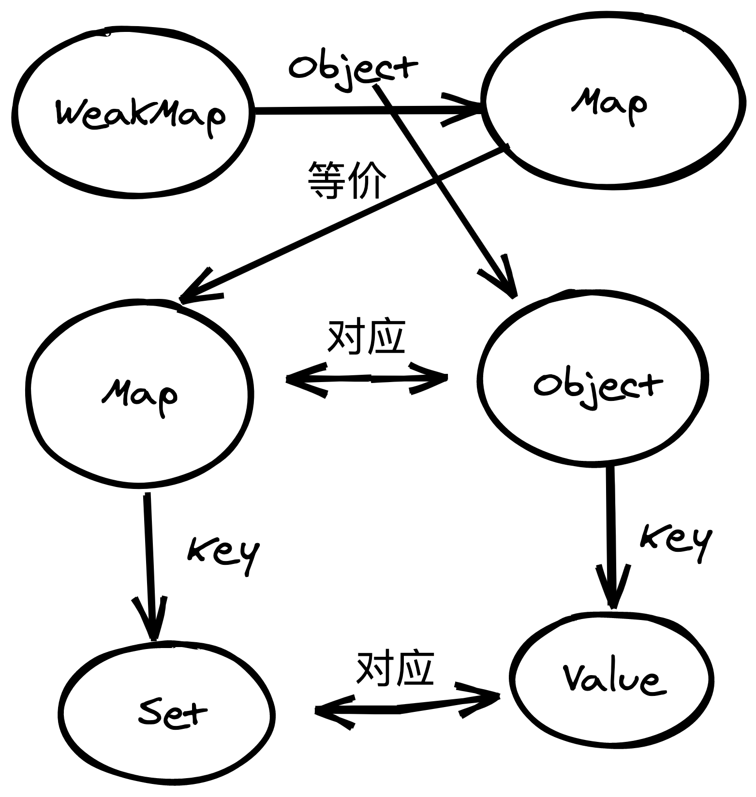

# Reactivity(响应式系统)

`Vue2`的响应式是基于`Observer/Dep/Watcher`三者组成的。而`Vue3`即是基于`effect/reactive`组成的。

实际上它们分别对应各自的`effect => Watcher`，`reactive => Observer`，由它们之间构成订阅关系来进行信息的通知。

## 详细了解

如果你想详细了解这两者的细致组成，那么可以参考下面的解读，其会逐字逐句的对代码进行解释。

- [reactive()](<./reactive(对象响应化)/README.md>)
- [effect()](<./effect(副作用函数)/README.md>)
- [scheduler 调度队列](<./flush-scheduler(刷新调度队列)/README.md>)

## 总结(简洁版)

通过`reactive()`处理后返回的对象我们简称为响应化对象，`effect()`生成的函数简称为副作用函数。

在`V3`中，响应化对象会对源对象进行`Proxy`代理，拦截其访问/修改等行为，由此这些拦截器就会为对应访问的字段生成对应的依赖项并对副作用函数进行观察、追踪。同时，副作用函数也会及时通知依赖项进行解绑。

### 依赖项

在`V3`中，依赖项由一个个的`Set()`对象组成(原生的集合数组)，它们每一个都与对应的对象键名(`key`)对应；而一个响应式对象则会生成一个`Map()`对象来管理这些`Set()`，这就形成了`key => Set()`的映射；而全部响应式对象的`Map()`都会存储在一个全局的`WeakMap()`中进行保存，可以通过源对象来访问到对应的依赖项集合`Map()`；单个依赖项`Set()`中，则存放着正在追踪的副作用函数。

于是它们形成了下面的场景:

按访问关系来看：



按集合关系来看：
/imgs/dependence%20structure.svg>)

> 使用`WeakMap`后，不用关心当前`Map`的释放问题，倘若这个依赖项集合在未来没有被使用到，那么它也会被自动垃圾回收掉。

### 副作用函数

副作用函数为一个高阶函数，它将你原函数进行装饰，赋予其依赖追踪的能力：

```js
// 伪代码
function effect(fn) {
    const wrapper = function (...args) {

        // ...其他能力，比如追踪依赖
        fn.apply(null, args)
    }

    // 追踪当前effect的依赖项们
    wrapper.deps = []

    // 自定义调度函数，依赖项更新时，自定义更新行为还是调用原fn
    wrapper.scheduler = ...

    // ...一些其他的属性和代码行为

    return wrapper
}
```

### 依赖收集/副作用函数追踪

当这个返回的函数被调用时，就会进行依赖项追踪。首先，副作用会(与依赖项)互相清空之前收集的所有依赖项，同时，如果我们在`fn`中使用到某个响应式对象，并访问到某个字段时，在符合条件后，就会调用`track()`函数对副作用函数进行依赖项收集/副作用函数追踪：

```js
// track 伪代码
const dep = new Set()

// 清空依赖项，等会重新收集(伪代码勿吹毛求疵)
effect.deps = []
dep.clear()

// 副作用函数收集这个依赖项
effect.deps.push(dep)

// 依赖项追踪这个effect
dep.add(effect)
```

这样依赖项与副作用函数就形成了**互相订阅**的关系。

### 依赖更新

当我们更改某个响应式对象的某一个字段时，如果当前字段曾经追踪过副作用函数，那么就会调用`trigger()`函数，此时依赖项就会通知其`Set()`中的所有副作用函数更新。

副作用函数的更新重新计算可以自定义，通过`scheduler`字段，可以指定在更新时执行这个函数而不是执行原来的副作用函数。当然原副作用函数还是会作为参数允许调用。

```js
effect({
    // ...
    scheduler: effect => // do some thing
})
```

于是可以有两种更新模式：

/imgs/update-loop.png>)

这两种模式具体体现在`API`上分别就是`watch()/watchEffect()`

> 实际上`watchEffect()`也是通过的第二种方式更新，但是行为为第一种模式

单个副作用函数的更新的行为是**同步执行**的，即不会涉及到任务队列等问题，经过自主处理调度(`scheduler`)后可以将其处理为异步行为，当然这不再本文涉及的范围中。

---

至此整个依赖项和副作用的关系总结就结束了，整体的结构和`V2`中其实是一样的。
