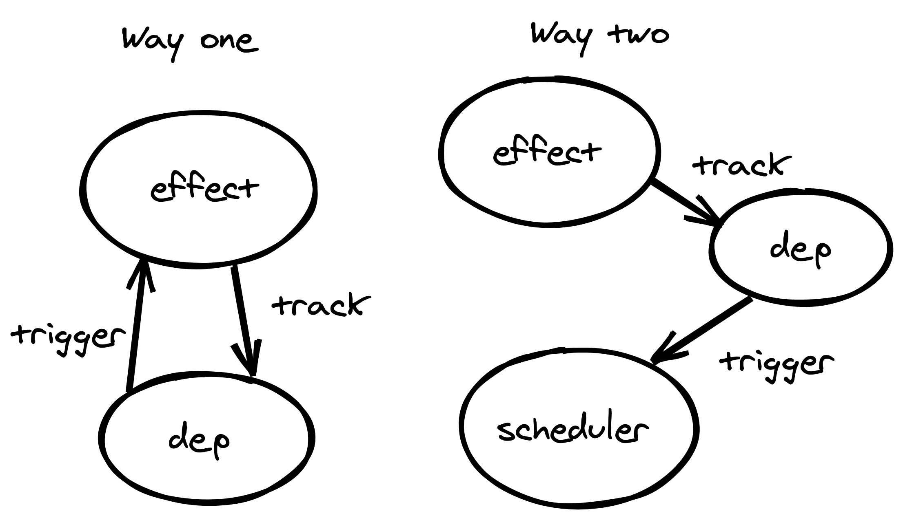

# effect(副作用函数)

## 快速导航

- [ReactiveEffect 副作用函数实例](#reactiveeffect)
- [副作用函数的生命周期](#副作用函数的生命周期)
  - [依赖项收集](#依赖项收集)
  - [更新调度](#更新调度)
  - [销毁](#销毁)
- [副作用函数作用域](#副作用函数作用域)
  - [setup()及其其中的作用域](#setup-及其其中的作用域)
    - [嵌套作用域](#嵌套作用域)
  - [注册清理函数](#注册清理函数)

作为`Vue2`中的`Watcher`，在`Vue3`中其被转化为`ReactiveEffect`。当然它和`Watcher`的作用都是一样的——收集依赖项/被依赖项提醒更新。

但我们能使用的是基于其构造的`effect()`函数，它在其基础上赋予了其他的能力。现在让我们来看看这个`API`

```js
// 副作用工厂函数
export function effect<T = any>(
  fn: () => T,
  options?: ReactiveEffectOptions
): ReactiveEffectRunner {
  // 进行effect化的函数已effect化时，获取其原函数
  if ((fn as ReactiveEffectRunner).effect) {
    fn = (fn as ReactiveEffectRunner).effect.fn
  }

  // 创建新的effect函数(会自动收集到当前活跃的scope)
  const _effect = new ReactiveEffect(fn)

  // 如果具有配置
  if (options) {
    // 将配置覆盖到effect实例上
    extend(_effect, options)

    // 如果具有effect作用域，那么重新进行收集
    if (options.scope) recordEffectScope(_effect, options.scope)
  }

  // 默认情况下或未指定lazy时，自动执行一次调度函数
  if (!options || !options.lazy) {
    _effect.run()
  }

  // 将其调度函数绑定至当前effect
  const runner = _effect.run.bind(_effect) as ReactiveEffectRunner
  runner.effect = _effect

  // 返回调度函数
  return runner
}
```

上述中，最核心的就是`ReactiveEffect`构造函数，它用于创建一个副作用实例对象。所以我们先看它，等会再返回来看其他的逻辑。

虽然上述可以传递`options`，但是实际应用到`ReactiveEffect`的实例化中的仅有收集依赖项的`getter()`函数。(其实有其他的，但是应用给副作用函数的仅有那两个)

## ReactiveEffect

响应式副作用实例的构造函数比较简单，至少在实例化阶段非常简单。实例化时，只会为其确认依赖项作用。

```js
// effect Class化
export class ReactiveEffect<T = any> {
  // 活跃状态
  active = true

  // 依赖项
  deps: Dep[] = []

  // can be attached after creation
  // 标记是否为deferredComputed
  computed?: boolean

  // 是否允许递归调用
  allowRecurse?: boolean

  // 在失活时调用
  onStop?: () => void

  // dev only
  // 在当前effect被依赖项追踪时调用
  onTrack?: (event: DebuggerEvent) => void

  // dev only
  // 在effect触发更新时触发
  onTrigger?: (event: DebuggerEvent) => void

  // 构造函数，接受一个原函数、一个调度函数、一个作用域作为参数
  constructor(
    // 收集依赖项的getter，也是默认调度函数
    public fn: () => T,
    // 自定义调度函数
    public scheduler: EffectScheduler | null = null,
    scope?: EffectScope | null
  ) {
    // 将当前effect加入scope中
    recordEffectScope(this, scope)
  }
}
```

关于上述作用域部分现在不进行描述。(后面会细 🔐)

一个副作用函数实例基本上就具有上述的功能(已写在注释中)，接下来我们会随着其生命周期一个个的进行了解。现在让我们接着来看`effect()`函数的其他部分，首先是重写副作用函数实例的属性

```js
// 如果具有配置
if (options) {
  // 将配置覆盖到effect实例上
  extend(_effect, options)

  // 如果具有effect作用域，那么重新进行收集
  if (options.scope) recordEffectScope(_effect, options.scope)
}
```

其次是在非`lazy`的情况下，自调用一次副作用函数，进行依赖收集。

```js
// 默认情况下或未指定lazy时，自动执行一次调度函数
if (!options || !options.lazy) {
  _effect.run()
}
```

最后将这个收集依赖项的调度方法返回，而不是返回副作用函数实例。

```js
// 将其调度函数绑定至当前effect
const runner = _effect.run.bind(_effect) as ReactiveEffectRunner
runner.effect = _effect

// 返回调度函数
return runner
```

至此`effect()`函数就简单的阅读完毕，现在按其生命周期进行想起解读下。

## 副作用函数的生命周期

副作用函数的生命周期无非就分为三个阶段：创建、依赖项收集、更新调度(`2`、`3` 在有些情况下是一样的)、销毁。

首先创建阶段及上述的阶段，所以我们无需在赘述，现在让我们直接看依赖项收集阶段。

### 依赖项收集

依赖项收集必须调用副作用函数实例的`run()`方法，该方法就用于依赖项的收集与重新计算。

在此之前，我们先来看两个变量，它们分别表示当前正在进行依赖收集的`effect()`们的执行栈与栈顶正在执行依赖收集的`effect()`

```js
// effect执行栈，防止重复同一effect在同一时间同时执行
const effectStack: ReactiveEffect[] = []

// 当前effect执行栈栈顶正在执行的effect
let activeEffect: ReactiveEffect | undefined
```

通过上述执行栈来控制当前`effect()`不会在同一时间被重复执行多次；
除此之外，还有一个`shouldTrack`变量，用于控制当前是否可以进行副作用函数追踪。

```js
let shouldTrack = true
const trackStack: boolean[] = []

export function pauseTracking() {
  trackStack.push(shouldTrack)
  shouldTrack = false
}

export function enableTracking() {
  // 存储上一次是否应该追踪的许可
  trackStack.push(shouldTrack)

  // 当前允许进行effect追踪
  shouldTrack = true
}

export function resetTracking() {
  const last = trackStack.pop()
  shouldTrack = last === undefined ? true : last
}
```

好了，现在让我们先整体来看调度函数：

```js
function run() {
  // 已失活，无副作用调度原函数
  if (!this.active) {
    return this.fn()
  }

  // 确认当前effect未在进行调度
  if (!effectStack.includes(this)) {
    try {
      // 加入调度栈中
      effectStack.push((activeEffect = this))

      // 允许effect追踪
      enableTracking()

      // 增加递归深度，并记录当前的track bit
      trackOpBit = 1 << ++effectTrackDepth

      // 当前effect递归追踪次数不超过30次时
      if (effectTrackDepth <= maxMarkerBits) {
        // 初始化当前依赖项
        initDepMarkers(this)

        // 超过30次递归时，直接清空依赖项重新收集
      } else {
        cleanupEffect(this)
      }

      // 调用原函数
      return this.fn()
    } finally {
      // 30层以下时，对新旧依赖项进行diff更新
      if (effectTrackDepth <= maxMarkerBits) {
        finalizeDepMarkers(this)
      }

      trackOpBit = 1 << --effectTrackDepth

      // 停止当前的effect追踪
      resetTracking()

      // 退出effect调度栈
      effectStack.pop()

      // 重置activeEffect
      const n = effectStack.length
      activeEffect = n > 0 ? effectStack[n - 1] : undefined

      // 在finally中才进行依赖项更新和收集，这意味着，在第一次依赖项收集时
      // 如果发生mutation，不会触发收集和更新
    }
  }
}
```

 上述调度函数，实际上就是调用了原函数，对其中使用到的响应式对象进行了依赖收集。

首先确保当前的`effect()`未在执行，这也同时确保了**不会有重复的`effect()`执行，也确保在之后的`effectTrackDepth`可用于指代当前的、唯一的`effect()`**

```js
if (!effectStack.includes(this)) {
  /* ... */
}
```

进入该语句后，将当前`effect()`收集到该`effectStack`中，并允许开始进行依赖收集：

```js
// 加入调度栈中
effectStack.push((activeEffect = this))

// 允许effect追踪
enableTracking()
```

**在每次调度时，会记录下当前`effectStack`的深度(你也可以理解为当前副作用函数调用栈的长度)，并且当前的深度会作为一个唯一`bit`位，即当前深度是多少，其就会代表二进制的第几位；它也代表了当前正在计算的副作用函数。**

此时我们调度副作用函数的原函数，在此期间，如果对响应式对象进行了访问，那么就会对其进行副作用函数追踪([对于依赖项收集，你需要跳转到这里继续查看](<./dep(依赖项)/README.md>))

```js
// 增加递归深度，并记录当前的track bit
trackOpBit = 1 << ++effectTrackDepth

// 当前effect递归追踪次数不超过30次时
if (effectTrackDepth <= maxMarkerBits) {
  // 初始化当前依赖项
  initDepMarkers(this)

  // 超过30次递归时，直接清空依赖项重新收集
} else {
  cleanupEffect(this)
}

// 调用原函数，进行依赖项收集
this.fn()
```

通过[上述对依赖项的详细解释](<./dep(依赖项)/README.md>)，我相信你应该懂依赖项收集过程了。在`finally`语句中，调度函数做了收尾工作，将不再使用的依赖项剔除，然后还原各种状态。

```js
// 30层以下时，对新旧依赖项进行diff更新
if (effectTrackDepth <= maxMarkerBits) {
  finalizeDepMarkers(this)
}

// 还原当前的深度位
trackOpBit = 1 << --effectTrackDepth

// 停止当前的effect追踪
resetTracking()

// 退出effect调度栈
effectStack.pop()

// 重置activeEffect
const n = effectStack.length
activeEffect = n > 0 ? effectStack[n - 1] : undefined

// 在finally中才进行依赖项更新和收集，这意味着，在第一次依赖项收集时
// 如果发生mutation，不会重复触发收集和更新
```

#### 一些其他问题

在上述依赖收集过程中，我刻意避开了以下条件语句，只说明了`if`语句前半的执行流程：

```js
// 当前effect递归追踪次数不超过30次时
if (effectTrackDepth <= maxMarkerBits) {
  // 初始化当前依赖项
  initDepMarkers(this)

  // 超过30次递归时，直接清空依赖项重新收集
} else {
  cleanupEffect(this)
}
```

类似代码有几处，出现这种条件分叉的原因是各个平台对于数值类型值有独有的优化。在上述代码中，`effectTrackDepth`的深度被限制到了`30`及其以内，这是因为在`Javascript`中，2<sup>30</sup>以内的数将会以`Smi`存在，此时其不会占用内存。当`effectTrackDepth`超过`30`时，其会清空全部依赖项来一次没有`diff`的更新，当然这种情况本来就很极端。

```js
// The number of effects currently being tracked recursively.
// 当前递归更新的effects数量
let effectTrackDepth = 0

export let trackOpBit = 1

/**
 * The bitwise track markers support at most 30 levels op recursion.
 * This value is chosen to enable modern JS engines to use a SMI on all platforms.
 * When recursion depth is greater, fall back to using a full cleanup.
 * 最大进行30层的递归操作，超过时回退到直接清空依赖项重新收集。
 * 不超过30次的原因是，31以下时，浏览器对整数会使用SMI进行优化处理
 */
const maxMarkerBits = 30
```

关于`Smi`，你可以通过这篇文章了解
[Smi -- Small Integer](https://github.com/gdh51/JavascriptSummary/tree/master/%E8%BF%9B%E9%98%B6/%E5%B9%B3%E5%8F%B0%E4%BC%98%E5%8C%96/Smi)

上述就是一次依赖收集、副作用函数追踪的全部过程。

### 更新调度

当响应式对象的某个`key`的值发生变动时，便会调用`trigger()`函数提醒副作用函数进行调度。

> 这里用了调度而不是重新计算，因为调度可以被自定义，默认情况下是重新计算

整个流程可以总结为以下几步：

1. 通过`trigger()`函数处理各种情况的触发
2. 统一通过`triggerEffects()`触发副作用函数重新计算
3. 依次根据情况调度更新。

首先步骤`1`就不进行详细描述了，其大概就是设计了对各种类型值发生变化的处理，最终再引起副作用函数的更新，以下是其的伪代码：

```js
// 触发effect重新调度进行更新
export function trigger(
  // 由哪个对象触发的effect更新
  target: object,
  // 当前触发更新的类型
  type: TriggerOpTypes,
  // 该对象触发更新的key值
  key?: unknown,
  // 更新的值
  newValue?: unknown,
  // 未更新前的值
  oldValue?: unknown,
  // 变更前的原target的copy
  oldTarget?: Map<unknown, unknown> | Set<unknown>
) {
  // 获取该响应式对象的依赖项Map
  const depsMap = targetMap.get(target)

  // 没有，说明该对象没有进行响应化
  if (!depsMap) {
    // never been tracked
    return
  }

  // 将当前要进行触发effect更新的dep收集起来
  let deps: (Dep | undefined)[] = []

  // 一些将依赖项加入该数组的操作，此处省略

  const eventInfo = __DEV__
    ? { target, type, key, newValue, oldValue, oldTarget }
    : undefined

  // 触发单个依赖项更新
  if (deps.length === 1) {
    if (deps[0]) {
      if (__DEV__) {
        triggerEffects(deps[0], eventInfo)
      } else {
        triggerEffects(deps[0])
      }
    }

    // 有多个依赖项需要更新时，统一整成一个
  } else {
    const effects: ReactiveEffect[] = []
    for (const dep of deps) {
      if (dep) {
        effects.push(...dep)
      }
    }

    // 整合为一个依赖项进行更新
    if (__DEV__) {
      triggerEffects(createDep(effects), eventInfo)
    } else {
      triggerEffects(createDep(effects))
    }
  }
}
```

上述代码比较简单，所以我们直接来看`triggerEffects()`函数，其仅仅是遍历当前触发更新的依赖项的副作用函数，并且在非允许重复调度的情况下，调度一次。

```js
export function triggerEffects(
  dep: Dep | ReactiveEffect[],
  debuggerEventExtraInfo?: DebuggerEventExtraInfo
) {
  // spread into array for stabilization
  for (const effect of isArray(dep) ? dep : [...dep]) {
    // 如果当前effect不为正在更新的effect或为允许递归调用时，
    // 才进行更新
    if (effect !== activeEffect || effect.allowRecurse) {
      // 触发依赖项更新的onTrigger
      if (__DEV__ && effect.onTrigger) {
        effect.onTrigger(extend({ effect }, debuggerEventExtraInfo))
      }

      // 优先调用用户自定义的调度函数
      if (effect.scheduler) {
        effect.scheduler()

        // fallback调用原来的调度函数
      } else {
        effect.run()
      }
    }
  }
}
```

上述的调度条件是`effect !== activeEffect || effect.allowRecurse`，所以当其正在进行重新计算时其不会再次调度，当然从`ReactiveEffect.prototype.run()`函数中我们知道，即使其重复调度也不会执行；当然如果你自定义调度的话，其还是可以再次调度的。

> 注意整个依赖项触发副作用函数更新都是**同步**的过程。

由此我们可以根据副作用函数看出两种更新模式：



并不是所有的`API`都是同步更新的，对于`watch()/watchEffect()`这两个`API`，其通过定制调度函数，在调度阶段将更新任务添加到了一个调度队列中，并在合适的时机调度。(`computed()`函数是同步的)

如果你想详细了解可以点击:

- [`computed()`计算属性](<./specialEffect(特殊副作用函数)/computed/README.md>)
- [`watch()/watchEffect()监听属性、监听`](<./specialEffect(特殊副作用函数)/watch/README.md>)
- [`刷新调度队列`](<../flush-scheduler(刷新调度队列)/README.md>)

### 销毁

销毁一个副作用函数实例比较简单，仅需要调用其`ReactiveEffect.prototype.stop()`函数即可。其会将依赖项与副作用函数互相解绑，宾将当前`ReactiveEffect.active = false`。

```js
ReactiveEffect.prototype.stop = function () {
  // 当前effect还处于活跃状态时
  if (this.active) {
    // 依赖项与effect之间互相解绑
    cleanupEffect(this)

    // 调用onStop hook
    if (this.onStop) {
      this.onStop()
    }

    // 将当前组件失活
    this.active = false
  }
}
```

当其置为`false`时，副作用函数实例的调度函数便无副作用，仅会执行原函数。

```js
ReactiveEffect.prototype.run = function () {
  // 已失活，无副作用调度原函数
  if (!this.active) {
    return this.fn()
  }
}
```

## 副作用函数作用域

在`Vue3.2`加入了一个副作用作用域。所谓副作用作用域，就是用来管理当前作用域下的副作用函数们。即在当前这个作用域使用的副作用函数，在这个作用域或父级作用域销毁后会统一失活其管理的副作用函数。

一个副作用函数作用域实例如下：

```js
export class EffectScope {
  // 活跃
  active = true

  // 当前作用域的副作用函数们
  effects: ReactiveEffect[] = []

  // 作用域注销时调用的清理函数
  cleanups: (() => void)[] = []

  // 父级作用域
  parent: EffectScope | undefined

  // 当前作用域管理的子作用域
  scopes: EffectScope[] | undefined
  /**
   * track a child scope's index in its parent's scopes array for optimized
   * removal
   * 记录📝在父作用域中的下标，方便移除时效率
   */
  private index: number | undefined

  // 是否执行单独的作用域
  constructor(detached = false) {
    // 非单独作用域时，记录父级作用域信息
    if (!detached && activeEffectScope) {
      this.parent = activeEffectScope
      this.index =
        (activeEffectScope.scopes || (activeEffectScope.scopes = [])).push(
          this
        ) - 1
    }
  }
}
```

并且其具有一个全局控制的作用域栈，来记录当前正在进行作用域收集的作用域：

```js
// 当前正在活跃的副作用函数作用域
let activeEffectScope: EffectScope | undefined

// 当前正在活跃的副作用函数作用域们
const effectScopeStack: EffectScope[] = []
```

从上述构造函数可以看到，整体分工还是比较明确的，不太复制，现在我们将其代入到组件实例的生命周期中去看。

### setup 及其其中的作用域

作为一个组件实例，首先其会注册一个独立的作用域用来管理`setup()`中的副作用函数。整个过程的伪代码类似于：

```js
const scope = new EffectScope(true)

// 设置当前作用域为正在活跃的作用域
scope.on()

// 调用setup()函数
setup()

// 退出活跃状态
scope.off()
```

上述代码中，首先调用`EffectScope.prototype.on()`将当前作用域置为当前活跃作用域，那么之后的副作用函数会自动注册到这个当前活跃作用域中。

```js
// 设置当前作用域为活跃作用域
function on() {
  if (this.active) {
    effectScopeStack.push(this)
    activeEffectScope = this
  }
}
```

之后在调用`setup()`函数时，如果使用到了涉及副作用函数的`API`，那么在创建副作用函数时，其会调用`recordEffectScope()`函数将这个副作用函数加入到当前实例的副作用函数作用域中。

```js
// 将当前effect加入scope中(这里的scope指指定的，用户调用的副作用函数一般特定指定)
recordEffectScope(this, scope)

export function recordEffectScope(
  effect: ReactiveEffect,
  scope?: EffectScope | null
) {
  scope = scope || activeEffectScope
  if (scope && scope.active) {
    scope.effects.push(effect)
  }
}
```

当`setup()`函数调用完毕后，便会取消刚刚设置的当前活跃作用域：

```js
// 退出活跃状态
scope.off()

// 取消当其作用域作为活跃作用域
function off() {
  if (this.active) {
    effectScopeStack.pop()
    activeEffectScope = effectScopeStack[effectScopeStack.length - 1]
  }
}
```

当然每个组件实例自身也有一个副作用函数，由于它不是在`setup()`函数中调用中自动加入作用域的，所以其是在直接创建就指定了作用域加入的，即：

```js
// 此时scope就为上面创建的组件实例作用域
recordEffectScope(this, scope)
```

#### 嵌套作用域

在`setup()`函数中，我们往往会注册自己的作用域(这也是这个`API`)的初衷，即像下面一样：

```js
// 一般来说我们不注册独立的作用域
const scope = effectScope()

scope.run(() => {
  watchEffect(() => {})
  computed(() => 1)
})
```

通过`EffectScope.prototype.run()`函数，可以其回调函数中使用到的副作用函数注册到这个作用域中：

```js
// 在当前作用域中调度原函数
function run<T>(fn: () => T): T | undefined {
  // 当前作用域为活跃状态
  if (this.active) {
    try {
      // 将当前作用域置为正在操作作用域
      this.on()

      // 调度当前传入的函数
      return fn()

      // 调度完毕时，还原当前正在操作的作用域
    } finally {
      this.off()
    }
  } else if (__DEV__) {
    warn(`cannot run an inactive effect scope.`)
  }
}
```

像这样就创建了一个子作用域，并受到了组件实例副作用函数作用域的管理。其在注销时也会注销这个作用域；除此之外我们可以手动单独注销这个作用域：

```js
// 指定true，从父级作用域中移除，防止内存泄露
scope.stop(true)

// 失活当前作用域
function stop(fromParent?: boolean) {
  if (this.active) {
    // 递归失活当前作用域中的副作用函数
    this.effects.forEach(e => e.stop())

    // 调用注册的清理函数
    this.cleanups.forEach(cleanup => cleanup())

    // 递归失活子作用域
    if (this.scopes) {
      this.scopes.forEach(e => e.stop(true))
    }
    // nested scope, dereference from parent to avoid memory leaks
    // 嵌套作用域从父作用域中分离(这里用于处理单独失活时)
    if (this.parent && !fromParent) {
      // optimized O(1) removal
      const last = this.parent.scopes.pop()

      // 非目标移除时，替换当前移除位置-+
      if (last && last !== this) {
        this.parent.scopes[this.index] = last
        last.index = this.index
      }
    }
    this.active = false
  }
}
```

在自主创建作用域时或有注销需求时，要注意到参数，否则有可能会照成内存的泄露：首先在创建作用域时，除非有特殊需要，不要创建独立作用域(即传参为`true`，默认为`false`)，它不会随着组件注销而自动注销；其次在注销作用域时，非独立作用域一定要指定来自父级作用域(即`.stop(true)`)，这样当前注销的作用域才会从父级作用域中移除。

### 注册清理函数

通过`onScopeDispose()`方法会向**当前活跃的副作用作用域**注册清理函数。

```js
export function onScopeDispose(fn: () => void) {
  if (activeEffectScope) {
    activeEffectScope.cleanups.push(fn)
  } else if (__DEV__) {
    warn(
      `onDispose() is called when there is no active effect scope` +
        ` to be associated with.`
    )
  }
}
```

注意条件，这意味着如果你要为自己的作用域注册时，你需要先调用`scope.on()`来设置当前活跃作用域。

最后，当注册的作用域注销时，会调用这些清理函数。
