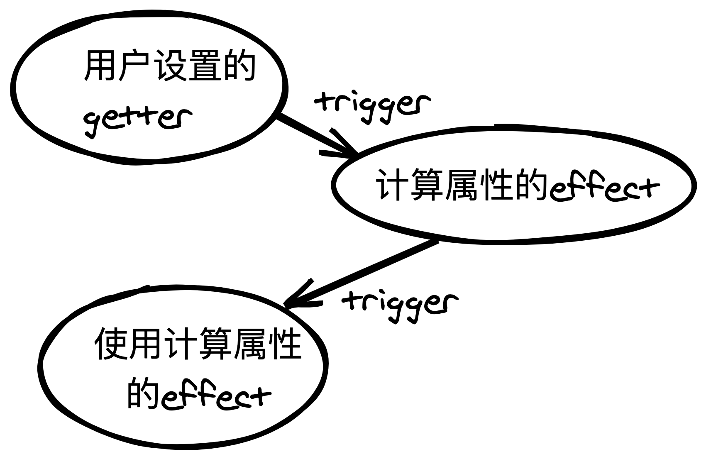

# specialEffect(特殊副作用函数)

`computed()/watch()/watchEffect()`是一类特殊的`effect()`。除此之外还有一个渲染`setupRenderEffect()`

- [computed() 计算值](./computed/README.md)
- [watch()/watchEffect() 监听值/监听副作用函数](./watch/README.md)

## 渲染函数 setupRenderEffect()
