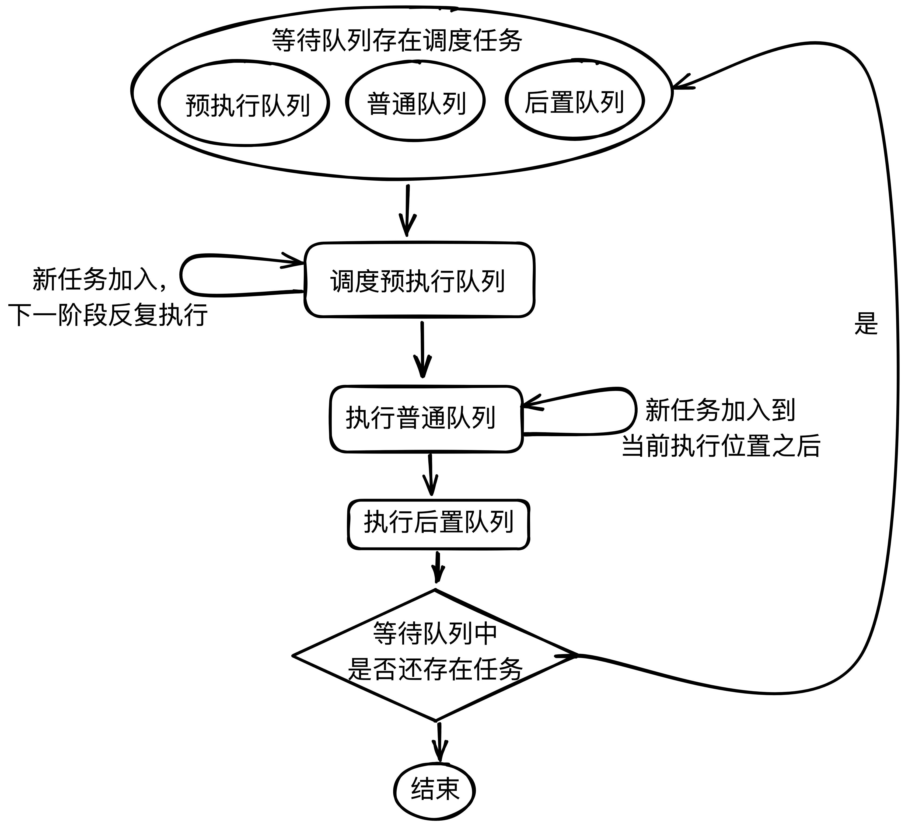

# flush-scheduler(刷新调度队列)

在`Vue3`中，部分副作用函数(`API`)的更新不是同步进行的，它们会通过一个调度队列(`Schedulder`)进行更新。

> 原始的副作用函数实例更新是同步的，但可以通过自定义更新调度函数来让其通过调度队列更新。

目前**同步调度更新**的副作用函数`API`有：

- `computed()`计算属性函数。
- `watch()/watchEffect()`使用同步模式。

好了，进入正题。

在`Vue3`中调度队列一共被分为了三种：

1. 预处理队列`preFlushCbs`
2. 普通队列`queue`
3. 后置处理队列`postFlushCbs`

处于队列中的函数，会按照上述的顺序进行执行。无论是哪一种队列，它们各自都会有一个`queue()`函数用于将当前的任务(`job`——`Vue3`的调度任务被称为`job`)将入到对应的调度队列中，然后触发更新。且它们各自的函数都是通过装饰`queueCb()`创建的，实际就是通过`queueCb()`将其加入到对应的队列中：

```js
export function queuePreFlushCb(cb: SchedulerJob) {
  queueCb(cb, activePreFlushCbs, pendingPreFlushCbs, preFlushIndex)
}

export function queuePostFlushCb(cb: SchedulerJobs) {
  queueCb(cb, activePostFlushCbs, pendingPostFlushCbs, postFlushIndex)
}

// 普通的调度直接使用queueCb
```

## 调度任务抽象构造

一个调度任务基本上就是一个副作用函数，所以它具有以下的属性(也可以通过其`TS`接口看出):

```js
export interface SchedulerJob extends Function {

  // 组件实例的uid
  id?: number

  // 是否还处于活跃
  active?: boolean

  // 延迟计算属性的标识
  computed?: boolean
  /**
   * Indicates whether the effect is allowed to recursively trigger itself
   * when managed by the scheduler.
   * 当一个副作用函数的调度由调度队列管理时，该属性决定其
   * 是否可以进行递归更新
   *
   * By default, a job cannot trigger itself because some built-in method calls,
   * e.g. Array.prototype.push actually performs reads as well (#1740) which
   * can lead to confusing infinite loops.
   * 默认情况下，一个调度任务是不会递归调用的(内部方法限制)
   * The allowed cases are component update functions and watch callbacks.
   * Component update functions may update child component props, which in turn
   * trigger flush: "pre" watch callbacks that mutates state that the parent
   * relies on (#1801). Watch callbacks doesn't track its dependencies so if it
   * triggers itself again, it's likely intentional and it is the user's
   * responsibility to perform recursive state mutation that eventually
   * stabilizes (#1727).
   */
  allowRecurse?: boolean
  /**
   * Attached by renderer.ts when setting up a component's render effect
   * Used to obtain component information when reporting max recursive updates.
   * dev only.
   * 开发模式下属性，用于获取组件信息防止超出限制的递归调用
   */
  ownerInstance?: ComponentInternalInstance
}
```

## 加入调度队列

由上我们可知加入调度队列都是通过`queueCb()`来进行的，`queueCb()`函数的逻辑包含两个：

1. 加入等待队列
2. 启动调度任务

```js
function queueCb(
  cb: SchedulerJobs,
  // 处理中队列
  activeQueue: SchedulerJob[] | null,
  // 等待处理队列
  pendingQueue: SchedulerJob[],
  // 当前处理中队列处理的任务下标
  index: number
) {
  // 单个调度任务
  if (!isArray(cb)) {
    // 为有激活队列时或激活队列不包含当前的effect时，将该effect添加到等待队列中
    if (
      !activeQueue ||
      !activeQueue.includes(
        cb,

        // 如果当前effect允许重复调用，则从下一个effect处开始查找
        // (这里表示重复调用的effect作为新的effect调用)
        cb.allowRecurse ? index + 1 : index
      )
    ) {
      pendingQueue.push(cb)
    }
  } else {
    // if cb is an array, it is a component lifecycle hook which can only be
    // triggered by a job, which is already deduped in the main queue, so
    // we can skip duplicate check here to improve perf
    // 如果cb为数组，则说明其为数组的生命周期hook
    pendingQueue.push(...cb)
  }

  // 开始刷新队列
  queueFlush()
}
```

逻辑比较清晰，结合注释应该不难理解，最后其调用了`queueFlush()`函数来启动调度任务。在`Vue3`的中，每次调度任务启动时，会通过`Promise`在微任务阶段启动，并且本次任务会放置在全局的`currentFlushPromise`变量上。

```js
const resolvedPromise: Promise<any> = Promise.resolve()

// 当前进行中的调度任务Promise
let currentFlushPromise: Promise<void> | null = null
```

`currentFlushPromise`用于鉴定当前是否处于刷新任务中，待会我们可以从`nextTick()`函数中看到它的作用。除此之外，还有两个变量负责控制是否处于调度任务中和是否处于等待进入调度任务中：

```js
// 是否处于刷新更新中
let isFlushing = false

// 是否已经进入刷新更新等待阶段(下一个阶段就是更新中)
let isFlushPending = false
```

第一次进入调度任务是通过`queueFlush()`来启用的，它会在上述两个状态都处于`false`时启用：

```js
function queueFlush() {
  // 当在进行队列刷新时或已在等待队列刷新时，不再次执行
  if (!isFlushing && !isFlushPending) {
    // 等待进行队列刷新
    isFlushPending = true

    // 时机在下一次task时
    currentFlushPromise = resolvedPromise.then(flushJobs)
  }
}
```

届时，就会将等待进入调度任务状态置为`true`并在微任务阶段启动一个调度任务函数。那么在这个阶段的间歇发生的调度任务会直接加入等待队列，但不会再次启动调度任务。

通过一个`fulfilled`的`Promise`，其在下一个微任务阶段调度了`flushJobs()`函数，该函数按我们设想的顺序，开始逐个刷新调度任务队列。

进入这个阶段时，`isFlushPending`状态将会被归还，`isFlushing`状态便会启用：

```js
// 进入task阶段，更改pending状态
isFlushPending = false

// 进入刷新队列阶段
isFlushing = true
```

之后便开始执行预处理队列。

## 预处理队列

在查看预处理队列执行前，先看看其构造分为三个部分：

```js
// 处于等待中的预处理函数队列
const pendingPreFlushCbs: SchedulerJob[] = []

// 正在处理的预处理函数队列
let activePreFlushCbs: SchedulerJob[] | null = null

// 当前处理到的具体下标
let preFlushIndex = 0
```

那么通过`flushPreFlushCbs()`执行预处理的副作用函数，此时会传入一个`Map`用于记录、查看当前副作用函数执行次数，防止重复调用次数过高：

```js
// 执行预执行effect
flushPreFlushCbs(seen)
```

`flushPreFlushCbs()`函数在调用时首先会将处于等待中的函数除重后置于当前处理的预处理队列中(覆盖式替换)，然后依次调用当前处理队列中的调度任务。之后递归继续调用原函数，直到预执行函数全部指向完毕。

```js
// 处理预先队列，这些effect会再实例更新前执行
export function flushPreFlushCbs(
  // 已经执行过的effct
  seen?: CountMap,
  parentJob: SchedulerJob | null = null
) {
  // 如果有等待中的预执行函数
  if (pendingPreFlushCbs.length) {
    // 指定当前的父级调度函数(实际为组件的渲染函数)，防止重复加入
    currentPreFlushParentJob = parentJob

    // 过滤重复的effect，将effect载入预执行函数的激活队列
    // (同一时段执行的副作用函数不需要多次触发)
    activePreFlushCbs = [...new Set(pendingPreFlushCbs)]

    // 清空等待预执行函数队列的长度
    pendingPreFlushCbs.length = 0

    // 生成一个Map记录执行过的effect
    if (__DEV__) {
      seen = seen || new Map()
    }

    // 依次执行 激活队列中的函数
    // (这里执行的函数长度为无重复的，存在重复时某些effect会执行不到)
    for (
      preFlushIndex = 0;
      preFlushIndex < activePreFlushCbs.length;
      preFlushIndex++
    ) {
      // 记录当前effect的执行次数，超过100次报错
      if (
        __DEV__ &&
        checkRecursiveUpdates(seen!, activePreFlushCbs[preFlushIndex])
      ) {
        continue
      }

      // 这期间加入预处理函数将在下一轮进行处理
      activePreFlushCbs[preFlushIndex]()
    }

    // 还原这些状态
    activePreFlushCbs = null
    preFlushIndex = 0

    // 重置父级任务
    currentPreFlushParentJob = null

    // recursively flush until it drains
    // 递归继续执行新生产的预执行函数
    flushPreFlushCbs(seen, parentJob)
  }
}
```

从上述函数可以看到，预处理函数的执行是一批一批的，直至执行完毕，每一批队列中的函数不会重复，但是不同批次中，未执行的预处理函数可能会存在同样的。


### 关于 currentPreFlushParentJob

**首先，本小段最好在已知整个调度流程的情况下阅读，现在可以跳过。**

注意在上述函数中，存在在一个`currentPreFlushParentJob`变量。该变量在一般的执行流程中基本上没有什么必要，使用该变量的场景是这样的：假设有一个父组件和子组件，父组件向子组件传递了一个`prop`变量`a`，且此时`a`有一个更新调度时机为预处理(`pre`)的`watch()/watchEffect()`，且子组件在视图中使用到了`a`。当`a`发生变化时，肯定会引起`watch()/watchEffect()`的更新调度。

首先我们要确定，`watch()/watchEffect()`的调度肯定要先于子组件渲染函数的更新调度(因为它是预处理的，`pre`)。其次，这次更新的顺序应该为：

父组件`a`对应属性发生变化 -> 调度更新父组件渲染函数 -> 更新渲染函数时`prop: a`发生变化 -> **调度更新子组件为`pre`的`watch()/watchEffect()` -> 调度更新子组件渲染函数。**

以上是正确的逻辑，也即目前代码的逻辑。但基于当前调度队列的知识，你觉得的逻辑应该为(加粗处为区别)：

父组件`a`对应属性发生变化 -> 调度更新父组件渲染函数 -> 更新渲染函数时`prop: a`发生变化 -> **调度更新子组件渲染函数 -> 调度更新子组件为`pre`的`watch()/watchEffect()`**

实际上当`Vue`在更新组件，对`props`进行更新后，会立即调用`flushPreFlushCbs()`对预处理型(`pre`)的副作用函数进行调度更新：

```js
// props update may have triggered pre-flush watchers.
// props的更新可能会导致预处理watchers发生调度更新
// flush them before the render update.
// 在render函数更新前，调度更新预处理副作用函数
flushPreFlushCbs(undefined, instance.update)
```

这样就确保了预处理函数能够在当前组件的渲染函数调度更新前进行更新。此时我们可以看到其传入了第二个参数，即即将要作为`currentPreFlushParentJob`变量值的调度任务。

那么该变量的用途是什么呢？该变量最初的用意是来防止子组件的渲染函数重复执行，但实际并未达到目的。
首先`currentPreFlushParentJob`属性的使用只会出现在组件更新时，由`prop`变动导致`watch()/watchEffect()`调度时，此时`watch()/watchEffect()`的调度可能会引起组件渲染函数中使用到的字段更新，即再次导致组件重新执行渲染调度任务。[#1777](https://github.com/vuejs/vue-next/issues/1777)
实际上，即使加入该变量后，上述的流程还是会导致渲染函数**执行两次**。而导致执行两次的原因**并不是**因为`watch()/watchEffect()`导致的，而是由`props`变更导致的。在`Vue3.2.4`之前，在处理`props`变更时，渲染函数的副作用函数的`allowRecurse`为`true`，当有`props`变动时，其会通过`triggerEffects()`像调度队列加入一个渲染的调度任务(这次是多余的)，之后通过`patch()`节点会执行一次调度任务，在之后就会执行刚刚加入调度队列的任务这就导致了渲染函数执行了两次，通过一次`prop`变动。
这也说明了实际上和`watch()/watchEffect()`没什么关系。记住刚刚我们说过渲染函数的副作用函数的`allowRecurse = true`，那么由`watch()/watchEffect()`导致的渲染更新调度任务在加入`queueJobs()`时，实际会由于判断条件被拒绝。(参考下方的`queueJobs()`加入条件)所以，即使没有`currentPreFlushParentJob`也不会导致调度任务被重复添加。

`Vue3.2.4`在`props`变动前，渲染函数的副作用函数会被`allowRecurse = false`，此时才解决了重复渲染的问题。

## 普通队列

普通队列只分为两个部分，没有等待中队列：

```js
// 正常处理队列
const queue: SchedulerJob[] = []
let flushIndex = 0
```

其处理过程类似于`Vue2`的调度队列，即一直处理直到处理完毕，中途有加入新的调度任务则在当前位置向后加入。

通过`queueJob()`函数可以向普通队列中加入调度任务。一般来说`queueJob()`中的调度任务为组件的渲染函数调度任务。
在`Vue3`中每一个调度任务都会被赋予一个`id`即当前组件实例的`uid`。`uid`是按父到子组件从小到大排列的，通过这个就可以保证调度更新时执行顺序的正确性。

新晋的任务，无论在何时都会加入到第一个比其`id`小的调度任务之后。这个查找过程是通过`findInsertionIndex()`函数来查找的。`findInsertionIndex()`通过二分法来进行查找，查找的范围为下一个即将刷新的调度任务开始。(没有`id`的调度任务会被视为`Infinity`加入到最后)

```js
// #2768
// Use binary-search to find a suitable position in the queue,
// so that the queue maintains the increasing order of job's id,
// which can prevent the job from being skipped and also can avoid repeated patching.
// 使用2分查找为当前job找到合适的位置，
// 这样可以维持调度队列的增序
// 同时避免当前job被跳过或重复执行
function findInsertionIndex(id: number) {
  // the start index should be `flushIndex + 1`
  // 从下一个(待更新的)effect开始查询
  let start = flushIndex + 1
  let end = queue.length

  while (start < end) {
    // 向下取整查找中间值
    const middle = (start + end) >>> 1

    // 获取中值调度任务的id(无则取无限大)
    const middleJobId = getId(queue[middle])

    // 中值是否比目标值小，小时缩减左边界
    middleJobId < id
      ? (start = middle + 1)
      : // 大时缩短右边界
        (end = middle)
  }

  // 返回目标位置
  return start
}
```

除了按上述规则加入到队列外，队列在加入调度任务时会进行检查，在某些允许重复调用的调度任务前，其会在允许其在当前正在执行的调度任务后存在；否则，其不允许从当前正在执行的调度任务开始存在重复的调度任务。

```js
if (
  // 当前队列为空
  (!queue.length ||
    // 或队列中不存在当前任务且当前任务不是前置任务
    !queue.includes(
      job,
      isFlushing && job.allowRecurse ? flushIndex + 1 : flushIndex
    )) &&
  // 防止更新props时，将当前渲染函数重复加入
  job !== currentPreFlushParentJob
) {
}
```

最后，当加入了新的调度任务后，同样会开始启动执行这些调度任务，所以`queueJob()`函数整体如下：

```js
export function queueJob(job: SchedulerJob) {
  // the dedupe search uses the startIndex argument of Array.includes()
  // by default the search index includes the current job that is being run
  // so it cannot recursively trigger itself again.
  // 默认情况下查询当前任务是否存在时会从当前正常更新的下标开始，这样可以避免循环触发
  // if the job is a watch() callback, the search will start with a +1 index to
  // allow it recursively trigger itself - it is the user's responsibility to
  // ensure it doesn't end up in an infinite loop.
  // 如果一个任务是watch api的回调，那么会允许其循环调用，这时需要用户自己去控制避免无限循环
  if (
    // 当前队列为空
    (!queue.length ||
      // 或队列中不存在当前任务且当前任务不是前置任务
      !queue.includes(
        job,
        isFlushing && job.allowRecurse ? flushIndex + 1 : flushIndex
      )) &&
    // 防止更新props时，将当前渲染函数重复加入
    job !== currentPreFlushParentJob
  ) {
    // 无id的加入到最后
    if (job.id == null) {
      queue.push(job)

      // 有id的加入到合适的位置
    } else {
      queue.splice(findInsertionIndex(job.id), 0, job)
    }

    // 执行队列刷新
    queueFlush()
  }
}
```

### 普通调度任务执行阶段

从上面我们知道`flushJobs()`函数在第一阶段会执行完所有的预执行队列函数，那么在第二阶段其会开始执行普通调度任务(普通调度任务即组件的渲染函数任务)。

之前我们提到，渲染函数的更新会按父到子组件的顺序进行，所以在执行前期会进行一个排序:

```js
// Sort queue before flush.
// This ensures that:
// 1. Components are updated from parent to child. (because parent is always
//    created before the child so its render effect will have smaller
//    priority number)
// 2. If a component is unmounted during a parent component's update,
//    its update can be skipped.
// 1. 按父 ——》 子更新组件；如果父组件未挂载元素，则跳过该effect的执行
queue.sort((a, b) => getId(a) - getId(b))
```

之后便依次开始执行普通调度任务，且确保其处于活跃状态。

```js
try {
    // 执行普通队列中的effect
    for (flushIndex = 0; flushIndex < queue.length; flushIndex++) {
      const job = queue[flushIndex]
      if (job && job.active !== false) {
        if (__DEV__ && checkRecursiveUpdates(seen!, job)) {
          continue
        }
        // console.log(`running:`, job.id)
        callWithErrorHandling(job, null, ErrorCodes.SCHEDULER)
      }
    }
  } finally {/* ...cleanup */}
```

如果此时有新的普通调度任务加入队列，那么会按条件加入到当前正在执行的普通调度函数之后某个合适的位置。

执行完毕后，对普通队列进行打扫：

```js
// 重置普通队列的参数
flushIndex = 0
queue.length = 0
```

## 后置队列

后置队列即最后执行的调度任务的队列，其会在普通任务调度完毕后执行。它的构造和预执行队列基本一致：

```js
const pendingPostFlushCbs: SchedulerJob[] = []
let activePostFlushCbs: SchedulerJob[] | null = null
let postFlushIndex = 0
```

其向队列中[加入后置调度任务的过程也和预处理调度任务一样](#加入调度队列)：

```js
export function queuePostFlushCb(cb: SchedulerJobs) {
  queueCb(cb, activePostFlushCbs, pendingPostFlushCbs, postFlushIndex)
}
```

---

执行完普通调度队列后，就该执行后置队列中的调度任务了，后置任务的执行通过`flushPostFlushCbs()`实现:

```js
// 执行后置执行effect
flushPostFlushCbs(seen)
```

后置队列的刷新和预执行队列的刷新有相识之处，但其不会立即对新加入的后置任务进行处理。

首先其会将当前等待队列中的后置函数全部转移到激活队列中。这里要当前后置队列是否在刷新中，如果在刷新中则直接加入就结束掉整个流程(组件在更新时会手动调用该函数):

```js
if (pendingPostFlushCbs.length) {
  // 去重
  const deduped = [...new Set(pendingPostFlushCbs)]
  pendingPostFlushCbs.length = 0

  // #1947 already has active queue, nested flushPostFlushCbs call
  // 如果已有post函数则说明正在执行了，则合并(可以单独调用api加入)，不用重复执行该函数了
  if (activePostFlushCbs) {
    activePostFlushCbs.push(...deduped)
    return
  }

  // 执行
  activePostFlushCbs = deduped
}
```

一般情况下，后置队列中的调度任务不具有`id`，但是如果有`Suspense`组件，那么其调度任务会在该函数中处理，导致有`id`。所以此时需要先对激活队列进行排序：

```js
// 同样的排序，父到子(Suspense组件)
activePostFlushCbs.sort((a, b) => getId(a) - getId(b))
```

之后依次执行即可，最后置空队列：

```js
// 执行后置执行函数
for (
  postFlushIndex = 0;
  postFlushIndex < activePostFlushCbs.length;
  postFlushIndex++
) {
  if (
    __DEV__ &&
    checkRecursiveUpdates(seen, activePostFlushCbs[postFlushIndex])
  ) {
    continue
  }
  activePostFlushCbs[postFlushIndex]()
}
activePostFlushCbs = null
postFlushIndex = 0
```

(这里没说明这个过程中新加入的后置任务)

---

看完所有队列的刷新，在`flushJobs()`的最后，其会归还状态，但是如果上述三种队列中仍有调度任务，则会再次调用`flushJobs()`函数直到所有任务处理完毕。(这次任务会累加上次的调度任务记录，防止爆栈)：

```js
isFlushing = false
currentFlushPromise = null
// some postFlushCb queued jobs!
// keep flushing until it drains.
if (queue.length || pendingPreFlushCbs.length || pendingPostFlushCbs.length) {
  flushJobs(seen)
}
```

至此，刷新队列的调度流程就完毕了。


