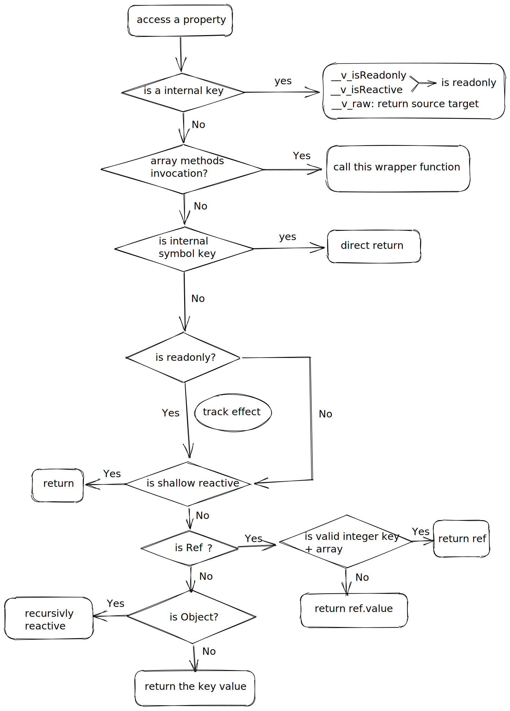

# 拦截器行为分类

拦截器其实都基于一些统一的函数创建的，但由于各自的行为不同产生了分化，一共可以分为以下几种：

- 普通对象拦截器
  - 可读可写/浅
  - 只读/浅
- 集合对象拦截器
  - 可读可写/浅
  - 只读/浅

虽然上述有那么多分类，但实际上创建拦截器的函数只按具体服务于什么类型的对象来区分：

- 服务于普通对象 -> [普通对象拦截器](#普通对象拦截器函数)
- 服务于集合对象 -> [集合对象拦截器](#集合对象拦截器)

## 普通对象拦截器函数

对于普通对象来说，它们的拦截器处理函数大部分都是基于一个函数进行创建的:

- `get() => createGetter(isReadonly, shallow)`
- `set() => createSetter(shallow)`

根据传入具体参数的不同就可以定制出不同的行为。

> 剩余`has/deleteProperty/ownKeys`都是自定义或使用固定的函数

这里我们先从访问(观察)行为开始(`createGetter()`)

### createGetter()——创建访问器

介于这是一个通用的`get()`生成器，它处理了所有的处理器行为所以显得比较臃肿，在看该函数之前，我们需要知道在`Vue3`中一些属性(`Flag`)代表的含义：

```js
// 当前响应化对象自身的一些Properties
export const enum ReactiveFlags {

  // 是否跳过该对象的响应化
  SKIP = '__v_skip',

  // 是否为普通响应化
  IS_REACTIVE = '__v_isReactive',

  // 是否为只读响应化
  IS_READONLY = '__v_isReadonly',

  // 源目标对象
  RAW = '__v_raw'
}
```

它们分别会在以下`API`处理后出现：

- `__v_skip` => `markRaw()`
- `__v_isReactive` => `reactive()`
- `__v_isReadonly` => `readonly()`
- `__v_raw`被响应式代理后的源对象

同时，同`Vue2`一样，访问器用于对`effect`的变化进行跟踪；不同于`Vue2`的是，其不会一次性的对响应化的对象进行完全代理，只会代理表层，直到访问到内部的对象才会进行下一次响应化处理，这是一个`lazy`的行为。

直接看看该函数吧，以下注释基本上很全面，这里我调一些点说明下：

```js
/**
 * @description 创建Proxy拦截器的访问器
 * @param isReadonly 是否为只读访问器
 * @param shallow 是否深层观察
 * @returns
 */
function createGetter(isReadonly = false, shallow = false) {
  return function get(target: Target, key: string | symbol, receiver: object) {

    // 是否为普通的响应化
    if (key === ReactiveFlags.IS_REACTIVE) {

      // 这里可知只读的不为响应式(也没有必要是)
      return !isReadonly

    // 是否为只读响应化
    } else if (key === ReactiveFlags.IS_READONLY) {
      return isReadonly

    // 源对象字段，访问后返回源对 象
    } else if (
      key === ReactiveFlags.RAW &&
      receiver === (isReadonly ? readonlyMap : reactiveMap).get(target)
    ) {
      return target
    }

    // 源对象是否为数组
    const targetIsArray = isArray(target)

    // 当前数组为可写数组，当使用其原型方法时，调用处理后的该方法
    if (!isReadonly && targetIsArray && hasOwn(arrayInstrumentations, key)) {
      return Reflect.get(arrayInstrumentations, key, receiver)
    }

    // 获取对象上的原属性值
    const res = Reflect.get(target, key, receiver)

    // 检测是否为内置symbol或不可观察的属性
    if (
      isSymbol(key)
        ? builtInSymbols.has(key as symbol)
        : isNonTrackableKeys(key)
    ) {
      return res
    }

    // 在普通响应式对象访问时，进行对effect进行跟踪
    // 只读对象没有必要收集，因为你不会更新它。
    if (!isReadonly) {
      track(target, TrackOpTypes.GET, key)
    }

    // 如果当前只是浅响应式，那么不对其内部属性进行递归响应化
    if (shallow) {
      return res
    }

    // 是否为ref对象
    if (isRef(res)) {
      // ref unwrapping - does not apply for Array + integer key.
      const shouldUnwrap = !targetIsArray || !isIntegerKey(key)
      return shouldUnwrap ? res.value : res
    }

    // 当深度跟踪的属性为一个对象时，将该对象进行响应化
    // 此时的响应化是lazy的
    if (isObject(res)) {
      // Convert returned value into a proxy as well. we do the isObject check
      // here to avoid invalid value warning. Also need to lazy access readonly
      // and reactive here to avoid circular dependency.
      return isReadonly ? readonly(res) : reactive(res)
    }

    return res
  }
}
```

#### 数组方法操作处理

在`get()`中，对于数组的方法具有特殊的处理，主要是为了防止重复无限的依赖更新以及一些特殊的情况。

```js
// 源对象是否为数组
const targetIsArray = isArray(target)

// 当前数组为可写数组，当使用其原型方法时，调用处理后的该方法
if (!isReadonly && targetIsArray && hasOwn(arrayInstrumentations, key)) {
  return Reflect.get(arrayInstrumentations, key, receiver)
}
```

`arrayInstrumentations`对象中的方法包含两`part`，下面会分别取出来进行说明：

```js
const arrayInstrumentations: Record<string, Function> = {}

// instrument length-altering mutation methods to avoid length being tracked
// which leads to infinite loops in some cases (#2137)
// 为会触发长度改变的mutation方法进行改造，防止其长度被观察
;(['push', 'pop', 'shift', 'unshift', 'splice'] as const).forEach(key => {
  const method = Array.prototype[key] as any
  arrayInstrumentations[key] = function (this: unknown[], ...args: unknown[]) {

    // 停止观测effect
    pauseTracking()

    // 调用原函数
    const res = method.apply(this, args)
    resetTracking()
    return res
  }
})
```

##### 数组查找方法的处理

首先看第一部分，是关于数组的查找方法的，先浏览一次：

```js
// instrument identity-sensitive Array methods to account for possible reactive
// values#737
;(['includes', 'indexOf', 'lastIndexOf'] as const).forEach(key => {
  const method = Array.prototype[key] as any
  arrayInstrumentations[key] = function(this: unknown[], ...args: unknown[]) {

    // 获取响应化代理源对象，进行effect追踪
    const arr = toRaw(this)

    // 让length对effect进行追踪
    for (let i = 0, l = this.length; i < l; i++) {

      // 手动对数组元素进行effect追踪
      track(arr, TrackOpTypes.GET, i + '')
    }
    // we run the method using the original args first (which may be reactive)
    // 使用raw来调用原方法来进行查找，因为数组元素中可能会有响应化的对象或ref后的对象
    const res = method.apply(arr, args)
    if (res === -1 || res === false) {
      // if that didn't work, run it again using raw values.
      return method.apply(arr, args.map(toRaw))
    } else {
      return res
    }
  }
})
```

那么为什么在使用`Proxy API`后还需要重写这些函数呢?主要是因为存在这样的问题：如果一个数组中的元素包含一些被`reactive()/ref()`的元素，那么这些方法就会出问题，看下面这个例子：

```js
const raw = {},
  newArray = reactive([1, 2, raw])

arr[2] === raw // false
```

上面是由于使用了`reactive()/ref()`导致数组中的对象被代理为`Proxy`，所以导致结果不相等，同理，在我们使用诸如`indexOf()/lastIndexOf()/includes()`之类的方法时，我们实际想对比的是其原值而不是被代理后的对象。所以你在这里看到了这个操作：

```js
const arr = toRaw(this)
```

至于以下操作，只是遵从这些函数的基本行为，因为原本的函数调用是会触发`length`及其某些数组下标的访问的(虽然某些函数不是全部)：

```js
// 让length对effect进行追踪
for (let i = 0, l = this.length; i < l; i++) {
  // 手动对数组元素进行effect追踪
  track(arr, TrackOpTypes.GET, i + '')
}
```

还有一个疑问点就是为什么要调用两次查找，这里其实是`Vue`想将数组的这三个方法做出这样的效果，即使我们拿原数组元素后代理后的数组元素去查询，都能按照原来的数组行为进行。**即你拿代理后的数组元素和未代理的数组元素，查出来的效果都一样。**

```js
// we run the method using the original args first (which may be reactive)
// 使用raw来调用原方法来进行查找，因为数组元素中可能会有响应化的对象或ref后的对象
const res = method.apply(arr, args)
if (res === -1 || res === false) {
  // if that didn't work, run it again using raw values.
  return method.apply(arr, args.map(toRaw))
} else {
  return res
}
```

这里进入`if`条件语句的方式就是构造一个被响应化后的元素来做要查找的元素：

```js
const raw = [],
  o = {},
  ro = reactive({})

// 此时原数组实际上就是个纯纯的数组 + 对象，没有响应式
raw.push(o)

const arr = reactive(raw)

console.log(arr.includes(obj)) // true
console.log(arr.includes(o)) // true
```

这些操作实际上是为了方便开发者理解，因为我们在这些被代理后的数组对象中查找某个已存在的数组元素，是理所当然觉得其应该存在的。所以`V3`兼容了这个行为。

##### 数组突变方法的处理

对于数组突变方法，主要取消在调用这些方法时对其`length`进行依赖追踪。在调用下面这些方法时，是没有新的依赖追踪的。(这是`V3`有意为之，和`V2`的`watch`行为会有不同，详情查看[#2137](https://github.com/vuejs/vue-next/issues/2137))

```js
// instrument length-altering mutation methods to avoid length being tracked
// which leads to infinite loops in some cases (#2137)
// 为会触发长度改变的mutation方法进行改造，防止其长度被观察导致在watchEffect时造成无限循环
;(['push', 'pop', 'shift', 'unshift', 'splice'] as const).forEach(key => {
  const method = Array.prototype[key] as any
  arrayInstrumentations[key] = function (this: unknown[], ...args: unknown[]) {

    // 停止观测effect
    pauseTracking()

    // 调用原函数
    const res = method.apply(this, args)
    resetTracking()
    return res
  }
})
```

#### ref()下的对象处理

如果访问的字段的值为一个`ref`(引用)，那么根据具体是个什么值来决定是否将`ref`下的源对象返回。只要`V3`认为你访问的是一个数组的合法整数键值，那么就会返回原`ref`对象(因为这里之前对数组中存在`ref`调用`reverse()`后会导致`bug`)，而不是`ref.value`

```js
if (isRef(res)) {
  // ref unwrapping - does not apply for Array + integer key.
  const shouldUnwrap = !targetIsArray || !isIntegerKey(key)
  return shouldUnwrap ? res.value : res
}

// 是否为整数键名
export const isIntegerKey = (key: unknown) =>
  isString(key) &&
  key !== 'NaN' &&
  key[0] !== '-' &&
  '' + parseInt(key, 10) === key
```

#### 懒式响应化

对于一个嵌套多个对象的对象来说，在它被响应化时，如果你使用不到其深层次的属性或对象，那么其内部对象的响应化不会执行，直到你真的使用到它：

```js
if (isObject(res)) {
  // Convert returned value into a proxy as well. we do the isObject check
  // here to avoid invalid value warning. Also need to lazy access readonly
  // and reactive here to avoid circular dependency.
  return isReadonly ? readonly(res) : reactive(res)
}
```

---

简单总结下这个`get()`：



### createSetter()——创建写入器

写入器的逻辑就比较简单明了了，按照注释直接看下去就能理解。

```js
function createSetter(shallow = false) {
  return function set(
    target: object,
    key: string | symbol,
    value: unknown,
    receiver: object
  ): boolean {

    // 获取更改前值
    const oldValue = (target as any)[key]

    // 非浅响应化时
    if (!shallow) {

      // 获取是否为已处理的源对象
      value = toRaw(value)

      // 如果当前对象的该字段已被处理为ref，那么替换旧值即可
      if (!isArray(target) && isRef(oldValue) && !isRef(value)) {
        oldValue.value = value
        return true
      }
    } else {
      // in shallow mode, objects are set as-is regardless of reactive or not
      // 浅模式中按原来的样子处理
    }

    // 对象是否存在该访问的字段
    const hadKey =

      // 当为数组下标时
      isArray(target) && isIntegerKey(key)
        ? Number(key) < target.length
        : hasOwn(target, key)

    // 写入该值
    const result = Reflect.set(target, key, value, receiver)
    // don't trigger if target is something up in the prototype chain of original
    // 当当前代理的对象在源对象的原型链上时，不进行副作用触发
    if (target === toRaw(receiver)) {

      // 新增字段时，触发effect收集该字段
      if (!hadKey) {
        trigger(target, TriggerOpTypes.ADD, key, value)

      // 对比新旧值，在变化时触发副作用更新
      } else if (hasChanged(value, oldValue)) {
        trigger(target, TriggerOpTypes.SET, key, value, oldValue)
      }
    }
    return result
  }
}
```

知道了这两个创建函数，那么我们就可以看下它们的分化结果了。

- `普通响应化拦截器` -> `reactive()` => `mutableHandlers`
- `浅响应化拦截器` -> `shallowReactive()` => `shallowReactiveHandlers`
- `只读拦截器` -> `readonly()` => `readonlyHandlers`
- `只读浅拦截器` -> `shallowReadonly()` => `shallowReadonlyHandlers`

具体你可以在[普通集合对象拦截器](./普通对象拦截器/README.md)进行具体的了解。

## 集合对象拦截器

同于普通对象拦截器，集合对象拦截器也有相同的四种模式:

- `集合响应化拦截器` -> `reactive()` => `mutableCollectionHandlers`
- `浅响应化拦截器` -> `shallowReactive()` => `shallowCollectionHandlers`
- `只读拦截器` -> `readonly()` => `readonlyCollectionHandlers`
- `只读浅拦截器` -> `shallowReadonly()` => `shallowReadonlyCollectionHandlers`

不同与普通对象拦截器，集合对象的行为主要集中在函数调用上，所以它们的拦截器只有一个——拦截`get()`，之后在通过同样的重写方法的方式来进行用户操作行为的拦截。

具体你可以查看[集合对象拦截器](./集合对象拦截器/README.md)来进一步了解。
