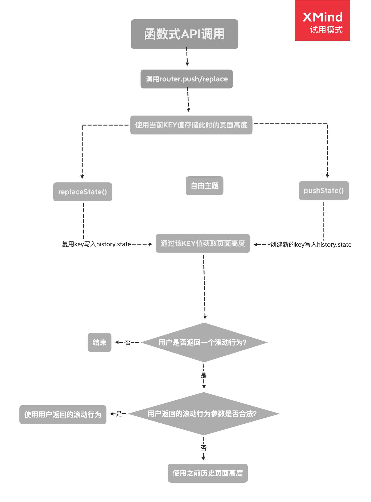

# 路由切换滚动条行为的处理

如果你使用过滚动条`scrollBehavior`这个属性，那么你应该知道，滚动条可以来做什么(保存跳转前的页面高度)，现在让我们来康康其原理。

## 位置信息的存放位置

首先页面高度位置信息存放在一个私有变量`positionStore`中：

```js
const positionStore = Object.create(null);
```

这里简单说下，以防在下面的内容中不知道它是一个什么。

## 滚动条行为安装

滚动条行为是否安装还是要看我们是否定义，最开始它会随着安装路由事件监听器时，一同确认安装:

```js
// 自定义的scrollBehavior函数
const expectScroll = router.options.scrollBehavior;

// 是否支持滚动条行为
const supportsScroll = supportsPushState && expectScroll;

// 支持时，安装滚动条行为监听函数
if (supportsScroll) {
    // 返回一个注销滚动条行为的函数
    this.listeners.push(setupScroll());
}
```

通过之前的学习，我们自带`this.listeners`中存放的是一个移除事件的回调函数，那么这里我们可以推测`setupScroll()`是返回的一个移除滚动条事件的函数。

那么该函数具体为：

```js
function setupScroll() {
    // Prevent browser scroll behavior on History popstate
    // 不实用浏览器自带的滚动条行为
    if ("scrollRestoration" in window.history) {
        window.history.scrollRestoration = "manual";
    }
    // Fix for #1585 for Firefox
    // Fix for #2195 Add optional third attribute to workaround a bug in safari https://bugs.webkit.org/show_bug.cgi?id=182678
    // Fix for #2774 Support for apps loaded from Windows file shares not mapped to network drives: replaced location.origin with
    // window.location.protocol + '//' + window.location.host
    // location.host contains the port and location.hostname doesn't
    // 修bug，支持文件协议下的滚动条行为
    const protocolAndPath =
        window.location.protocol + "//" + window.location.host;
    const absolutePath = window.location.href.replace(protocolAndPath, "");

    // preserve existing history state as it could be overriden by the user
    // 保留当前已存在的state，确保其可以为用户修改
    const stateCopy = extend({}, window.history.state);

    // 生成本次跳转滚动条的唯一key值
    stateCopy.key = getStateKey();

    // 重写当前路径的state
    window.history.replaceState(stateCopy, "", absolutePath);

    // 安装保存滚动条高度的函数
    window.addEventListener("popstate", handlePopState);

    // 返回一个注销函数
    return () => {
        window.removeEventListener("popstate", handlePopState);
    };
}
```

首先从上面的代码中确定几个变量的含义：首先是每次保存的`state`对象中，每次`Vue-Router`只会向其写入一个`key`字段，该字段表示的是对上一次跳转前页面位置的信息对象的映射。`Vue-Router`在内部可以通过它来查到那一次跳转前页面所处于的高度。

**每次该`key`值会在跳转后生成准备好，并在页面跳转时将页面高度信息存入该`key`值，并生成新的`key`值预备下一次跳转，如此往复。**

在第一次初始化时，我们可以明显的看见这样的操作：

```js
const stateCopy = extend({}, window.history.state);

// 生成本次跳转滚动条的唯一key值
stateCopy.key = getStateKey();

// 重写当前路径的state
window.history.replaceState(stateCopy, "", absolutePath);
```

在之前，我们来康康这个`key`的[整体结构](./页面高度映射key/README.md)。

之后便监听`popstate`事件在路由变更时做出页面高度的处理：

```js
window.addEventListener("popstate", handlePopState);
```

## 路由变更的处理

首先，我们要知道路由变更有两种方式：

-   调用函数`api`
-   浏览器控件

所以对于路由变更的处理也要分为两种，首先是我们最常用的函数跳转：

### 函数 api 跳转

通过函数`api`进行跳转，对于页面高度的处理需要封装在具体的函数中，因为它不会触发`popstate`事件。在`html5`中，其逻辑被封装在`pushState()`中，会在调用`window.history.pushState()`前，先进行位置信息存储：

```js
function pushState(url?: string, replace?: boolean) {
    // 保持当前滚动条的位置
    saveScrollPosition();

    // ....其他逻辑，先不关注
}
```

那么`saveScrollPosition()`就是将当前的(跳转前)页面高度位置信息对象，存入到对于的`key`值中：

```js
function saveScrollPosition() {
    // 为当前的跳转路径生成唯一key值
    const key = getStateKey();

    // 记录当前页面滚动条唯一
    if (key) {
        positionStore[key] = {
            x: window.pageXOffset,
            y: window.pageYOffset,
        };
    }
}
```

在存储完上述信息之后，该生成新的`key`了，此时对`key`值的生成又分两种情况，其实对应`replace`和`push`的语义，先看一看：

```js
// 如果是直接替换当前URL
if (replace) {
    // preserve existing history state as it could be overriden by the user
    // 保留存在的历史记录状态，以便开发人员可以重写它
    const stateCopy = extend({}, history.state);

    // 获取当前的key值
    // 这里因为是replace，所以不会生成新的key，因为我们认为你只想重写当前url的信息
    stateCopy.key = getStateKey();

    // 将当前URL地址替换进去
    history.replaceState(stateCopy, "", url);

    // 如果当前是更新模式，则创建一个新的key
} else {
    history.pushState(
        {
            key: setStateKey(genStateKey()),
        },
        "",
        url
    );
}
```

可以从上面看到，对于`replace`其会复用之前的`key`，因为`replace`在某种意义上表示重写当前的`url`信息；而`push`则会新生成一个`key`值，这个`key`会作为下一次跳转前存储位置信息使用。

### 浏览器控件跳转

浏览器控件跳转就是通过`popstate`事件来完成，具体就是我们绑定的事件回调函数`handlePopState()`：

```js
// 每次出发pushState的时候，存储跳转前的滚动条位置
function handlePopState(e) {
    saveScrollPosition();

    // 获取当前URL下的state
    if (e.state && e.state.key) {
        setStateKey(e.state.key);
    }
}
```

非常简单，先调用`saveScrollPosition()`存储之前位置信息，然后在设置新的`key`值，**注意**，这个`key`值来自于之前跳转过的`url`的`state`。在`popstate`事件触发时，我们可以在`event.state`中访问到这个`url`历史的`state`。这个应该可以理解，因为通过浏览器控件进行跳转的是我们**已经经过**的`url`。

## 还原某次页面高度

上面基本的信息已经提到了，但是唯独没可以跳转后的页面高度还原。其实这部分逻辑存在于各种跳转方式的跳转成功回调中，所以还是老规矩，按两种方式来说明：

-   函数式`api`跳转
-   浏览器控件跳转

### 函数式 api 跳转

我们知道函数`api`跳转是通过`push/replace`来实现的，在这两个方法内部会通过`history.transitionTo()`来进行`Route`的提交更新，并在更新完毕后会执行成功的回调。在这个回调的执行时，就会调用`handleScroll(this.router, route, fromRoute, false)`来进行滚动条高度的还原。该函数具体为：

```js
function handleScroll(
    // router实例
    router: Router,

    // 已跳转的Route
    to: Route,

    // 跳转前的Route
    from: Route,

    // 是否是通过popstate事件触发
    isPop: boolean
) {
    // 未挂载到具体的app的应用时，不执行该操作
    if (!router.app) {
        return;
    }

    // 为定义滚动条行为时，不执行该操作
    const behavior = router.options.scrollBehavior;
    if (!behavior) {
        return;
    }

    if (process.env.NODE_ENV !== "production") {
        assert(
            typeof behavior === "function",
            `scrollBehavior must be a function`
        );
    }

    // wait until re-render finishes before scrolling
    // 等待应用重新渲染完成后在进行滚动
    router.app.$nextTick(() => {
        // 获取当前key值对应的位置信息对象
        const position = getScrollPosition();
        const shouldScroll = behavior.call(
            router,
            to,
            from,

            // 仅在进行浏览器控件跳转时提供之前的页面高度信息
            isPop ? position : null
        );

        // 如果未返回任何值则不做任何操作
        if (!shouldScroll) {
            return;
        }

        // 返回一个Promise对象时,等待其resolve时滚动
        if (typeof shouldScroll.then === "function") {
            shouldScroll
                .then((shouldScroll) => {
                    scrollToPosition((shouldScroll: any), position);
                })
                .catch((err) => {
                    if (process.env.NODE_ENV !== "production") {
                        assert(false, err.toString());
                    }
                });

            // 直接返回时直接滚动
        } else {
            scrollToPosition(shouldScroll, position);
        }
    });
}
```

其具体的函数逻辑为在挂载`Router`的根实例重新渲染完毕后，计算我们通过`scrollBehavior()`返回的滚动信息对象，得出滚动位置对于文档的相对位置，然后滚动过去。

> 在上述逻辑中，默认通过函数`api`跳转时，不会传入之前路过的路由地址的位置信息对象，这很好理解，毕竟通过函数`api`跳转为一个新的查找行为，而不像通过浏览器进行前进后退跳转这种历史记录查找行为，所以不会传入一个具体的旧的位置信息对象。

之后通过`scrollToPosition()`这个函数进行滚动还原，要想理解该函数你需要理解一些浏览器自带的`api`，比如`element.getBoundingClientRect()`，**它相当于调用元素相对于当前视窗左上角的偏移量**；`pageYOffset`相当于**当前视窗相当于文档元素左上角的偏移量**。具备这些知识后，我们先看看该函数的大体模样：

```js
function scrollToPosition(shouldScroll, position) {
    // 确保返回的跳转位置为一个对象
    const isObject = typeof shouldScroll === "object";

    // 当返回的对象包含一个锚点或元素选择器时
    if (isObject && typeof shouldScroll.selector === "string") {
        // getElementById would still fail if the selector contains a more complicated query like #main[data-attr]
        // but at the same time, it doesn't make much sense to select an element with an id and an extra selector
        const el = hashStartsWithNumberRE.test(shouldScroll.selector) // $flow-disable-line
            ? // 以数字开头的hash值认为其为id
              document.getElementById(shouldScroll.selector.slice(1)) // $flow-disable-line
            : // 调用querySelector查询传入的
              document.querySelector(shouldScroll.selector);

        // 查询到对应元素时，
        if (el) {
            // 是否还定义相对于当前元素的偏移量(注意为对象，形式同非选择器时)
            let offset =
                shouldScroll.offset && typeof shouldScroll.offset === "object"
                    ? shouldScroll.offset
                    : {};

            // 标准化传入的offset对象
            offset = normalizeOffset(offset);

            // 计算相当于文档的偏移量
            position = getElementPosition(el, offset);

            // 确保传入的x/y都为数字
        } else if (isValidPosition(shouldScroll)) {
            // 计算相当于文档的偏移量
            position = normalizePosition(shouldScroll);
        }

        // 确保传入的x/y都为数字
    } else if (isObject && isValidPosition(shouldScroll)) {
        position = normalizePosition(shouldScroll);
    }

    // 滚动到对应位置
    if (position) {
        window.scrollTo(position.x, position.y);
    }
}
```

首先，无论怎样，我们返回的滚动信息一定要为一个对象，其次可以有两种返回值形式：

```js
// 形式1
const pos1 = {
    x: Number,
    y: Number,
};

// 形式2
const pos2 = {
    // 一个元素选择器，具体用法参考document.querySelector
    selector: String,

    // 同形式1，表示相对于selector指定元素的偏移量
    // 未找到selector指定元素时，则相对于文档
    offset: Object,
};
```

之后其要对我们返回的这个对象进行计算，得出相对于文档的偏移量。在非元素选择器的情况下，其计算较为简单：

```js
function normalizePosition(obj: Object): Object {
    return {
        x: isNumber(obj.x) ? obj.x : window.pageXOffset,
        y: isNumber(obj.y) ? obj.y : window.pageYOffset,
    };
}
```

如果这是一个元素选择器，那么情况稍微复杂点：

```js
// 获取对应元素的高度，并将计算最终的偏移量
function getElementPosition(el: Element, offset: Object): Object {
    // 获取文档的位置
    const docEl: any = document.documentElement;

    // 通过该函数获取的值为在视窗中的位置
    const docRect = docEl.getBoundingClientRect();

    // 获取元素的位置
    const elRect = el.getBoundingClientRect();

    // 计算元素相当于文档的偏移量，我们传入的offset对象的正值相当于向元素上/左移动
    return {
        x: elRect.left - docRect.left - offset.x,
        y: elRect.top - docRect.top - offset.y,
    };
}
```

其会分别获取文档相对于视口和对应选择器元素相对于视口的位置，然后计算出两者的偏移量。这里相当于两个点都参照另一个点作为基准来计算两个点的偏移量，如果你理解不了那就动手画个图试试。

当然这里会额外计算一个`offset`变量，它表示相对于选择器元素的偏移量，正值相对于向元素上方移动，反之。

最后调用对应的滚动`api`进行一个平滑的滚动：

```js
window.scrollTo(position.x, position.y);
```

### 浏览器控件跳转页面高度的还原

页面高度还原应该在使用浏览器控件时触发，因为这种使用方式才体现了回到历史的页面。而这种方式的触发必须通过`popstate`事件。在`history.init()`时，我们在路由切换的最后挂载了事件对其进行了监听：

```js
window.addEventListener("popstate", handleRoutingEvent);
this.listeners.push(() => {
    window.removeEventListener("popstate", handleRoutingEvent);
});
```

在`handleRoutingEvent()`函数的最后，其在`Route`提交成功时，进行了滚动条的还原：

```js
const handleRoutingEvent = () => {
    // ... 之前的代码略过

    // 进行路由跳转
    this.transitionTo(location, (route) => {
        // 跳转完成时，处理当前页面的滚动条高度
        if (supportsScroll) {
            handleScroll(router, route, current, true);
        }
    });
};
```

此时传入的第四个参数为`true`，代表是通过`popstate`事件触发，此时`scrollBehavior()`函数的调用会传入之前存储的页面位置信息作为第 3 个参数：

```js
scrollBehavior.call(
    router,
    to,
    from,

    // 仅在进行浏览器控件跳转时提供之前的页面高度信息
    isPop ? position : null
);
```

之后的流程你也知道了，同函数式调用一样。

## 总结

下面用流程图清晰的概括下整个过程：

### 函数 API 形式


