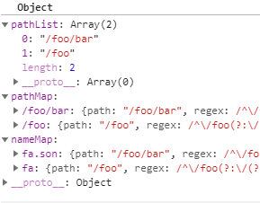

# 路由表

在`VueRouter`中，我们为什么能根据我们定义在`routes`中的各个地址来渲染对应的组件，具体的原理就是在初始化`Router`时，其会将我们定义的`routes`中的一个个路由信息转化为一张路由表，并且会根据我们定义路由的顺序，影响路由表渲染组件优先级的权重。

整个路由表由`createMatcher()`函数通过``routes`创建：

```js
// 根据路由配置创建路由适配表
this.matcher = createMatcher(options.routes || [], this)
```

该函数会创建三个不同形式的路由表(实际上为一个，另外两个方面进行查询)，这些表不会向外部暴露，会存储在闭包中，仅暴露两个接口来进行路由地址的查询，其具体的函数为：

```js
function createMatcher(
    routes: Array < RouteConfig > ,
    router: VueRouter
): Matcher {
    const {

        // 按定义顺序转化好的路由地址表
        pathList,

        // 按路由地址到对应路由对象的查询表
        pathMap,

        // 按路由名称到对应路由对象的查询表
        nameMap
    } = createRouteMap(routes);

    // 返回两个接口，一个用于添加新的路由地址，一个用户查询已存在的路由地址
    return {
        match,
        addRoutes
    };
}
```

我们可以从上述函数中看出，该函数的主要目的是构成一个闭包，来存储路由表，具体的创建过程由`createRouteMap()`函数来创建。该函数的主要作用就是递归调用`addRouteRecord()`函数来向三种路由表中添加新的路由，该函数的主要逻辑为：

```js
function createRouteMap(

    // 原始的路由配置对象(option.routes)
    routes: Array < RouteConfig > ,

    // 以下三个参数为之前该函数输出结果，用于添加新的路由信息
    oldPathList ? : Array < string > ,
    oldPathMap ? : Dictionary < RouteRecord > ,
    oldNameMap ? : Dictionary < RouteRecord >
): {
    pathList: Array < string > ,
    pathMap: Dictionary < RouteRecord > ,
    nameMap: Dictionary < RouteRecord >
} {
    // the path list is used to control path matching priority
    // 一个用于匹配路径的路径表
    const pathList: Array < string > = oldPathList || [];

    // 路径到对应路由信息的映射表
    const pathMap: Dictionary < RouteRecord > = oldPathMap || Object.create(null);

    // 命名路由到路由信息的映射表
    const nameMap: Dictionary < RouteRecord > = oldNameMap || Object.create(null);

    // 遍历，将原始路由中的路由信息添加到三个表中
    routes.forEach(route => {
        addRouteRecord(pathList, pathMap, nameMap, route);
    });

    // ensure wildcard routes are always at the end
    // 确保通配符路径永远在转化后路由表数组的最后
    for (let i = 0, l = pathList.length; i < l; i++) {

        // 找到通配符路径将其添加到路径表数组
        if (pathList[i] === '*') {
            pathList.push(pathList.splice(i, 1)[0]);
            l--;
            i--;
        }
    }

    if (process.env.NODE_ENV === 'development') {

        // warn if routes do not include leading slashes
        // 每个路由地址都必须在首部以/开头
        const found = pathList
            // check for missing leading slash
            .filter(path => path && path.charAt(0) !== '*' && path.charAt(0) !== '/')

        // 否则警告
        if (found.length > 0) {
            const pathNames = found.map(path => `- ${path}`).join('\n')
            warn(false, `Non-nested routes must include a leading slash character. Fix the following routes: \n${pathNames}`)
        }
    }

    // 返回三个记录路由情况的对象
    return {
        pathList,
        pathMap,
        nameMap
    }
}
```

这里先看一个具体的配置和其生成的结果：

```js
// 配置如下：
const routes = [{
        path: '/foo',
        component: Foo,
        name: 'fa',
        children: [
            {
                path: 'bar',
                name: 'fa.son',
                component: Bar
            }
        ]
    }
];
```

生成的结果如图：


那么知道了前后生成结果，那么我们现在可以来看一下具体的中间过程了，上述代码中核心的一段就是：

```js
// 遍历，将原始路由中的路由信息添加到三个表中
routes.forEach(route => {
    addRouteRecord(pathList, pathMap, nameMap, route)
});
```

它的作用就是通过的`addRouteRecord()`方法，向`pathList/pathMap/nameMap`三者上添加路由路径表。

## 路由表的生成——addRouteRecord()

`addRouteRecord()`方法根据我们最初配置的路由表数组(`routes`)，将其与其子路由信息全部添加到三个不同的路由表对象中，这里我们按代码从上到下依次来浏览，那么总体可以按照以下步骤来归纳：

1. [路由信息对象的生成](#%e8%b7%af%e7%94%b1%e4%bf%a1%e6%81%af%e8%ae%b0%e5%bd%95%e5%af%b9%e8%b1%a1)
2. [递归生成子路由信息对象](#%e9%80%92%e5%bd%92%e7%94%9f%e6%88%90%e5%ad%90%e8%b7%af%e7%94%b1%e4%bf%a1%e6%81%af%e5%af%b9%e8%b1%a1)
3. [记录当前路由信息并为别名生成路由信息](#%e8%ae%b0%e5%bd%95%e5%bd%93%e5%89%8d%e8%b7%af%e7%94%b1%e4%bf%a1%e6%81%af%e5%b9%b6%e4%b8%ba%e5%88%ab%e5%90%8d%e7%94%9f%e6%88%90%e8%b7%af%e7%94%b1%e4%bf%a1%e6%81%af)

### 路由信息记录对象

该方法要做的第一件事情就是为当前的路径配置对象生成一个`record`路径信息记录对象，它记录了该路由有关的所有信息：

```js
// 提取配置中的路由地址和组件名称
const {
    path,
    name
} = route;

// 为没配置path的用户报错
if (process.env.NODE_ENV !== 'production') {
    assert(path != null, `"path" is required in a route configuration.`)
    assert(
        typeof route.component !== 'string',
        `route config "component" for path: ${String(
    path || name
  )} cannot be a ` + `string id. Use an actual component instead.`
    )
}

// 2.6新增api，用于将控制正则表达式路由规则的解析行为
const pathToRegexpOptions: PathToRegexpOptions =
    route.pathToRegexpOptions || {};

// 标准化格式化用户配置的路径
const normalizedPath = normalizePath(path, parent, pathToRegexpOptions.strict)

// 路由路径匹配规则是否大小写敏感
if (typeof route.caseSensitive === 'boolean') {

    // 同步正则表达式的大小写敏感规则
    pathToRegexpOptions.sensitive = route.caseSensitive
}

// 输入路由信息
const record: RouteRecord = {
    path: normalizedPath,

    // 根据path生成一份正则表达式
    regex: compileRouteRegex(normalizedPath, pathToRegexpOptions),

    // 该路由路径下代表的组件(默认情况下存放于default)
    components: route.components || {
        default: route.component
    },

    // 组件生成的vm实例
    instances: {},

    // 当前路由名称
    name,
    parent,

    // 别名路由匹配的真实路径
    matchAs,

    // 路由重定向路径
    redirect: route.redirect,
    beforeEnter: route.beforeEnter,

    // 路由信息元参数对象，记录该路由的信息
    meta: route.meta || {},

    // 是否将组件参数信息设置为组件实例属性
    props: route.props == null ?

        // 未定义传入组件的参数时，初始化为空对象
        {} :

        // 是否定义有子组件视图
        route.components ?

        // 当定义有命名视图时，则使用原定义
        route.props :

        // 未有命名视图时，则存放在默认位置中
        {
            default: route.props
        }
}
```

上述部分比较简单，不用过渡深究，其中生成`path`所用的[`normalizePath()`](./工具方法/README.md#normalizepath%e6%a0%87%e5%87%86%e5%8c%96%e8%b7%af%e7%94%b1%e8%b7%af%e5%be%84)方法与将其`path`生成正则表达式的[`compileRouteRegex()`](./工具方法/README.md#compilerouteregex%e6%a0%b9%e6%8d%ae%e8%b7%af%e5%be%84%e7%94%9f%e6%88%90%e6%ad%a3%e5%88%99%e8%a1%a8%e8%be%be%e5%bc%8f)方法，该方法具体是使用的[`path-to-regexp`](https://www.npmjs.com/package/path-to-regexp)这个库，具体就不说明了。

综上，我们可以从其中看到还有个`pathToRegexpOptions`属性(`Vue`文档中并未说明具体配置项)可以配置在路由信息中，这个属性就是用来控制路径转换为正则表达式时的行为的，具体就与[`path-to-regexp`](https://www.npmjs.com/package/path-to-regexp)库的配置对齐。

### 递归生成子路由信息对象

接下来便是处理路由中的嵌套路由了，这里就比较普通，但是要预防一个问题，就是在配置子路由时，如果不配置其子路由路径且配置了父录路由的名称，此时跳转至父路由时，就不会触发子路由组件的刷新。

```js
// 是否设置子路由路径
if (route.children) {
    // Warn if route is named, does not redirect and has a default child route.
    // If users navigate to this route by name, the default child will
    // not be rendered (GH Issue #629)
    // 警告：如果该路由为命名路由，则不要重定向或有一个默认的子路由
    // 如果用户通过路由名称跳转到该路由时，该默认子组件不会被重新渲染
    if (process.env.NODE_ENV !== 'production') {

        // 命名路由，不具有重定向但不具有具体的子路由路径
        if (
            route.name &&
            !route.redirect &&

            // 路径是否为单独的/或为空字符串
            route.children.some(child => /^\/?$/.test(child.path))
        ) {
            warn(
                false,
                `Named Route '${route.name}' has a default child route. ` +
                `When navigating to this named route (:to="{name: '${
            route.name
        }'"), ` +
                `the default child route will not be rendered. Remove the name from ` +
                `this route and use the name of the default child route for named ` +
                `links instead.`
            )
        }
    }

    // 遍历子路由数组，将其添加到记录中
    route.children.forEach(child => {
        const childMatchAs = matchAs ?
            cleanPath(`${matchAs}/${child.path}`) :
            undefined;

        // 递归调用该方法添加子路由
        addRouteRecord(pathList, pathMap, nameMap, child, record, childMatchAs)
    })
}
```

除此之外，这里我们还需要注意的是，当我们使用路由的别名时，此时`matchAs`参数为原路由路径的前缀。之后便是调用`addRouteRecord()`生成子路由记录信息对象，注意此时的子路由名称会发生变化。

### 记录当前路由信息并为别名生成路由信息

最后将当前路由信息对象加入到三个路由表中，同时，如果路由具有别名，同样要为其别名生成一个一样的路由记录信息对象，这里就不再多做阐述：

```js
// 如果Map中不存在该地址，则分别存入pathList与pathMap
if (!pathMap[record.path]) {
    pathList.push(record.path);
    pathMap[record.path] = record;
}

// 如果路由存在任何形式的别名
if (route.alias !== undefined) {

    // 格式化别名为数组，并依次添加为一个单独的路由
    const aliases = Array.isArray(route.alias) ? route.alias : [route.alias]
    for (let i = 0; i < aliases.length; ++i) {
        const alias = aliases[i];

        // 禁止别名与路径值重复
        if (process.env.NODE_ENV !== 'production' && alias === path) {
            warn(
                false,
                `Found an alias with the same value as the path: "${path}". You have to remove that alias. It will be ignored in development.`
            )
            // skip in dev to make it work
            continue
        }

        // 将别名作为一个新的路由也添加到路由表中
        const aliasRoute = {
            path: alias,
            children: route.children
        };
        addRouteRecord(
            pathList,
            pathMap,
            nameMap,
            aliasRoute,
            parent,
            record.path || '/' // matchAs
            )
    }
}

// 如果具有路由名称，将其同时添加到路由名表中
if (name) {
    if (!nameMap[name]) {
        nameMap[name] = record
    } else if (process.env.NODE_ENV !== 'production' && !matchAs) {
        warn(
            false,
            `Duplicate named routes definition: ` +
            `{ name: "${name}", path: "${record.path}" }`
        )
    }
}
```

## 处理通配符和不正规的路径

处理完三个路由表信息对象后，在`createRouteMap()`函数的最后处理通配符对象，始终要使其在`pathList`的最后，以便无路由匹配时，使用它；同时限制路由路径必须以`/`开头。

```js
// ensure wildcard routes are always at the end
// 确保通配符路径永远在路由表数组的最后
for (let i = 0, l = pathList.length; i < l; i++) {

    // 找到通配符路径将其添加到路径表数组
    if (pathList[i] === '*') {
        pathList.push(pathList.splice(i, 1)[0])
        l--
        i--
    }
}

if (process.env.NODE_ENV === 'development') {

    // warn if routes do not include leading slashes
    // 除*外每个路由地址都必须在首部以/开头
    const found = pathList
        // check for missing leading slash
        .filter(path => path && path.charAt(0) !== '*' && path.charAt(0) !== '/')

    // 否则警告
    if (found.length > 0) {
        const pathNames = found.map(path => `- ${path}`).join('\n')
        warn(false, `Non-nested routes must include a leading slash character. Fix the following routes: \n${pathNames}`)
    }
}
```

到此为止，三个路由表就全部生成了！

最后，值得注意的是这三个对象并未直接返回暴露给外界，相反，提供了两个接口来提供用户操作：

```js
return {
    match,
    addRoutes
};
```

## 暴露给外界的两个接口

在`createRouteMap()`函数调用后，返回了两个接口函数：

```js
return {
    match,
    addRoutes
};
```

前者用于从路由表中匹配对应的路由路径地址，然后返回一个当前路径地址对象，后者就是用于动态添加一个新的路由路径，流程和`createRouteMap()`方法一样，不同的是此时会在原有的三张表上添加：

```js
function addRoutes(routes) {

    // 添加新的路由路径，在原3表的基础上
    createRouteMap(routes, pathList, pathMap, nameMap)
}
```