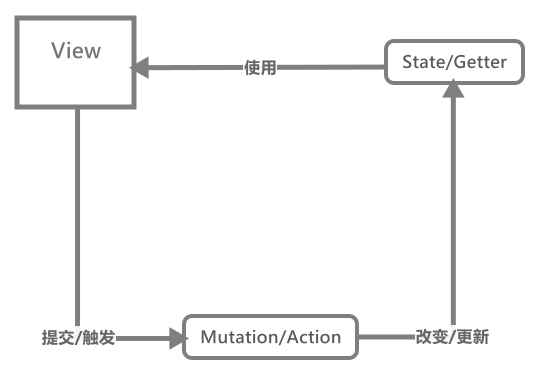

# VueX的学习

阅读本文你将知道什么：

- `Store`内部的构造，和实例化过程
- 严格模式的实现
- 模块命名空间的内部原理
- 比平时更细腻的函数处理细节

阅读前请确保，你对`Vue`与`VueX`有一定的使用经验。

## 阅读引导

根据`VueX`的属性，我们可以将它的分为`4`部分，当然我还是推荐从初始化实例开始，了解一下其整个生命周期的：

- [VueX插件的使用](./vuex插件安装/README.md)
- [Store存储空间](./Store存储空间/README.md)

如果你想具体到某个模块，则推荐看下面

- [ModuleCollection模块集合管理](./ModuleCollection模块集合管理/README.md)
- [Module模块](./Module模块/README.md)
- [Mutation函数](./Mutation函数/README.md)
- [Action函数](./Action函数/README.md)
- [Getter访问器](./Getter访问器/README.md)

在这之后，就是一些相关`API`的解析，比如辅助函数和函数变量订阅者：

- [API 介绍](./相关API/REAMDE.md)

最后用一张图总结下其中的数据流动方式：

